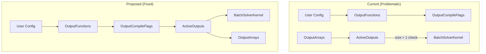
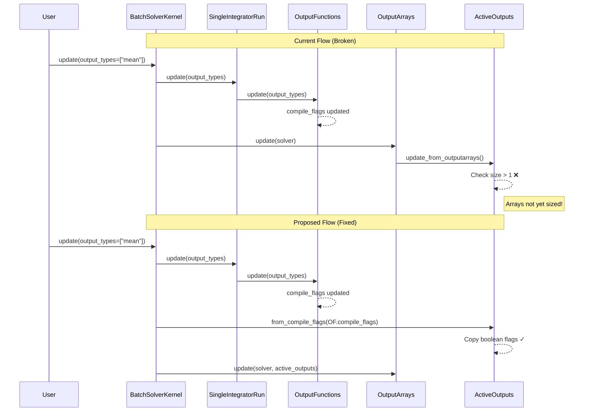

# ActiveOutputs Derivation from OutputCompileFlags

## User Stories

### US-1: Reliable Output Flag Propagation on Update
**As a** CuBIE user calling `BatchSolverKernel.update()` with new output configuration  
**I want** the kernel's `ActiveOutputs` flags to correctly reflect the updated settings  
**So that** the compiled kernel writes to the correct array slices without buffer overruns

**Acceptance Criteria:**
- After calling `solverkernel.update({"output_types": ["state", "mean", "max"]})`, the kernel's `ActiveOutputs.state_summaries` is `True`
- Updated solver's compile settings match a fresh solver instantiated with identical configuration
- No array index-out-of-bounds errors during kernel execution after updates

### US-2: Size-1 Arrays Work Correctly
**As a** CuBIE user running single-run batches or single-variable summaries  
**I want** size-1 output arrays to be correctly marked as active  
**So that** status codes and single summaries are properly transferred to the host

**Acceptance Criteria:**
- A batch with 1 run correctly saves and transfers the status code
- A single summary from a single variable correctly computes and transfers
- ActiveOutputs flags are derived from configuration, not array size

### US-3: Consistent Flag Semantics Across Layers
**As a** CuBIE developer maintaining the output handling system  
**I want** a single source of truth for output activation flags  
**So that** there are no contradictions between what the loop compiles and what the kernel indexes

**Acceptance Criteria:**
- `OutputCompileFlags` is the authoritative source for output activation decisions
- `ActiveOutputs` delegates to or derives from `OutputCompileFlags`
- Flag propagation works correctly at initialization and after updates

---

## Executive Summary

This fix addresses a logical loop in the output flag propagation system where `ActiveOutputs` uses array size checks to determine activation, but arrays aren't sized until after output configuration is known. The `size > 1` heuristic also breaks for legitimate size-1 cases (single runs, single-variable summaries).

**Root Cause:** `ActiveOutputs.update_from_outputarrays()` checks `array.size > 1` to determine activity, but:
1. This creates a chicken-and-egg problem during updates
2. Single-run batches and single-variable summaries legitimately have size-1 arrays

**Solution:** Derive `ActiveOutputs` flags from `OutputCompileFlags`, which is the authoritative source computed from user-requested output types and selected indices.

---

## Architecture Overview

### Data Flow Comparison

---

## Key Technical Decisions

### Decision 1: Factory Method for ActiveOutputs
Add `ActiveOutputs.from_compile_flags(compile_flags: OutputCompileFlags) -> ActiveOutputs` to create instances from the authoritative source.

**Rationale:** Maintains encapsulation while establishing clear data flow from configuration to activation.

### Decision 2: Remove Size-Based Logic
Eliminate `size > 1` checks from `update_from_outputarrays()`. Replace with delegation to compile flags.

**Rationale:** Size-based logic is fundamentally flawed for size-1 edge cases and creates circular dependencies.

### Decision 3: Propagate Through Solver Instance
`BatchSolverKernel.update()` obtains fresh `ActiveOutputs` from `single_integrator.output_compile_flags` after updating the single integrator.

**Rationale:** The `SingleIntegratorRun` already has access to `OutputFunctions` and its `compile_flags` property.

### Decision 4: Keep ActiveOutputs as Separate Class
Rather than merging with `OutputCompileFlags`, keep `ActiveOutputs` as a distinct class with kernel-specific semantics (e.g., status_codes, iteration_counters).

**Rationale:** 
- `OutputCompileFlags` has compile-time semantics (summarise, save_state)
- `ActiveOutputs` has kernel indexing semantics (state_summaries, iteration_counters)
- The mapping is straightforward but not 1:1

---

## Field Mapping

| OutputCompileFlags | ActiveOutputs | Notes |
|-------------------|---------------|-------|
| save_state | state | Direct |
| save_observables | observables | Direct |
| summarise_state | state_summaries | Direct |
| summarise_observables | observable_summaries | Direct |
| save_counters | iteration_counters | Direct |
| (always true) | status_codes | Always active when running |

---

## Expected Impact

1. **Fixes `test_all_lower_plumbing`:** Updated solver will have matching `ActiveOutputs` to fresh solver
2. **Fixes Issue #142:** Single-run batches will correctly mark status_codes as active
3. **Simplifies mental model:** Clear unidirectional data flow from config → flags → activation
4. **No breaking changes:** ActiveOutputs API remains stable; internal derivation changes

---

## References

- Issue #142: "BUG: Size-1 runs have unpredictable outcomes"
- `src/cubie/batchsolving/arrays/BatchOutputArrays.py`: ActiveOutputs, OutputArrays
- `src/cubie/outputhandling/output_config.py`: OutputCompileFlags, OutputConfig
- `src/cubie/batchsolving/BatchSolverKernel.py`: Usage of ActiveOutputs in kernel compilation
- `tests/batchsolving/test_SolverKernel.py`: test_all_lower_plumbing failure
