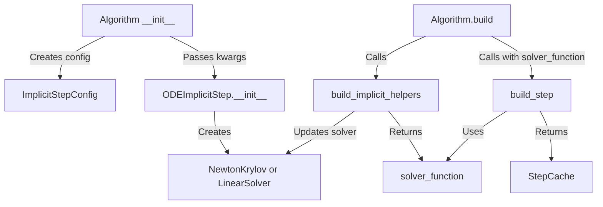

# Algorithm Pattern Replication - Human Overview

## User Stories

### User Story 1: Consistent Optional Parameter Pattern
**As a** developer maintaining CuBIE algorithm implementations  
**I want** all algorithm step __init__ methods to follow the Optional=None pattern  
**So that** configuration defaults are centralized in config classes and the codebase is consistent

**Acceptance Criteria:**
- All algorithm step __init__ methods use Optional[type] = None for parameters with config defaults
- kwargs dictionaries are built conditionally (only include non-None values)
- No hardcoded default values in __init__ signatures that duplicate config defaults
- Pattern matches newton_krylov.py lines 155-226

### User Story 2: Consistent Buffer Registration Pattern
**As a** developer working with CUDA buffer management  
**I want** algorithm steps with custom buffers to have dedicated register_buffers() methods  
**So that** buffer registration is explicit and follows the established pattern

**Acceptance Criteria:**
- Algorithm steps with custom buffers have register_buffers() method extracted
- register_buffers() follows pattern from newton_krylov.py lines 232-265
- Buffer registration is not mixed into __init__ or build_step

### User Story 3: Consistent build_step Signature
**As a** developer implementing algorithm steps  
**I want** all build_step methods to accept solver_function parameter  
**So that** solver device functions are passed explicitly rather than accessed via self

**Acceptance Criteria:**
- All build_step signatures include solver_function: Callable parameter
- solver_function parameter appears between driver_function and numba_precision
- Algorithm steps use solver_function parameter instead of self.solver.device_function
- Signature matches ODEImplicitStep.build_step (lines 231-240)

### User Story 4: Remove Unnecessary Override
**As a** developer maintaining Rosenbrock algorithm  
**I want** unnecessary build() override removed from GenericRosenbrockWStep  
**So that** the code uses the base class implementation unless specialized logic is needed

**Acceptance Criteria:**
- GenericRosenbrockWStep.build() override is removed (lines 330-364)
- build_implicit_helpers() override remains (contains Rosenbrock-specific logic)
- Algorithm functions correctly with base class build() method

### User Story 5: Fix Typo in newton_krylov.py
**As a** developer using NewtonKrylov solver  
**I want** the buffer registration to use correct variable names  
**So that** the code works without runtime errors

**Acceptance Criteria:**
- Line 248 in newton_krylov.py uses self.n instead of self.nn
- Buffer registration completes successfully
- No regression in existing functionality

## Executive Summary

This refinement ensures all algorithm step implementations replicate the patterns established in `ODEImplicitStep` and `NewtonKrylov`. The changes are surgical fixes to align six algorithm step files with the base class patterns:

1. **Optional Parameter Pattern**: Algorithm __init__ methods currently hardcode default values that duplicate config class defaults. This violates DRY and makes defaults harder to maintain.

2. **Buffer Registration Pattern**: NewtonKrylov extracts buffer registration into a dedicated method, but algorithm steps mix it into other methods.

3. **build_step Signature**: The base class build_step accepts solver_function explicitly, but algorithm overrides omit this parameter and access self.solver.device_function.

4. **Unnecessary Override**: Rosenbrock overrides build() for no architectural reason.

5. **Simple Typo**: newton_krylov.py has self.nn instead of self.n on line 248.

## Data Flow Overview

## Key Technical Decisions

### Decision 1: Optional=None Pattern
**Rationale**: Centralizes defaults in config classes, prevents duplication, follows NewtonKrylov pattern

**Implementation**:
- Change all config-default parameters to Optional[type] = None
- Build kwargs dict conditionally
- Pass **kwargs to super().__init__()

### Decision 2: Extract register_buffers()
**Rationale**: Separates buffer registration from initialization logic, improves clarity

**Implementation**:
- Create register_buffers() method in algorithm steps with custom buffers
- Call from appropriate lifecycle point
- Follow NewtonKrylov pattern exactly

### Decision 3: Explicit solver_function Parameter
**Rationale**: Makes data flow explicit, avoids hidden dependencies on self

**Implementation**:
- Add solver_function parameter to all build_step signatures
- Use parameter instead of self.solver.device_function
- Matches base class signature

### Decision 4: Remove Rosenbrock build() Override
**Rationale**: The override duplicates base class logic without adding value

**Implementation**:
- Delete lines 330-364 in generic_rosenbrock_w.py
- Verify build_implicit_helpers() override remains
- Test that base build() method works correctly

## Expected Impact

- **Code Consistency**: All algorithm steps follow identical patterns
- **Maintainability**: Single source of truth for defaults
- **Clarity**: Explicit parameter passing vs hidden dependencies
- **Reduced Duplication**: Less code to maintain

## Trade-offs

**None** - These are pure improvements with no downsides. The changes:
- Don't affect runtime behavior
- Don't break existing APIs
- Simplify rather than complicate
- Fix bugs (typo) and inconsistencies

## Files Affected

**Core changes**:
- src/cubie/integrators/matrix_free_solvers/newton_krylov.py (typo fix)
- src/cubie/integrators/algorithms/backwards_euler.py
- src/cubie/integrators/algorithms/backwards_euler_predict_correct.py
- src/cubie/integrators/algorithms/crank_nicolson.py
- src/cubie/integrators/algorithms/generic_dirk.py
- src/cubie/integrators/algorithms/generic_firk.py
- src/cubie/integrators/algorithms/generic_rosenbrock_w.py

**Test files** (mirror changes):
- tests/integrators/algorithms/instrumented/*.py

## Risk Assessment

**Low Risk** - Changes are:
- Mechanical pattern replication
- Already validated in base classes
- Covered by existing tests
- No architectural changes
