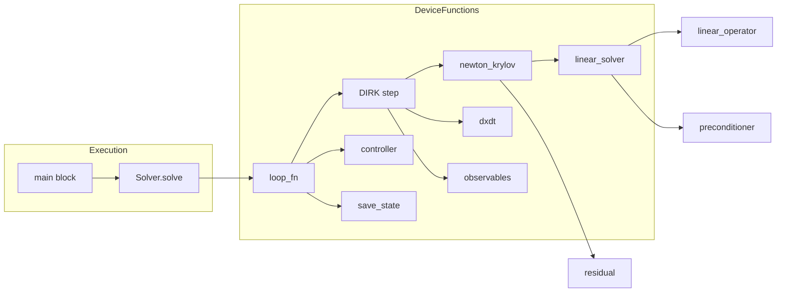

# All-in-One Debug File - Agent Plan

## Overview

This plan creates a standalone debug file `all_in_one.py` that consolidates all CUDA device functions into a single location. The file addresses Numba's lineinfo limitation when tracing execution across multiple source files.

---

## Component Descriptions

### 1. Configuration Section

**Purpose**: Define all solver settings in an easily editable location at file top.

**Expected Behavior**:
- Contains a `solver_settings` dictionary following `tests/conftest.py` patterns
- Includes precision setting (default `np.float32`)
- Contains all algorithm, controller, loop, and output parameters
- Defines the Lorenz system specification

**Key Elements**:
```python
precision = np.float32
solver_settings = {
    "algorithm": "dirk",
    "duration": 1.0,
    "warmup": 0.0,
    "dt": 0.01,
    "dt_min": 1e-7,
    "dt_max": 1.0,
    "dt_save": 0.1,
    "dt_summarise": 0.2,
    "atol": 1e-6,
    "rtol": 1e-6,
    "step_controller": "pid",
    "kp": 1/18,
    "ki": 1/9,
    "kd": 1/18,
    # ... additional settings
}
```

---

### 2. Lorenz System Definition

**Purpose**: Provide a concrete ODE test case.

**Expected Behavior**:
- Uses `cubie.create_ODE_system()` to define the Lorenz attractor
- Equations: dx = σ(y-x), dy = x(ρ-z)-y, dz = xy-βz
- Initial state: x=1.0, y=0.0, z=0.0
- Parameters: ρ=21.0
- Constants: σ=10.0, β=8/3

**Integration Point**:
- The system object is used to generate CUDA device functions
- Generated code must be captured from `generated/` directory

---

### 3. Utility Device Functions

**Source**: `src/cubie/_utils.py`

**Functions to Include**:
- `clamp_factory()` - Clamping utility used by controllers
- `get_noise_32()` / `get_noise_64()` - Only if SDE support needed (not needed for ODE)

**Expected Behavior**:
- `clamp(value, minimum, maximum)` returns value bounded by min/max
- Uses `selp` for predicated execution without branching

---

### 4. PID Controller Device Function

**Source**: `src/cubie/integrators/step_control/adaptive_PID_controller.py`

**Expected Behavior**:
- Computes error norm from state and error vectors
- Updates step size using PID formula with deadband
- Returns rejection status when dt falls below minimum

**Key Captures** (compile-time constants):
- `kp`, `ki`, `kd` - PID gains scaled by algorithm order
- `atol`, `rtol` - Tolerance arrays
- `min_gain`, `max_gain` - Step size change limits
- `dt_min`, `dt_max` - Absolute step size bounds
- `deadband_min`, `deadband_max` - Unity deadband thresholds

**Signature**:
```python
def controller_PID(dt, state, state_prev, error, niters, accept_out, local_temp):
    # Returns status code
```

---

### 5. Linear Solver Device Function

**Source**: `src/cubie/integrators/matrix_free_solvers/linear_solver.py`

**Expected Behavior**:
- Implements minimal-residual or steepest-descent iteration
- Takes operator and preconditioner as closure-captured callbacks
- Iterates until convergence or max iterations

**Key Captures**:
- `operator_apply` - Matrix-vector product callback
- `preconditioner` - Approximate inverse callback
- `n` - Vector length
- `tolerance` - Convergence threshold
- `max_iters` - Iteration limit
- `correction_type` - "minimal_residual" or "steepest_descent"

**Signature**:
```python
def linear_solver(state, parameters, drivers, base_state, t, h, a_ij, rhs, x):
    # Returns status with iteration count in upper 16 bits
```

---

### 6. Newton-Krylov Solver Device Function

**Source**: `src/cubie/integrators/matrix_free_solvers/newton_krylov.py`

**Expected Behavior**:
- Implements damped Newton iteration using the linear solver
- Evaluates residual and Jacobian-vector products through callbacks
- Performs backtracking line search when steps fail

**Key Captures**:
- `residual_function` - Nonlinear residual evaluator
- `linear_solver` - The linear solver from component 5
- `n` - Vector length
- `tolerance` - Newton convergence threshold
- `max_iters` - Maximum Newton iterations
- `damping` - Backtracking factor
- `max_backtracks` - Maximum backtracking attempts

**Signature**:
```python
def newton_krylov_solver(stage_increment, parameters, drivers, t, h, a_ij, 
                         base_state, shared_scratch, counters):
    # Returns status with iteration count in upper 16 bits
```

---

### 7. DIRK Step Device Function

**Source**: `src/cubie/integrators/algorithms/generic_dirk.py`

**Expected Behavior**:
- Implements diagonally-implicit Runge-Kutta step
- Manages stage accumulators for multi-stage methods
- Invokes Newton solver for each implicit stage
- Computes error estimate from embedded method

**Key Captures**:
- `tableau` - DIRK Butcher tableau (coefficients)
- `stage_count` - Number of RK stages
- `nonlinear_solver` - The Newton-Krylov solver from component 6
- `dt_compile` - Fixed step size if controller is fixed
- `is_controller_fixed` - Whether to use compile-time dt

**Shared Memory Layout**:
- `stage_accumulator`: (stage_count-1) * n elements
- `solver_scratch`: solver_shared_elements

**Signature**:
```python
def step(state, proposed_state, parameters, driver_coeffs, drivers_buffer,
         proposed_drivers, observables, proposed_observables, error,
         dt_scalar, time_scalar, first_step_flag, accepted_flag,
         shared, persistent_local, counters):
    # Returns status code
```

---

### 8. Generated ODE Functions

**Source**: `generated/<system_name>.py` (generated at runtime)

**Functions to Capture**:
1. `dxdt_factory(constants, numba_precision)` → `dxdt` device function
2. `observables_factory(constants, numba_precision)` → `observables` device function
3. `linear_operator(...)` → JVP-based operator for implicit methods
4. `neumann_preconditioner(...)` → Polynomial preconditioner
5. `stage_residual(...)` → Nonlinear residual function

**Capture Process**:
1. Run initial solver setup to trigger code generation
2. Copy generated code from `generated/` directory
3. Inline factories into all_in_one.py
4. Call factories with constants to get device functions

---

### 9. Output Functions

**Source**: `src/cubie/outputhandling/`

**Functions to Include**:
- `save_state_factory()` - State snapshot function
- `update_summary_factory()` - Summary accumulation function
- `save_summary_factory()` - Summary commit function

**Expected Behavior**:
- Save selected state/observable indices at each save point
- Accumulate summary metrics (mean, max, etc.)
- Write summaries at summary intervals

---

### 10. Integration Loop

**Source**: `src/cubie/integrators/loops/ode_loop.py`

**Expected Behavior**:
- Orchestrates the main time-stepping loop
- Manages state/proposal buffers
- Calls step function, controller, and output functions
- Handles adaptive stepping and save timing

**Key Captures**:
- All device function callbacks
- Buffer indices (shared and local memory layout)
- Timing parameters (dt_save, dt_summarise, etc.)
- Output compile flags

---

## Architectural Changes

### File Structure

```
all_in_one.py
├── Configuration Section
│   ├── precision
│   ├── solver_settings dict
│   └── lorenz_system specification
│
├── Utility Functions
│   └── clamp_factory() inlined
│
├── Generated Code Placeholder
│   ├── [INSERT dxdt_factory]
│   ├── [INSERT observables_factory]
│   ├── [INSERT linear_operator]
│   ├── [INSERT neumann_preconditioner]
│   └── [INSERT stage_residual]
│
├── Matrix-Free Solvers
│   ├── linear_solver_factory() inlined
│   └── newton_krylov_solver_factory() inlined
│
├── Step Controller
│   └── PID controller inlined
│
├── Algorithm Step
│   └── DIRK step inlined
│
├── Output Functions
│   ├── save_state inlined
│   ├── update_summaries inlined
│   └── save_summaries inlined
│
├── Integration Loop
│   └── loop_fn inlined
│
└── Execution Section
    ├── System instantiation
    ├── Solver setup (triggers generation)
    ├── Copy generated code instruction
    └── Dummy run execution
```

---

## Integration Points

### 1. CuBIE Library Imports
The file still imports from `cubie` for:
- `create_ODE_system()` - System definition
- `Solver` - Initial setup (triggers code generation)
- `cuda_simsafe` - CUDA compatibility layer
- Type definitions

### 2. Generated Code Integration
After running the solver once:
1. Generated code appears in `./generated/<system_hash>.py`
2. Copy factory functions into the `Generated Code Placeholder` section
3. Modify imports as needed

### 3. Output Types
The file supports output types:
- `state` - State snapshots
- `mean` - Mean summary metric
- `time` - Time values at save points
- `iteration_counters` - Newton/Krylov iteration counts

---

## Expected Interactions



---

## Data Structures

### Buffer Indices (Shared Memory)
```python
LoopSharedIndices:
    state: slice            # Current state vector
    proposed_state: slice   # Proposed next state
    observables: slice      # Current observables
    proposed_observables: slice
    parameters: slice       # System parameters
    drivers: slice          # Driver values
    proposed_drivers: slice
    state_summaries: slice  # Summary accumulation buffer
    observable_summaries: slice
    error: slice            # Error estimate vector
    counters: slice         # Iteration counters
    scratch: slice          # Remaining scratch space
```

### Local Memory Indices
```python
LoopLocalIndices:
    dt: slice               # Current step size
    accept: slice           # Accept/reject flag
    controller: slice       # Controller scratch
    algorithm: slice        # Algorithm scratch
```

---

## Dependencies

### Required Imports
```python
import numpy as np
from numba import cuda, int16, int32, from_dtype
import cubie as qb
from cubie.cuda_simsafe import (
    activemask, all_sync, compile_kwargs, selp, from_dtype as simsafe_dtype
)
```

### Captured at Compile Time
- Precision type (numba_precision)
- Tolerance arrays (atol, rtol)
- Tableau coefficients (a, b, c, diagonal)
- Buffer sizes and indices
- Compile flags

---

## Edge Cases

### 1. Fixed vs Adaptive Step Control
The DIRK step uses compile-time branching based on `is_controller_fixed`. Both paths must be present in the inlined code.

### 2. Multi-Stage vs Single-Stage
Stage accumulator sizing depends on `stage_count`. The inlined code must handle both cases.

### 3. Driver Functions
If system has no drivers, driver-related code paths are bypassed via compile-time flags.

### 4. Summary Metrics
If no summarised indices specified, summary functions become no-ops but must still be present.

---

## Notes for Implementer

1. **Order of Definition**: Device functions must be defined before they are referenced in closures. Define in dependency order: utilities → operators → solvers → step → controller → loop.

2. **Closure Captures**: Many device functions capture compile-time constants. Document which values are captured where.

3. **Generated Code**: The generated code section is a placeholder. After running once, the developer must manually copy code from `generated/`.

4. **CUDA Decorators**: All device functions need `@cuda.jit(device=True, inline=True)` decorators with appropriate signatures.

5. **No-op Functions**: When certain features are disabled (e.g., no observables), the code still calls the functions but they do nothing.
