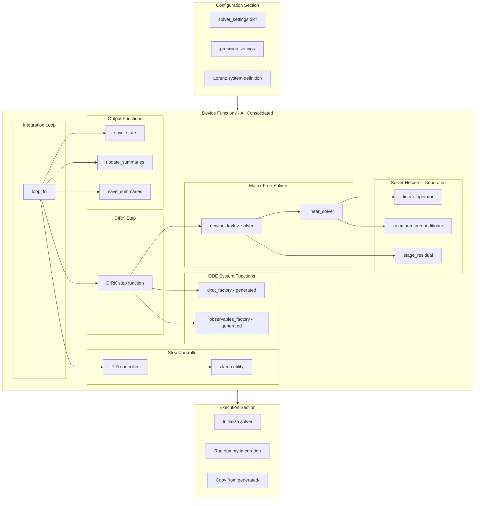
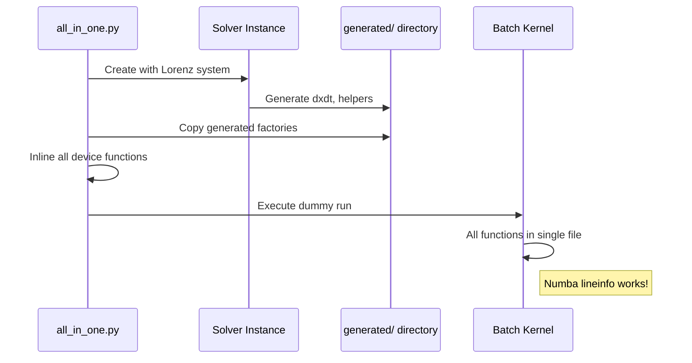

# All-in-One Debug File - Human Overview

## User Stories

### US-1: Consolidated CUDA Debug File
**As a** developer debugging Numba's lineinfo functionality  
**I want** a single Python file that contains all CUDA device functions consolidated together  
**So that** I can trace execution linearly without Numba's lineinfo losing track across multiple files

**Acceptance Criteria:**
- [ ] All CUDA device functions are defined in a single file
- [ ] The file can be executed standalone
- [ ] Numba's lineinfo can trace through the entire execution path
- [ ] All device function signatures match the original implementations

### US-2: Complete Lorenz System Integration
**As a** developer testing the debug file  
**I want** a working Lorenz attractor ODE system defined in the file  
**So that** I have a concrete, well-understood test case for debugging

**Acceptance Criteria:**
- [ ] Lorenz system defined with σ=10, ρ=21, β=8/3
- [ ] Initial conditions x=1.0, y=0.0, z=0.0
- [ ] System compiles and runs without errors

### US-3: Adaptive DIRK Integration with PID Control
**As a** developer debugging implicit integrators  
**I want** the debug file to use an adaptive DIRK step with PID step control  
**So that** I can debug the most complex integration pathway

**Acceptance Criteria:**
- [ ] DIRK algorithm step function included
- [ ] PID controller device function included
- [ ] Newton-Krylov solver chain included (linear solver + Newton iteration)

### US-4: Configurable Settings
**As a** developer modifying debug parameters  
**I want** all solver settings defined at the top of the file  
**So that** I can easily adjust tolerances, step sizes, and durations

**Acceptance Criteria:**
- [ ] Settings dictionary at file top with clearly labeled sections
- [ ] Settings match conftest.py patterns
- [ ] Easy to modify without searching through file

### US-5: Generated Code Capture
**As a** developer understanding the full code path  
**I want** the generated dxdt and solver helper factories included  
**So that** I can see the complete device function chain

**Acceptance Criteria:**
- [ ] Instructions to capture generated code from pwd/generated
- [ ] Place for inserting generated factories into the file
- [ ] Complete compilation chain visible in single file

---

## Executive Summary

This plan creates a debug-focused Python file `all_in_one.py` that consolidates all CUDA device functions into a single location. The primary goal is to work around Numba's lineinfo limitations when debugging across multiple source files.

The file will:
1. Define a Lorenz system ODE
2. Set up an adaptive DIRK integrator with PID step control
3. Include all necessary device functions inline
4. Capture and include generated code from the symbolic ODE system
5. Execute a dummy run to demonstrate the complete pipeline

---

## Architecture Overview

---

## Data Flow

---

## Key Technical Decisions

### 1. Inline All Device Functions
Rather than importing from multiple modules, all device functions are copied inline. This allows Numba's lineinfo to track execution through a single file.

### 2. Capture Generated Code
The symbolic ODE system generates Python code dynamically. This generated code must be captured and included in the all-in-one file after the initial solver run.

### 3. Match Existing Signatures
All inlined device functions must maintain their exact signatures to ensure compatibility with the compilation chain.

### 4. Settings at Top
Following conftest.py patterns, all configurable settings are placed at the top of the file for easy modification during debugging sessions.

---

## Trade-offs

| Decision | Benefit | Cost |
|----------|---------|------|
| Single file | Lineinfo works | Code duplication |
| Inline everything | Complete visibility | Large file |
| Manual copy step | Captures dynamic code | Extra manual step |
| Lorenz system | Well-understood | Limited complexity |

---

## Expected Impact

- **Immediate**: Developers can trace Numba CUDA execution through complete integration paths
- **Debugging**: Line-by-line debugging becomes possible for implicit integrators
- **Documentation**: Serves as a reference for understanding the device function chain

---

## References

- `tests/conftest.py` - Settings patterns and fixture organization
- `src/cubie/integrators/algorithms/generic_dirk.py` - DIRK implementation
- `src/cubie/integrators/step_control/adaptive_PID_controller.py` - PID controller
- `src/cubie/integrators/matrix_free_solvers/` - Newton-Krylov chain
- `src/cubie/odesystems/symbolic/odefile.py` - Generated code location
