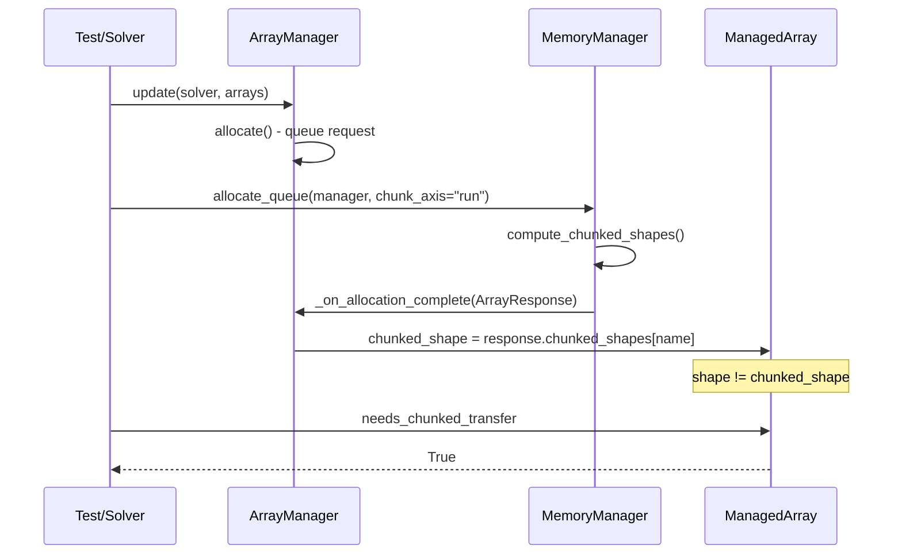

# Array Manager Test Refactor - Human Overview

## User Stories

### US-1: Chunked Array Manager Tests Use Correct Setup Pattern
**As a** developer maintaining the array manager test suite  
**I want** tests that use the same allocation pattern as production code  
**So that** I can trust that test results reflect actual runtime behavior

**Acceptance Criteria:**
- [ ] Tests use `allocate_queue()` with `chunk_axis` parameter to set up chunking
- [ ] Tests do not manually set `_chunks` or `_chunk_axis` before allocation
- [ ] `needs_chunked_transfer` returns `True` when allocation response specifies chunking
- [ ] Buffer pool integration tests correctly populate `_active_buffers`

### US-2: SolverKernel Tests Use Fixture Pattern
**As a** developer writing solver tests  
**I want** to use existing solver fixtures instead of instantiating kernels directly  
**So that** tests follow cubie patterns and avoid bypassing initialization logic

**Acceptance Criteria:**
- [ ] No tests instantiate `BatchSolverKernel` directly (except in validation tests)
- [ ] Tests use `solver`, `solver_mutable`, `solverkernel`, or `solverkernel_mutable` fixtures
- [ ] Commented tests in `test_chunk_axis_property.py` are reinstated using fixtures

### US-3: Remove Unused Properties/Attributes
**As a** maintainer of the array manager implementation  
**I want** unused code removed from the implementation  
**So that** the codebase remains clean and maintainable

**Acceptance Criteria:**
- [ ] Unused properties identified and removed
- [ ] No breaking changes to public API

---

## Executive Summary

This refactor addresses failing tests in the array manager test suite that use incorrect patterns for setting up chunked scenarios. The tests manually configure chunking state without going through the proper allocation API (`allocate_queue`), causing `needs_chunked_transfer` to return incorrect values.

## Architecture Diagram

```mermaid
flowchart TD
    subgraph "Current Test Pattern (Incorrect)"
        A1[Test Creates ArrayManager] --> B1[Manually Set _chunks]
        B1 --> C1[Call initialise/finalise]
        C1 --> D1[needs_chunked_transfer = False]
        D1 --> E1[Test Fails]
    end

    subgraph "Production Pattern (Correct)"
        A2[Solver Creates ArrayManager] --> B2[Call update]
        B2 --> C2[allocate_queue with chunk_axis]
        C2 --> D2[ArrayResponse with chunked_shapes]
        D2 --> E2[_on_allocation_complete]
        E2 --> F2[ManagedArray.chunked_shape set]
        F2 --> G2[needs_chunked_transfer = True]
    end
```

## Data Flow: Chunked Shape Propagation

## Key Technical Decisions

### 1. Create Parameterized Chunked Array Manager Fixture
Instead of each test setting up its own array manager with manual chunking configuration, create a common fixture that:
- Creates an array manager through the solver fixture
- Calls `allocate_queue()` with a specified `chunk_axis`
- Properly populates `chunked_shape` on `ManagedArray` instances

### 2. Use Solver Fixtures for SolverKernel Tests
The `test_SolverKernel.py::test_all_lower_plumbing` test creates a `BatchSolverKernel` directly. While this is intentional for that specific validation test, the fixture should still be used for test setup. The test needs to ensure `saved_*_indices` arrays have enough elements for the system being tested.

### 3. Reinstate Commented Tests in test_chunk_axis_property.py
The commented tests in `TestChunkAxisInRun` and `TestUpdateFromSolverChunkAxis` can be reinstated by using the solver fixture pattern instead of direct instantiation.

## Trade-offs Considered

| Approach | Pros | Cons | Decision |
|----------|------|------|----------|
| Fix tests individually | Minimal change | Inconsistent patterns | Rejected |
| Create common chunked fixture | Consistent, reusable | Larger initial change | **Selected** |
| Mock allocation response | Fast, isolated | Doesn't test real flow | Rejected |

## Expected Impact

- 7 failing tests will pass after refactor
- Tests will more accurately reflect production behavior
- Reduced test maintenance burden through fixture reuse
