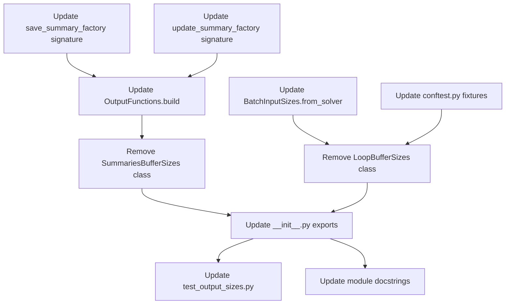

# Array Sizing Consolidation - Agent Plan

## Overview

This document provides technical specifications for the `detailed_implementer` and `reviewer` agents to execute the array sizing consolidation refactoring.

---

## Component: `SummariesBufferSizes` Removal

### Current Behavior

The `SummariesBufferSizes` class in `output_sizes.py` provides:
- `state: int` - Height of state summary buffer
- `observables: int` - Height of observable summary buffer  
- `per_variable: int` - Per-variable buffer slots

A factory method `from_output_fns(output_fns)` extracts these from `OutputFunctions`:
```python
return cls(
    output_fns.state_summaries_buffer_height,
    output_fns.observable_summaries_buffer_height,
    output_fns.summaries_buffer_height_per_var,
)
```

### Redundancy Analysis

`OutputConfig` already provides identical properties:
- `state_summaries_buffer_height` 
- `observable_summaries_buffer_height`
- `summaries_buffer_height_per_var`

`OutputFunctions` exposes these via delegation to `compile_settings` (which is an `OutputConfig` instance).

### Consumers to Update

1. **`output_functions.py`**
   - Property `summaries_buffer_sizes` returns `SummariesBufferSizes.from_output_fns(self)`
   - Used internally by `build()` method to pass to summary factories
   - **Action:** Remove property; pass `OutputConfig` properties directly

2. **`save_summaries.py`**
   - `save_summary_factory(buffer_sizes: SummariesBufferSizes, ...)` 
   - Uses only `buffer_sizes.per_variable`
   - **Action:** Change signature to accept `per_variable: int` directly

3. **`update_summaries.py`**
   - `update_summary_factory(buffer_sizes: SummariesBufferSizes, ...)`
   - Uses only `buffer_sizes.per_variable`
   - **Action:** Change signature to accept `per_variable: int` directly

4. **`tests/outputhandling/test_output_sizes.py`**
   - Class `TestSummariesBufferSizes` with multiple test methods
   - **Action:** Remove entire test class

5. **`tests/outputhandling/test_output_functions.py`**
   - May reference `SummariesBufferSizes` indirectly
   - **Action:** Verify no direct references; update if needed

---

## Component: `LoopBufferSizes` Removal

### Current Behavior

The `LoopBufferSizes` class provides:
- `state_summaries: int`
- `observable_summaries: int`
- `state: int`
- `observables: int`
- `dxdt: int`
- `parameters: int`
- `drivers: int`

Factory methods:
- `from_system_and_output_fns(system, output_fns)` - Combines system sizes with summary heights
- `from_solver(solver_instance)` - Mirrors sizing from a BatchSolverKernel

### Redundancy Analysis

`LoopBufferSettings` in `ode_loop.py` provides:
- `n_states`, `n_parameters`, `n_drivers`, `n_observables` - Direct size attributes
- `state_summary_buffer_height`, `observable_summary_buffer_height` - Summary heights
- `local_sizes` property returns `LoopLocalSizes` with all buffer dimensions

The `LoopBufferSizes` class exists only to bundle these values for the test fixtures.

### Consumers to Update

1. **`tests/conftest.py`**
   - Imports `LoopBufferSizes` from `cubie.outputhandling.output_sizes`
   - `loop_buffer_sizes` fixture: `LoopBufferSizes.from_system_and_output_fns(system, output_functions)`
   - `loop_buffer_sizes_mutable` fixture: Same pattern
   - `_build_loop_instance()` function uses `loop_buffer_sizes` parameter
   - **Action:** Change fixtures to build `LoopBufferSettings` directly

2. **`output_sizes.py`**
   - `BatchInputSizes.from_solver()` calls `LoopBufferSizes.from_solver(solver_instance)`
   - Uses `loopBufferSizes.state`, `loopBufferSizes.parameters`, `loopBufferSizes.drivers`
   - **Action:** Access system_sizes directly from solver_instance

3. **`tests/outputhandling/test_output_sizes.py`**
   - Class `TestLoopBufferSizes` with multiple test methods
   - Integration test `test_edge_case_all_zeros_with_nonzero` uses `LoopBufferSizes`
   - **Action:** Remove `TestLoopBufferSizes`; update integration test

4. **`tests/integrators/loops/test_interp_vs_symbolic.py`**
   - May use `LoopBufferSizes` indirectly via fixtures
   - **Action:** Verify no direct imports; should work after fixture update

---

## Component: `output_sizes.py` Module Docstring Update

### Current Docstring
```python
"""Sizing helpers for output buffers and arrays.

The classes in this module compute buffer and array shapes needed for CUDA
batch solving, covering temporary loop storage as well as host-visible output
layouts. ...
"""
```

### Required Update

Clarify that the module now focuses **only on output array shapes**:

```python
"""Output array shape helpers for CUDA batch solving.

This module computes host-visible output array dimensions for time-series
and summary results. Classes here determine array shapes used by
:mod:`cubie.batchsolving.arrays` for memory allocation.

Internal buffer sizing for CUDA loops is handled by
:class:`cubie.integrators.loops.ode_loop.LoopBufferSettings`.
"""
```

---

## Component: Factory Signature Changes

### `save_summary_factory` in `save_summaries.py`

**Current signature:**
```python
def save_summary_factory(
    buffer_sizes: SummariesBufferSizes,
    summarised_state_indices: ...,
    summarised_observable_indices: ...,
    summaries_list: ...,
) -> Callable:
```

**Target signature:**
```python
def save_summary_factory(
    summaries_buffer_height_per_var: int,
    summarised_state_indices: ...,
    summarised_observable_indices: ...,
    summaries_list: ...,
) -> Callable:
```

**Internal changes:**
- Replace `int32(buffer_sizes.per_variable)` with `int32(summaries_buffer_height_per_var)`

### `update_summary_factory` in `update_summaries.py`

**Current signature:**
```python
def update_summary_factory(
    buffer_sizes: SummariesBufferSizes,
    summarised_state_indices: ...,
    summarised_observable_indices: ...,
    summaries_list: ...,
) -> Callable:
```

**Target signature:**
```python
def update_summary_factory(
    summaries_buffer_height_per_var: int,
    summarised_state_indices: ...,
    summarised_observable_indices: ...,
    summaries_list: ...,
) -> Callable:
```

**Internal changes:**
- Replace `int32(buffer_sizes.per_variable)` with `int32(summaries_buffer_height_per_var)`

---

## Component: `OutputFunctions.build()` Update

### Current Implementation
```python
def build(self) -> OutputFunctionCache:
    config = self.compile_settings
    summary_metrics.update(dt_save=config.dt_save, precision=config.precision)
    
    buffer_sizes = self.summaries_buffer_sizes  # Returns SummariesBufferSizes
    
    update_summary_metrics_func = update_summary_factory(
        buffer_sizes,
        config.summarised_state_indices,
        ...
    )
    
    save_summary_metrics_func = save_summary_factory(
        buffer_sizes,
        config.summarised_state_indices,
        ...
    )
```

### Target Implementation
```python
def build(self) -> OutputFunctionCache:
    config = self.compile_settings
    summary_metrics.update(dt_save=config.dt_save, precision=config.precision)
    
    per_var_height = config.summaries_buffer_height_per_var
    
    update_summary_metrics_func = update_summary_factory(
        per_var_height,
        config.summarised_state_indices,
        ...
    )
    
    save_summary_metrics_func = save_summary_factory(
        per_var_height,
        config.summarised_state_indices,
        ...
    )
```

### Property Removal

Remove:
```python
@property
def summaries_buffer_sizes(self) -> SummariesBufferSizes:
    """Summary buffer size helper built from the active configuration."""
    return SummariesBufferSizes.from_output_fns(self)
```

---

## Component: `BatchInputSizes.from_solver()` Update

### Current Implementation
```python
@classmethod
def from_solver(cls, solver_instance) -> "BatchInputSizes":
    loopBufferSizes = LoopBufferSizes.from_solver(solver_instance)
    num_runs = solver_instance.num_runs
    initial_values = (num_runs, loopBufferSizes.state)
    parameters = (num_runs, loopBufferSizes.parameters)
    driver_coefficients = (None, loopBufferSizes.drivers, None)
    ...
```

### Target Implementation
```python
@classmethod
def from_solver(cls, solver_instance) -> "BatchInputSizes":
    system_sizes = solver_instance.system_sizes
    num_runs = solver_instance.num_runs
    initial_values = (num_runs, system_sizes.states)
    parameters = (num_runs, system_sizes.parameters)
    driver_coefficients = (None, system_sizes.drivers, None)
    ...
```

---

## Component: Test Fixture Updates in `conftest.py`

### Current Fixtures

```python
from cubie.outputhandling.output_sizes import LoopBufferSizes

@pytest.fixture(scope="session")
def loop_buffer_sizes(system, output_functions):
    return LoopBufferSizes.from_system_and_output_fns(system, output_functions)
```

### Target Fixtures

```python
from cubie.integrators.loops.ode_loop import LoopBufferSettings

@pytest.fixture(scope="session")
def loop_buffer_settings(system, output_functions):
    """Loop buffer settings derived from system and output configuration."""
    return LoopBufferSettings(
        n_states=system.sizes.states,
        n_parameters=system.sizes.parameters,
        n_drivers=system.sizes.drivers,
        n_observables=system.sizes.observables,
        state_summary_buffer_height=output_functions.state_summaries_buffer_height,
        observable_summary_buffer_height=output_functions.observable_summaries_buffer_height,
        n_error=0,  # Set by caller based on algorithm
        n_counters=0,  # Set by caller based on compile_flags
    )
```

### `_build_loop_instance()` Update

Change parameter type from `loop_buffer_sizes: LoopBufferSizes` to `loop_buffer_settings: LoopBufferSettings` and update internal usage accordingly.

---

## Component: `__init__.py` Export Cleanup

### Current Exports
```python
from cubie.outputhandling.output_sizes import (
    BatchInputSizes,
    BatchOutputSizes,
    LoopBufferSizes,
    OutputArrayHeights,
    SingleRunOutputSizes,
    SummariesBufferSizes,
)

__all__ = [
    ...
    "SummariesBufferSizes",
    "LoopBufferSizes",
    ...
]
```

### Target Exports
```python
from cubie.outputhandling.output_sizes import (
    BatchInputSizes,
    BatchOutputSizes,
    OutputArrayHeights,
    SingleRunOutputSizes,
)

__all__ = [
    ...
    # Removed: "SummariesBufferSizes", "LoopBufferSizes"
    ...
]
```

---

## Expected Behavior After Changes

1. **No functional changes to CUDA kernels** - The same values flow through to compiled functions
2. **Fewer classes to understand** - Developers see `OutputConfig` and `LoopBufferSettings` as authoritative
3. **Cleaner data flow** - No intermediate wrapper classes
4. **All tests pass** - Existing behavior preserved

---

## Integration Points Summary

| Consumer | Currently Uses | Will Use |
|----------|---------------|----------|
| `save_summary_factory` | `SummariesBufferSizes.per_variable` | `int` parameter |
| `update_summary_factory` | `SummariesBufferSizes.per_variable` | `int` parameter |
| `OutputFunctions.build` | `self.summaries_buffer_sizes` | `config.summaries_buffer_height_per_var` |
| `BatchInputSizes.from_solver` | `LoopBufferSizes.from_solver()` | `solver_instance.system_sizes` |
| `tests/conftest.py` | `LoopBufferSizes` | `LoopBufferSettings` |

---

## Edge Cases to Consider

1. **Zero summary types**: When `output_types` contains no summary metrics, `summaries_buffer_height_per_var` is 0. The factory functions already handle this by returning no-op functions.

2. **Zero states/observables**: When a system has no observables, `n_observables=0`. `LoopBufferSettings` handles this with `max(1, value)` in computed properties.

3. **CUDASIM mode**: No changes needed - the refactoring affects only Python-level data flow, not CUDA compilation paths.

---

## Dependencies Between Tasks



Tasks can be executed in dependency order; earlier tasks do not depend on later ones.
