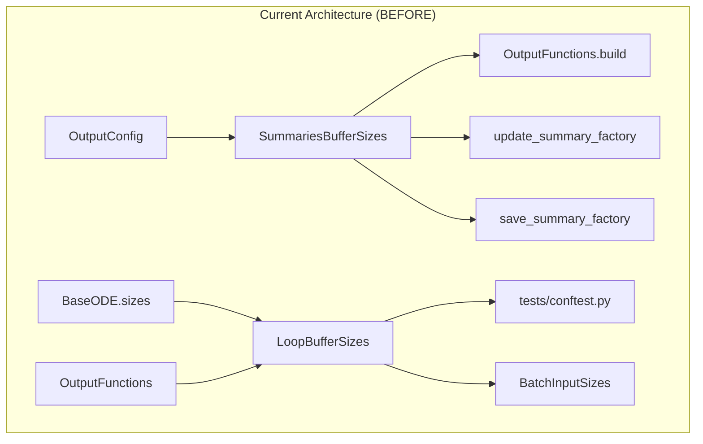
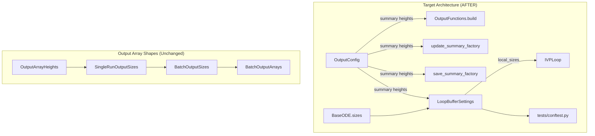
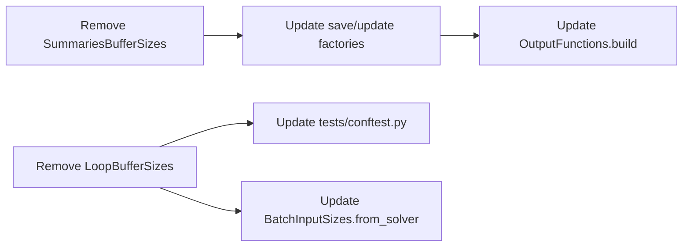

# Array Sizing Consolidation (Option A) - Human Overview

## User Stories

### US-1: Eliminate Redundant Buffer Sizing Classes
**As a** CuBIE developer  
**I want** to remove redundant sizing classes from `output_sizes.py`  
**So that** there is a single source of truth for internal buffer sizing  

**Acceptance Criteria:**
- `SummariesBufferSizes` class is removed (properties already exist in `OutputConfig`)
- `LoopBufferSizes` class is removed (functionality now in `LoopBufferSettings.local_sizes`)
- All existing tests pass after removal
- No references to removed classes remain in the codebase

### US-2: Update Factory Methods to Use OutputConfig Directly
**As a** CuBIE developer  
**I want** factory methods to consume `OutputConfig` directly instead of intermediate sizing classes  
**So that** data flows through a single, consistent path  

**Acceptance Criteria:**
- `save_summary_factory` and `update_summary_factory` accept `OutputConfig` directly
- `OutputFunctions.build()` method updated to use `OutputConfig` properties
- No behavioral changes to the compiled CUDA functions

### US-3: Clarify Module Responsibilities with Docstrings
**As a** CuBIE developer  
**I want** clear docstrings distinguishing the purposes of `output_sizes.py` and `LoopBufferSettings`  
**So that** future developers understand where to add new sizing logic  

**Acceptance Criteria:**
- `output_sizes.py` module docstring clarifies it handles **output array shapes only**
- `LoopBufferSettings` docstring clarifies it handles **internal buffer sizing**
- `OutputConfig` docstring clarifies it owns **summary buffer height properties**

---

## Executive Summary

This refactoring consolidates array sizing logic that has evolved organically in CuBIE. The goal is to establish clear ownership:

| Module | Responsibility |
|--------|---------------|
| `OutputConfig` | Summary buffer heights (state, observable, per-variable) |
| `LoopBufferSettings` | Internal loop buffer sizes and shared/local memory allocation |
| `output_sizes.py` | Output array shapes for host-visible results only |

Two classes will be removed:
1. **`SummariesBufferSizes`** - Its three properties (`state`, `observables`, `per_variable`) are already available directly on `OutputConfig`
2. **`LoopBufferSizes`** - Its functionality is superseded by `LoopBufferSettings.local_sizes` property

---

## Architecture Overview





---

## Data Flow Analysis

### Summary Buffer Heights

**Current flow (redundant):**
```
OutputConfig.summaries_buffer_height_per_var
    → SummariesBufferSizes.from_output_fns(output_fns)
        → SummariesBufferSizes.per_variable
            → save_summary_factory(buffer_sizes, ...)
```

**Target flow (direct):**
```
OutputConfig.summaries_buffer_height_per_var
    → save_summary_factory(config.summaries_buffer_height_per_var, ...)
```

### Loop Buffer Sizes

**Current flow (redundant):**
```
BaseODE.sizes + OutputFunctions
    → LoopBufferSizes.from_system_and_output_fns(system, output_fns)
        → LoopBufferSizes.{state, observables, dxdt, parameters, drivers, ...}
            → tests/conftest.py builds LoopBufferSettings from these
```

**Target flow (direct):**
```
BaseODE.sizes
    → LoopBufferSettings(n_states=..., n_parameters=..., ...)
        → LoopBufferSettings.local_sizes.{state, observables, ...}
```

---

## Key Technical Decisions

### 1. Remove `SummariesBufferSizes` Completely

**Rationale:** `OutputConfig` already has all three properties:
- `state_summaries_buffer_height` (same as `SummariesBufferSizes.state`)
- `observable_summaries_buffer_height` (same as `SummariesBufferSizes.observables`)
- `summaries_buffer_height_per_var` (same as `SummariesBufferSizes.per_variable`)

The class is a pure wrapper that adds no value.

### 2. Remove `LoopBufferSizes` Completely

**Rationale:** `LoopBufferSettings` already computes:
- `n_states`, `n_parameters`, `n_drivers`, `n_observables` from constructor args
- Summary buffer heights via `state_summary_buffer_height`, `observable_summary_buffer_height`
- The `local_sizes` property returns a `LoopLocalSizes` with all required dimensions

`LoopBufferSizes.from_system_and_output_fns()` just gathers the same data and stores it differently.

### 3. Keep `OutputArrayHeights`, `SingleRunOutputSizes`, `BatchOutputSizes`, `BatchInputSizes`

**Rationale:** These classes serve a distinct purpose:
- They compute **output array shapes** for host-visible results
- They are used by `BatchOutputArrays` and `BatchInputArrays` managers
- They have no overlap with internal buffer sizing

### 4. No File Moves Required

**Rationale:** After removing the redundant classes:
- `output_sizes.py` remains focused on output array shapes
- `LoopBufferSettings` in `ode_loop.py` remains the authority for internal buffers
- The logical grouping is already correct

---

## Impact Analysis

### Files to Modify

| File | Change |
|------|--------|
| `src/cubie/outputhandling/output_sizes.py` | Remove `SummariesBufferSizes`, `LoopBufferSizes` |
| `src/cubie/outputhandling/__init__.py` | Remove exports |
| `src/cubie/outputhandling/output_functions.py` | Update `summaries_buffer_sizes` property |
| `src/cubie/outputhandling/save_summaries.py` | Update factory signature |
| `src/cubie/outputhandling/update_summaries.py` | Update factory signature |
| `tests/outputhandling/test_output_sizes.py` | Remove tests for deleted classes |
| `tests/conftest.py` | Update `loop_buffer_sizes` fixture |

### Dependency Chain



---

## Risk Analysis

| Risk | Likelihood | Impact | Mitigation |
|------|------------|--------|------------|
| Missed usage of removed classes | Low | Medium | Comprehensive grep search before removal |
| Test failures in edge cases | Medium | Low | Run full test suite in CUDASIM mode |
| Breaking external code | None | N/A | Library is in development; no external consumers |

---

## Trade-offs Considered

### Alternative: Keep `SummariesBufferSizes` as a View Object

**Pros:** Maintains current API surface  
**Cons:** Adds unnecessary indirection; the properties are trivial accessors  
**Decision:** Remove - the class adds no value

### Alternative: Move All Sizing to a Single Module

**Pros:** Single location for all sizing logic  
**Cons:** Mixes output shapes with internal buffers; violates single responsibility  
**Decision:** Keep separation - internal buffers in `ode_loop.py`, output shapes in `output_sizes.py`
