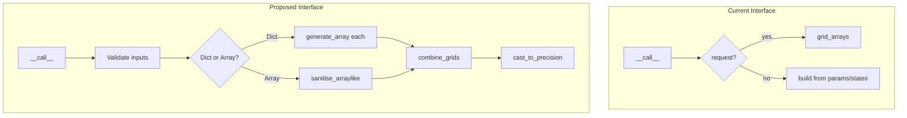
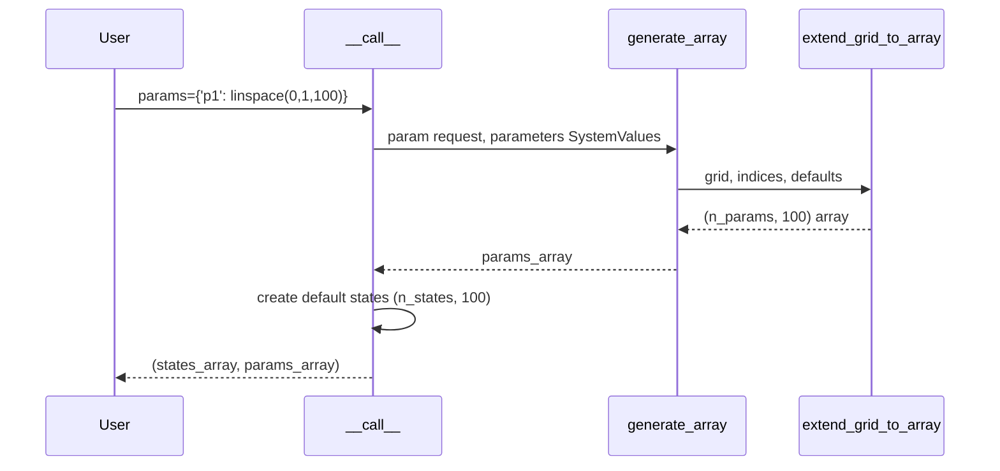

# BatchGridBuilder Bug Fix: Human Overview

## User Stories

### US-1: Single Parameter Sweep
**As a** CuBIE user,  
**I want to** call `build_grid({'p1': np.linspace(0,1,100)})` with a single varied parameter,  
**So that** I get 100 runs with all states and other parameters set to their default values.

**Acceptance Criteria:**
- Single parameter dict produces correct number of runs (100)
- Unspecified states use system default values
- Unspecified parameters use system default values
- Output arrays have shape (n_variables, n_runs)
- Both `combinatorial` and `verbatim` kinds work correctly

### US-2: Mixed States and Single Parameter Sweep
**As a** CuBIE user,  
**I want to** call `build_grid({'x': 0.2}, {'p1': np.linspace(0,3,300)})` with a single state override and parameter sweep,  
**So that** I get 300 runs with x=0.2, other states at defaults, and p1 varied across 300 values.

**Acceptance Criteria:**
- State override applies to all runs (x=0.2 for all 300)
- Parameter sweep produces 300 runs
- Other states and parameters use default values
- Works with both scalar state overrides and array sweeps

### US-3: Combinatorial Grid Generation
**As a** CuBIE user,  
**I want to** call `build_grid({'y': [0.1, 0.2]}, {'p1': np.linspace(0,1,100)}, kind='combinatorial')`,  
**So that** I get 200 runs representing all combinations of y values and p1 values.

**Acceptance Criteria:**
- Combinatorial produces 2 × 100 = 200 runs
- Each y value is paired with every p1 value
- Default values fill unspecified states/parameters

### US-4: Simplified API without `request` Parameter
**As a** CuBIE developer,  
**I want** the `request` parameter removed from `BatchGridBuilder.__call__()`,  
**So that** the API is cleaner and users clearly distinguish between states and parameters.

**Acceptance Criteria:**
- `__call__()` only accepts `params` and `states` (plus `kind`)
- Old `request` functionality preserved through `params` + `states` combination
- Clear error messages when inputs are malformed
- Docstrings and examples updated

### US-5: 1D Input Handling
**As a** CuBIE user,  
**I want** 1D arrays to work correctly as single-run configurations,  
**So that** I can easily override default values for a single run.

**Acceptance Criteria:**
- 1D array of length n_states treated as single run (column vector)
- 1D array of length n_params treated as single run (column vector)
- 1D partial arrays with warning about missing values

---

## Executive Summary

The `BatchGridBuilder` class is responsible for converting user-supplied dictionaries, arrays, and mixed inputs into the 2D NumPy arrays required by the batch solver. The current implementation has several bugs and a confusing interface:

1. **Single-dict with single parameter fails** - Edge case not handled
2. **1D arrays with single varied parameter raise errors** - Shape handling issues
3. **`request` parameter confuses users** - Mixing states/params in one dict adds complexity
4. **Missing test coverage** - Edge cases not tested

## Architectural Changes

## Data Flow for Single-Parameter Sweep

## Key Technical Decisions

### 1. Remove `request` Parameter
**Decision**: Remove the combined `request` dictionary parameter.  
**Rationale**: The distinction between states and parameters is reasonable for users to manage. Mixing them in one dict adds complexity without significant benefit.

### 2. Keep Backward Compatibility During Transition
**Decision**: Deprecate but don't immediately remove `request`.  
**Update**: Based on issue description, remove completely - no backwards compatibility enforcement.

### 3. Fix Shape Handling
**Decision**: Normalize all inputs to (variable, run) format early in processing.  
**Rationale**: Consistent shape handling prevents edge-case bugs.

## Trade-offs Considered

| Option | Pros | Cons |
|--------|------|------|
| Remove `request` entirely | Simpler API, clearer semantics | Breaking change |
| Keep `request` with deprecation | Gradual migration | Maintains complexity |
| Support both indefinitely | No breaking changes | Technical debt |

**Selected**: Remove `request` entirely per issue guidance.

## Expected Impact

- **Solver.build_grid()** - Will work correctly with simplified signature
- **Solver.solve()** - Internal call to grid_builder unchanged
- **Tests** - Need comprehensive edge-case coverage
- **Documentation** - Module docstring examples need updating

## References

- Issue describes expected behavior with examples
- Current tests in `tests/batchsolving/test_batch_grid_builder.py`
- `Solver.build_grid()` and `Solver.solve()` in `solver.py`
