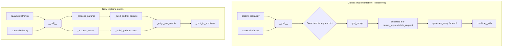
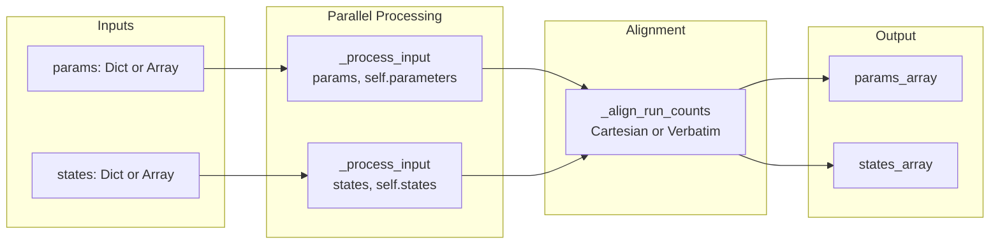

# BatchGridBuilder Complete Refactoring

## User Stories

### US-1: Separate Params Flow
**As a** CuBIE developer  
**I want** parameter inputs to flow through the BatchGridBuilder without being combined with states  
**So that** the code is readable, maintainable, and performs minimal transformations

**Acceptance Criteria:**
- `params` argument enters `__call__()` and remains separate throughout processing
- No intermediate step combines params with states into a single dictionary
- Parameter array output is generated directly from parameter inputs
- All tests pass with the new implementation

### US-2: Separate States Flow  
**As a** CuBIE developer  
**I want** state inputs to flow through the BatchGridBuilder without being combined with parameters  
**So that** the logic is traceable and each input category has its own processing path

**Acceptance Criteria:**
- `states` argument enters `__call__()` and remains separate throughout processing
- No intermediate step combines states with params into a single dictionary
- State array output is generated directly from state inputs
- All tests pass with the new implementation

### US-3: Eliminated Combined Dictionary Pattern
**As a** CuBIE maintainer  
**I want** the `grid_arrays()` method removed along with the combined `request` dictionary pattern  
**So that** there is only one clear path through the code

**Acceptance Criteria:**
- `grid_arrays()` method is removed or completely refactored
- No `request = {}; request.update(params); request.update(states)` pattern exists
- Internal helper functions work with separate inputs rather than combined dicts
- The module has fewer lines of code overall

### US-4: Simplified Processing Functions
**As a** CuBIE developer  
**I want** the module-level functions (`generate_array`, `generate_grid`, etc.) to work with direct inputs rather than mixed dictionaries  
**So that** each function has a clear single responsibility

**Acceptance Criteria:**
- Functions that process params only accept params
- Functions that process states only accept states
- Combination happens only at the final alignment step
- Function count is reduced where functions were doing redundant work

### US-5: Clean Call Site Updates
**As a** CuBIE user  
**I want** the `Solver` class and tests to use the new API without workarounds  
**So that** the API is consistent and intuitive

**Acceptance Criteria:**
- `Solver.build_grid()` and `Solver.solve()` work with the refactored code
- Test files are updated to match the new internal structure
- No backward-compatibility shims are introduced (breaking changes allowed)

---

## Executive Summary

The BatchGridBuilder module currently accepts separate `params` and `states` arguments but internally combines them into a single `request` dictionary, only to separate them again downstream. This creates unnecessary complexity and obfuscates the data flow.

This refactoring eliminates the combined dictionary pattern entirely, implementing a parallel processing architecture where params and states maintain separate paths until the final alignment step.

---

## Architecture Overview

---

## Data Flow Design

---

## Key Technical Decisions

### 1. Remove `grid_arrays()` Method
The `grid_arrays()` method exists solely to process a combined dictionary. With the new architecture, it becomes unnecessary since `__call__()` will handle the separate flows directly.

### 2. Create Unified `_process_input()` Helper
A single private method handles dict-to-array conversion for either params or states:
- Accepts input (dict or array) and a `SystemValues` instance
- Returns a 2D array in (variable, run) format
- Consolidates logic from multiple current functions

### 3. Keep `combine_grids()` and `extend_grid_to_array()`
These functions operate on arrays only (no dicts), so they remain useful:
- `combine_grids()` - Aligns two grids via Cartesian product or verbatim
- `extend_grid_to_array()` - Fills missing variables with defaults

### 4. Simplify Module-Level Functions
- `unique_cartesian_product()` - Keep as-is (pure array utility)
- `combinatorial_grid()` - Keep, rename to clarify it works on single dict
- `verbatim_grid()` - Keep, rename to clarify it works on single dict
- `generate_grid()` - Keep as dispatcher
- `generate_array()` - Keep as convenience wrapper

### 5. Remove Static Method Wrappers
The class currently has static method wrappers that delegate to module-level functions. These add confusion and can be removed if the class is the primary import path.

---

## Trade-offs Considered

| Approach | Pros | Cons | Decision |
|----------|------|------|----------|
| Keep combined dict internally | Less refactoring | Defeats purpose | **Rejected** |
| Split into two classes | Clear separation | Over-engineering | **Rejected** |
| Single `_process_input()` method | DRY, clear flow | Slight abstraction | **Selected** |
| Remove all module functions | Cleaner namespace | Breaks existing tests | **Partial** |

---

## Impact on Existing Architecture

1. **BatchGridBuilder class** - Major refactor of `__call__()`, removal of `grid_arrays()`
2. **solver.py** - No API changes needed (already uses separate params/states)
3. **Tests** - Internal helper function tests need updates; public API tests unchanged
4. **Module docstring** - Update examples to reflect simplified flow

---

## References

- Current implementation in `/home/runner/work/cubie/cubie/src/cubie/batchsolving/BatchGridBuilder.py`
- Test file at `/home/runner/work/cubie/cubie/tests/batchsolving/test_batch_grid_builder.py`
- Solver usage at `/home/runner/work/cubie/cubie/src/cubie/batchsolving/solver.py` lines 489-491, 566-568
