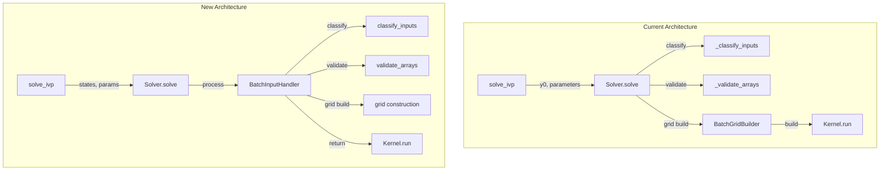
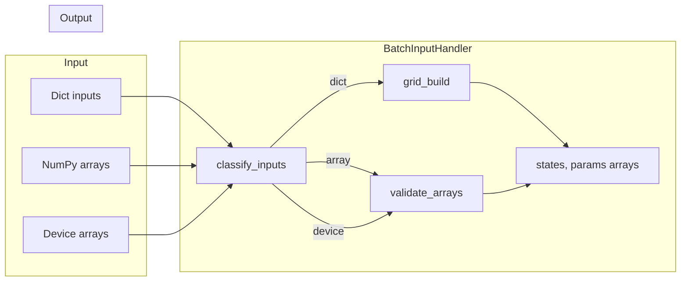

# BatchInputHandler Refactor: Human Overview

## User Stories

### US-1: Consistent Argument Order
**As a** developer using CuBIE  
**I want** a consistent `(states, params)` argument order across all input handling functions  
**So that** I can avoid bugs from accidentally swapping positional arguments

**Acceptance Criteria:**
- All public-facing methods and functions use `(states, params)` order
- All internal methods use `(states, params)` order  
- Call sites use explicit keyword arguments where appropriate
- Return values maintain `(states, params)` order (first states, then params)

### US-2: Regression Test for Positional Arguments
**As a** maintainer of CuBIE  
**I want** a regression test verifying positional argument order in `solve_ivp`  
**So that** future changes don't accidentally break the argument contract

**Acceptance Criteria:**
- Test passes `states, params` as positional arguments (no keywords)
- Test verifies states end up in the states bucket
- Test verifies params end up in the params bucket
- Test fails if arguments are accidentally swapped

### US-3: Unified Input Handling
**As a** developer using CuBIE  
**I want** all input validation and classification logic centralized in `BatchInputHandler`  
**So that** there's a single source of truth for how inputs are processed

**Acceptance Criteria:**
- `BatchInputHandler` contains all input classification logic
- `BatchInputHandler` contains all array validation logic
- Solver delegates to `BatchInputHandler` for input processing
- No duplicate validation code between Solver and input handler

### US-4: Fast Path for Device Arrays
**As a** user providing pre-formatted CUDA device arrays  
**I want** a frictionless path directly to the solver kernel  
**So that** I avoid unnecessary array transformations

**Acceptance Criteria:**
- Device arrays with correct shapes skip all grid construction
- Device arrays are passed directly to kernel execution
- No unnecessary host-device transfers for device arrays

### US-5: Fast Path for Right-Sized NumPy Arrays
**As a** user providing correctly-shaped NumPy arrays  
**I want** a combinationless path to the kernel  
**So that** I avoid unnecessary grid expansion

**Acceptance Criteria:**
- Right-sized NumPy arrays skip combinatorial expansion
- Arrays are validated and cast to precision only
- Direct path to kernel execution without grid construction

---

## Executive Summary

This refactor addresses three key issues in CuBIE's input handling:

1. **Inconsistent argument order** between `(states, params)` and `(params, states)` across functions
2. **Duplicated logic** between `BatchGridBuilder` and `Solver` for input validation
3. **Module naming** that doesn't reflect expanded responsibilities

The solution creates a unified `BatchInputHandler` class that becomes the single source of truth for all input processing, validation, and classification.

---

## Architecture Overview

## Input Processing Flow

## Key Technical Decisions

### 1. Argument Order Standardization
**Decision:** Standardize to `(states, params)` everywhere  
**Rationale:** 
- `states` is the primary input (what we're solving for)
- Matches mathematical convention (initial conditions first, parameters second)
- Aligns with existing `solve_ivp` signature (`y0` before `parameters`)

### 2. Return Value Order
**Decision:** Return `(states_array, params_array)` consistently  
**Rationale:**
- Matches argument order for consistency
- Current `BatchGridBuilder.__call__` already returns `(inits, params)`
- Minimizes breaking changes

### 3. Merge Strategy
**Decision:** Merge `_classify_inputs` and `_validate_arrays` from Solver into BatchInputHandler  
**Rationale:**
- Eliminates duplicate fast-path detection logic
- Creates single source of truth
- Reduces Solver complexity

### 4. Keyword Argument Usage
**Decision:** Use explicit keywords at call sites in BatchInputHandler and Solver  
**Rationale:**
- Prevents positional argument bugs
- Self-documenting code
- Matches user-facing API pattern

---

## Impact on Existing Architecture

### Files Modified
| File | Change Type |
|------|-------------|
| `BatchGridBuilder.py` | Renamed to `BatchInputHandler.py` |
| `solver.py` | Simplified (logic moves to handler) |
| `__init__.py` | Update exports |
| `test_batch_grid_builder.py` | Renamed, tests updated |
| `conftest.py` | Fixture names updated |

### API Changes
| Old API | New API |
|---------|---------|
| `BatchGridBuilder(interface)` | `BatchInputHandler(interface)` |
| `solver.grid_builder` | `solver.input_handler` |
| `solver._classify_inputs()` | Removed (in handler) |
| `solver._validate_arrays()` | Removed (in handler) |

### Backward Compatibility
- Public method signatures preserved
- Return value order unchanged (already `states, params`)
- Breaking: Class name change from `BatchGridBuilder` to `BatchInputHandler`

---

## Trade-offs Considered

### Option A: Keep Separate Classes
- **Pro:** Minimal change, lower risk
- **Con:** Perpetuates duplicated logic
- **Decision:** Rejected - duplication leads to bugs

### Option B: Merge into Solver
- **Pro:** All logic in one place
- **Con:** Solver becomes too large, single responsibility violation
- **Decision:** Rejected - better to have dedicated input handler

### Option C: BatchInputHandler (Selected)
- **Pro:** Single responsibility, clear naming, centralized logic
- **Con:** Breaking rename
- **Decision:** Selected - best long-term architecture

---

## Expected Outcomes

1. **Reduced Code:** Logic currently in both Solver and BatchGridBuilder will be consolidated
2. **Fewer Bugs:** Consistent argument order prevents accidental swaps
3. **Clearer API:** `BatchInputHandler` better describes module purpose
4. **Better Fast Paths:** Unified detection of device/array/dict inputs
5. **Regression Safety:** Test prevents future argument order regressions
