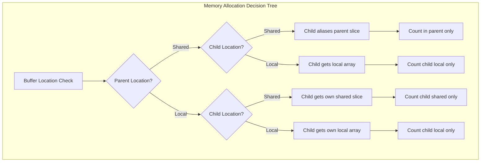

# Buffer Aliasing Behavior for Togglable Shared/Local Arrays

## User Stories

### US-1: Parent Shared → Child Aliases Parent
**As a** CuBIE integrator developer  
**I want** child arrays to automatically alias slices of their parent shared array  
**So that** memory is efficiently reused without double-counting elements  

**Acceptance Criteria:**
- When parent array (e.g., `solver_scratch`) is in shared memory, child buffers (delta, residual) slice directly from it
- Memory accounting includes only the parent's shared elements, not children
- Slice indices correctly offset into the parent's shared region

### US-2: Parent Local + Child Shared → Child Gets Own Shared Slice
**As a** CuBIE integrator developer  
**I want** a child to allocate its own shared memory slice when the parent is local but the child is configured as shared  
**So that** I can independently control memory locations for parent and child buffers  

**Acceptance Criteria:**
- When parent array is local but child location is 'shared', child gets its own shared memory region
- Memory accounting correctly adds child's shared elements to total
- No double-counting occurs between parent and child

### US-3: Parent Local + Child Local → Child Gets Own Local Array
**As a** CuBIE integrator developer  
**I want** a child to allocate its own local array when both parent and child are configured as local  
**So that** each component manages its own local memory independently  

**Acceptance Criteria:**
- When both parent and child locations are 'local', each allocates its own `cuda.local.array`
- Local memory accounting correctly sums both parent and child requirements
- No memory aliasing occurs between local arrays

### US-4: Non-Duplicative Memory Accounting
**As a** CuBIE performance engineer  
**I want** shared and local memory element counts to never double-count aliased buffers  
**So that** memory allocation calculations are accurate and don't over-reserve resources  

**Acceptance Criteria:**
- `shared_memory_elements` property never counts the same memory region twice
- `local_memory_elements` property never counts the same memory region twice
- When buffers alias (parent→child), only one is counted
- Memory accounting is consistent across the full hierarchy (Loop → Algorithm → Newton → LinearSolver)

### US-5: Hierarchical Buffer Settings Propagation
**As a** CuBIE solver builder  
**I want** buffer settings to correctly propagate through the component hierarchy  
**So that** changing a parent's location correctly affects how children compute their memory  

**Acceptance Criteria:**
- DIRKBufferSettings correctly accounts for NewtonBufferSettings depending on location configuration
- FIRKBufferSettings correctly accounts for NewtonBufferSettings depending on location configuration
- NewtonBufferSettings correctly accounts for LinearSolverBufferSettings
- RosenbrockBufferSettings correctly accounts for LinearSolverBufferSettings

---

## Executive Summary

The CuBIE library implements CUDA-based batch integration of ODEs/SDEs. Each algorithm and solver manages its own buffer allocations through `BufferSettings` subclasses that allow toggling between shared and local memory. The current implementation has inconsistencies in how aliased arrays are handled when parent arrays change their memory location.

### Core Problem

When arrays like `solver_scratch` in DIRK/FIRK were originally designed, they were always in shared memory, and child buffers (Newton's delta, residual, linear solver's temp) aliased slices of this parent. Now that locations are togglable, three scenarios must be handled:

1. **Parent shared**: Children alias the parent (original behavior)
2. **Parent local, child shared**: Child gets its own shared slice
3. **Parent local, child local**: Child gets its own local array

The current implementations don't consistently handle case #2, potentially leading to incorrect memory accounting or runtime errors.

---

## Architecture Overview

---

## Key Technical Decisions

### 1. Parent-Child Relationship Tracking
Each nested `BufferSettings` must know whether its parent provides shared scratch space or not. This is achieved by:
- Storing child `BufferSettings` as attributes (already done: `newton_buffer_settings`, `linear_solver_buffer_settings`)
- Adding a computed property or flag indicating parent availability

### 2. Memory Accounting Rules
The memory accounting follows these rules:
- **solver_scratch in DIRK/FIRK**: Always accounts for Newton's needs when Newton uses shared memory
- **Newton's delta/residual**: Only counted if they can't alias the parent's solver_scratch
- **LinearSolver's buffers**: Only counted if they can't alias Newton's scratch

### 3. Slice Offset Computation
When a child gets its own shared slice (parent local, child shared), the slice starts at offset 0 relative to its own allocation, not the parent's. This requires:
- Computing `lin_solver_start` based on Newton's own allocations when parent is local
- Ensuring slice indices don't reference non-existent parent regions

---

## Trade-offs Considered

### Option A: Explicit Parent Location Flag
Pass an explicit flag indicating parent provides shared scratch.
- **Pro**: Clear, explicit control
- **Con**: Another parameter to track, potential for inconsistency

### Option B: Computed from Context (Chosen)
Compute parent availability from existing buffer settings structure.
- **Pro**: DRY principle, settings remain authoritative source
- **Con**: Slightly more complex property logic

### Option C: Separate Allocation Functions
Different allocation paths for each scenario.
- **Pro**: Clear separation of concerns
- **Con**: Code duplication, harder to maintain

**Decision**: Option B - compute from context. The buffer settings hierarchy already exists; we enhance it to properly handle aliasing without adding new parameters.

---

## Expected Impact on Existing Architecture

1. **BufferSettings Base Class**: No changes needed - already provides abstract interface
2. **LinearSolverBufferSettings**: Already self-contained, no parent dependency
3. **NewtonBufferSettings**: Needs to conditionally include LinearSolver's shared elements based on whether Newton itself is using shared memory
4. **DIRKBufferSettings**: Needs to fix solver_scratch accounting - shouldn't include Newton's elements when parent provides them
5. **FIRKBufferSettings**: Same as DIRK
6. **RosenbrockBufferSettings**: Already stores linear_solver_buffer_settings; needs correct accounting

---

## References

- Current BufferSettings implementation: `src/cubie/BufferSettings.py`
- Newton solver implementation: `src/cubie/integrators/matrix_free_solvers/newton_krylov.py`
- DIRK implementation: `src/cubie/integrators/algorithms/generic_dirk.py`
- FIRK implementation: `src/cubie/integrators/algorithms/generic_firk.py`
- Existing tests: `tests/integrators/algorithms/test_buffer_settings.py`
