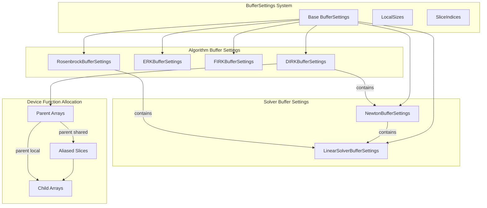
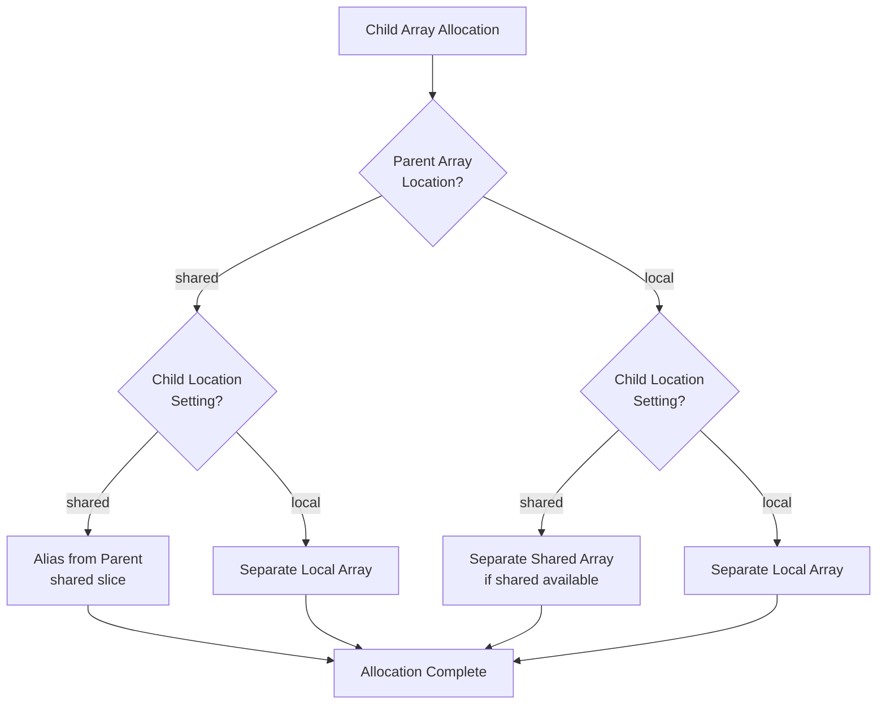

# Buffer Aliasing Fix - Human Overview

## User Stories

### US-1: Correct Child Array Allocation Based on Parent Location

**As a** CuBIE user with custom buffer settings  
**I want** child arrays (aliased from parent arrays) to respect both parent and child location settings  
**So that** memory is correctly allocated when I configure any combination of shared/local memory for arrays

**Acceptance Criteria:**
- When parent array is shared AND child location is shared: child aliases the parent (original behavior)
- When parent array is local AND child location is shared: child is separately allocated in shared memory
- When parent array is local AND child location is local: child is separately allocated in local memory
- Memory accounting correctly reflects aliased vs. separate allocations
- No double-counting of memory elements for aliased arrays

### US-2: Consistent Memory Behavior Across All Algorithm Files

**As a** developer extending CuBIE integrators  
**I want** all algorithm files to use the same consistent aliasing logic  
**So that** buffer settings work predictably across DIRK, ERK, FIRK, and Rosenbrock methods

**Acceptance Criteria:**
- All algorithm BufferSettings classes follow the same aliasing pattern
- Child buffer settings (e.g., Newton solver, linear solver) correctly propagate
- Solver scratch buffers correctly handle the case when solver uses all local memory

### US-3: Child Object Buffer Independence

**As a** user configuring Newton solver settings  
**I want** the Newton solver's buffer location settings to work independently  
**So that** I can configure solver memory without breaking parent algorithm's aliasing logic

**Acceptance Criteria:**
- When Newton solver requests no shared memory, parent arrays like `increment_cache` and `rhs_cache` still work
- Solver buffer settings are respected regardless of parent step function's settings

---

## Executive Summary

This plan addresses incorrect shared memory aliasing in CuBIE's BufferSettings system. Currently, several algorithm files (notably `generic_dirk.py`) alias child arrays from parent arrays based on incorrect conditions, leading to potential memory access issues when users toggle arrays between shared and local memory.

### The Core Problem

Before buffers were togglable, most were shared memory and arrays with disjoint lifetimes were aliased to reduce shared memory footprint. The transition to configurable locations introduced bugs:

1. **Aliasing conditioned on wrong factors**: `stage_base` aliasing in DIRK depends only on `multistage`, not whether `stage_accumulator` is actually in shared memory
2. **Missing fallback allocation**: When parent array (`solver_scratch`) is local, child arrays (`increment_cache`, `rhs_cache`) have no valid source to slice from
3. **Inconsistent patterns**: Different algorithm files may have different (possibly correct or incorrect) implementations

---

## Architecture Overview



### Aliasing Decision Flow



---

## Key Technical Decisions

### 1. Aliasing Requires Both Parent AND Child to be Shared

**Current logic (INCORRECT):**
```python
# Only checks multistage, ignores stage_accumulator location
if multistage:
    stage_base = stage_accumulator[some_slice]
```

**Correct logic:**
```python
# Must check both parent and child location settings
if use_shared_stage_accumulator and use_shared_stage_base:
    stage_base = stage_accumulator[some_slice]
elif use_shared_stage_base:
    stage_base = shared[stage_base_slice]  # Separate shared allocation
else:
    stage_base = cuda.local.array(stage_base_size, precision)
```

### 2. Memory Accounting Must Avoid Double-Counting

When parent and child are both shared AND aliased, only count the parent's size. When they're separate, count both.

### 3. Solver Scratch Buffer Handling

The `solver_scratch` buffer is special - it's meant to be the shared memory region passed to child solver objects. When the Newton solver uses all local arrays, `solver_scratch` should be zero-sized, not a non-existent slice.

---

## Affected Components

| File | Arrays with Aliasing Issues |
|------|---------------------------|
| `generic_dirk.py` | `stage_base` (from `stage_accumulator`), `increment_cache` (from `solver_scratch`), `rhs_cache` (from `solver_scratch`) |
| `generic_erk.py` | Potentially similar patterns (to be verified) |
| `generic_firk.py` | Potentially similar patterns (to be verified) |
| `generic_rosenbrock_w.py` | Potentially similar patterns (to be verified) |
| `newton_krylov.py` | Interfaces with parent's solver_scratch |
| `linear_solver.py` | Interfaces with Newton's shared memory region |

---

## Trade-offs Considered

### Option A: Add Explicit Child Location Settings (Selected)
- **Pros**: Most flexible, explicit control, minimal special-casing
- **Cons**: More configuration parameters to expose

### Option B: Derive Child Location from Parent
- **Pros**: Simpler API, fewer settings
- **Cons**: Less control, may not satisfy all use cases

### Option C: Always Separate Allocation
- **Pros**: Simplest logic, no aliasing bugs
- **Cons**: Higher memory usage, defeats purpose of aliasing optimization

**Decision**: Option A provides the best balance of flexibility and correctness.

---

## Expected Impact on Existing Architecture

1. **BufferSettings classes**: Will need additional location attributes for child arrays
2. **Memory accounting properties**: `shared_memory_elements` and `local_memory_elements` need aliasing-aware logic
3. **Device function allocation**: Compile-time branching becomes more complex with multi-condition checks
4. **Tests**: Need coverage for all aliasing combinations

---

## Research Findings

Based on code analysis:

1. **DIRKBufferSettings** manages: `stage_accumulator`, `increment_cache`, `rhs_cache`, `stage_base`, `proposed_increment`, and contains `newton_buffer_settings`

2. **NewtonBufferSettings** manages: `delta`, `residual`, `residual_temp`, and contains `linear_solver_buffer_settings`

3. **LinearSolverBufferSettings** manages: `preconditioned_vec`, `temp`

4. **RosenbrockBufferSettings** manages: `stage_rhs`, `stage_store`, `cached_auxiliaries`, and contains `linear_solver_buffer_settings`

5. The pattern of nested buffer settings (parent contains child) is consistent, enabling hierarchical memory accounting.

---

*Document prepared for CuBIE buffer aliasing fix feature plan*
