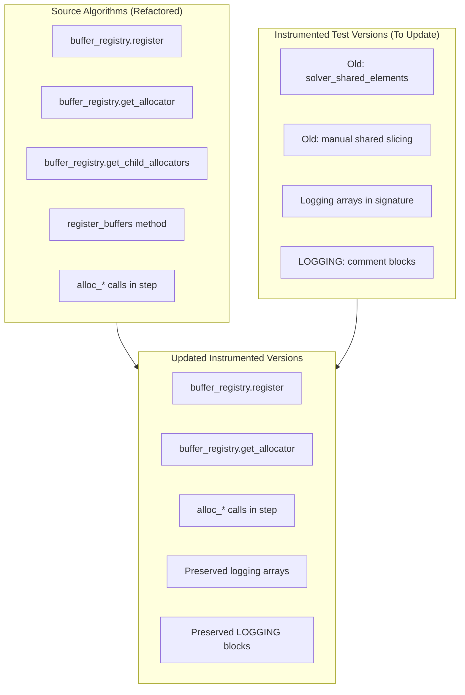

# Buffer Allocation Instrumented Sync - Overview

## User Stories

### US-1: Synchronize Buffer Allocation Refactoring to Instrumented Test Files
**As a** CuBIE developer,  
**I want** the instrumented test versions of algorithm step functions to use the same buffer allocation patterns as the source implementations,  
**So that** the instrumented tests can properly capture internal solver states without breaking due to mismatched buffer management.

**Acceptance Criteria:**
1. All instrumented algorithm files use `buffer_registry` for buffer management
2. Instrumented files use allocator-based buffer acquisition (`alloc_*` functions)
3. `register_buffers()` methods are added/updated where present in source
4. Child allocators are used for Newton solver buffers where applicable
5. The instrumented versions preserve their additional logging parameters and logging code
6. `solver_shared_elements` manual slicing is replaced with allocator calls
7. No modification to `backwards_euler_predict_correct.py` (skipped per requirement)

### US-2: Maintain Logging Functionality
**As a** CuBIE tester,  
**I want** the instrumented versions to retain their logging arrays and logging code,  
**So that** I can continue to capture internal solver states for debugging and validation.

**Acceptance Criteria:**
1. All instrumented step() signatures retain their logging array parameters
2. All LOGGING: comment blocks and associated code are preserved
3. Additional local arrays for instrumentation (e.g., `base_state_snapshot`) are retained

---

## Executive Summary

This task involves replicating buffer allocation refactoring from source algorithm implementations to their instrumented test counterparts. The source files have been updated to use:

1. **Buffer Registry Pattern**: Using `buffer_registry.register()` to register buffers with specific memory locations
2. **Allocator Functions**: Using `buffer_registry.get_allocator()` to obtain buffer allocation functions
3. **Child Allocators**: Using `buffer_registry.get_child_allocators()` for Newton solver buffers
4. **`register_buffers()` Method**: Encapsulating buffer registration in a dedicated method

The instrumented versions add logging arrays to step function signatures and capture internal solver states. These changes must preserve the logging functionality while updating buffer management.

---

## Architecture Diagram

---

## Files to Modify

| File | Key Changes |
|------|-------------|
| `tests/.../instrumented/backwards_euler.py` | Add `buffer_registry` import, use child allocators, remove `solver_shared_elements` |
| `tests/.../instrumented/crank_nicolson.py` | Add `buffer_registry` import, add `register_buffers()`, use allocators, add `CrankNicolsonStepConfig` |
| `tests/.../instrumented/explicit_euler.py` | No buffer allocation changes needed (explicit method, no solver buffers) |
| `tests/.../instrumented/generic_dirk.py` | Add `register_buffers()` method, update buffer names and allocator patterns, add `stage_rhs_location` |
| `tests/.../instrumented/generic_erk.py` | Add `register_buffers()` call, update naming conventions |
| `tests/.../instrumented/generic_firk.py` | Add `register_buffers()` method, update allocator patterns, add child allocators |
| `tests/.../instrumented/generic_rosenbrock_w.py` | Add `register_buffers()` method, update buffer names to match source |

---

## Key Technical Decisions

### 1. Buffer Naming Conventions
The source files use shorter, algorithm-specific buffer names (e.g., `stage_increment`, `cn_dxdt`), while some instrumented versions use prefixed names (e.g., `dirk_stage_increment`). The instrumented versions should match the source naming where possible.

### 2. Preserving Instrumented Differences
The instrumented versions have key differences that must be preserved:
- Additional imports for `InstrumentedLinearSolver` and `InstrumentedNewtonKrylov`
- Logging array parameters in `step()` function signatures
- `build_implicit_helpers()` creates instrumented solvers
- LOGGING blocks capture internal states

### 3. `register_buffers()` Method Placement
The source implementations call `register_buffers()` at the end of `__init__()`. The instrumented versions should follow the same pattern.

---

## Impact Analysis

- **Low Risk**: Changes are structural refactoring of buffer management
- **No Functional Changes**: Core algorithm logic remains unchanged
- **Preserves Test Infrastructure**: Logging capabilities fully maintained
- **Enables Future Improvements**: Unified buffer management pattern

---

## Trade-offs Considered

| Option | Pros | Cons |
|--------|------|------|
| Full source parity | Complete consistency, easier maintenance | Larger diff, more review effort |
| Minimal changes | Smaller diff | May miss some allocator patterns |
| **Selected: Exact replication** | Best long-term maintainability | Requires careful review of each file |

The selected approach exactly replicates source patterns while preserving instrumentation-specific code.
