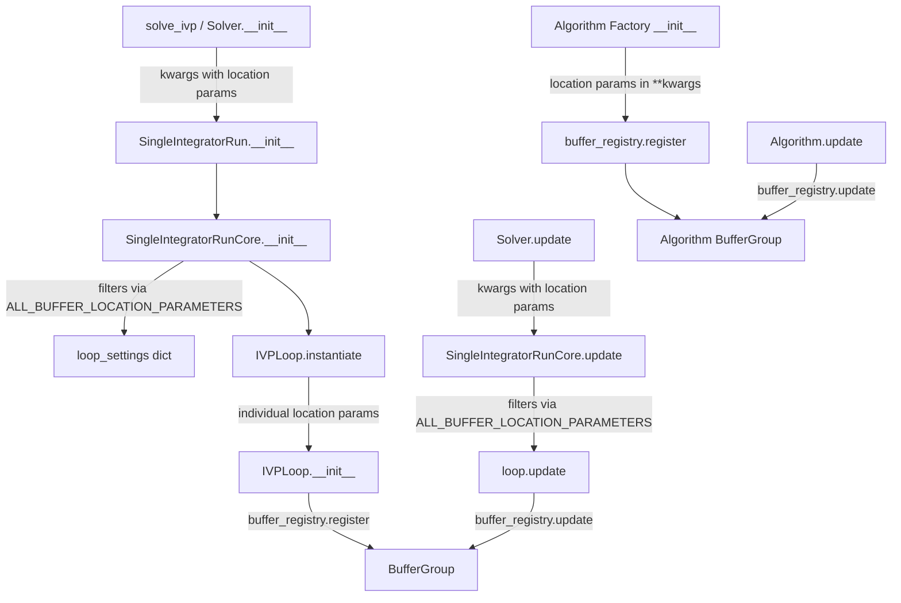
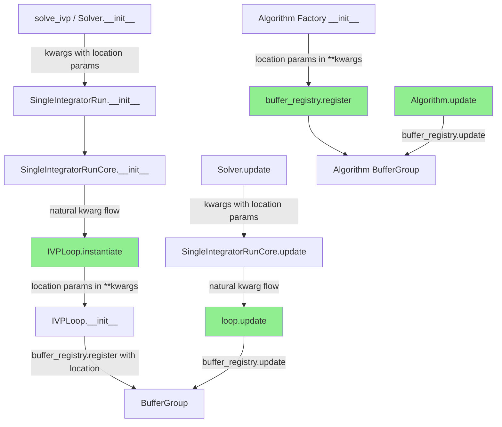
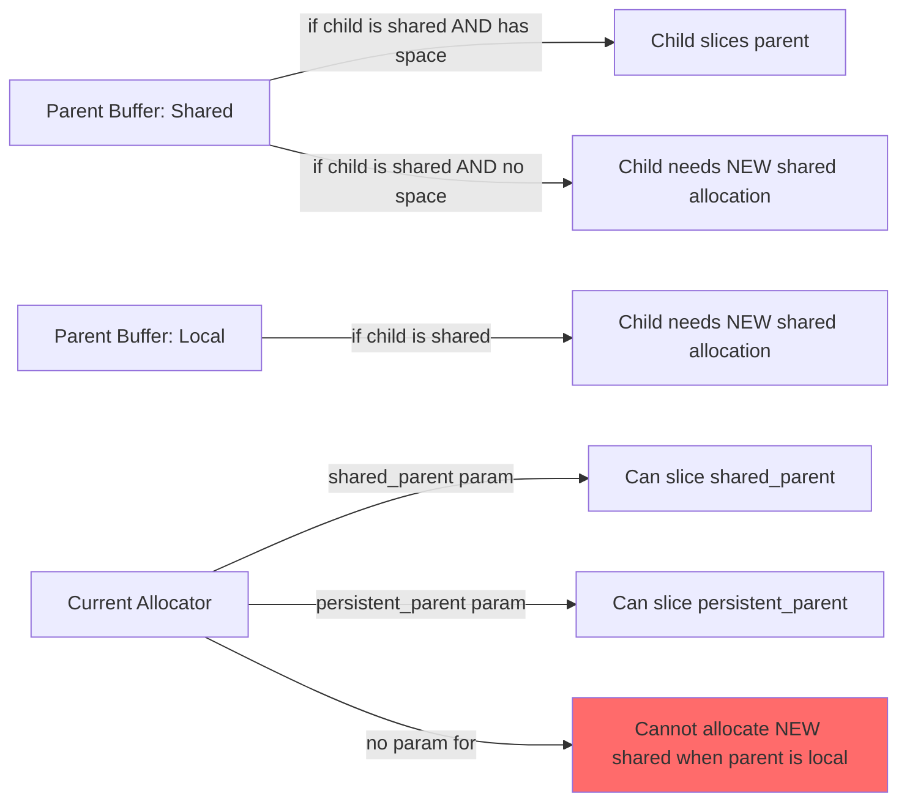

# Buffer Allocation Refactor Fixes - Human Overview

## User Stories

### Story 1: Dynamic Buffer Location Configuration at Solver Level
**As a** CuBIE user  
**I want to** specify buffer memory locations (shared vs local) when creating or updating a solver  
**So that** I can optimize GPU memory usage for my specific integration problem  

**Acceptance Criteria:**
- User can specify buffer locations via `solve_ivp(..., state_location='shared')` 
- User can specify buffer locations via `Solver(..., state_location='shared')`
- User can specify buffer locations via `solver.solve(..., state_location='shared')`
- User can update buffer locations dynamically via `solver.update(state_location='local')`
- All buffer location parameters follow consistent naming: `{buffer_name}_location`
- Parameters propagate correctly through entire initialization chain
- Parameters update correctly through entire update chain
- No special filtering or extraction logic required (treated as regular kwargs)

### Story 2: Unified Parameter Handling
**As a** developer maintaining CuBIE  
**I want** buffer location parameters to be handled identically to other factory parameters  
**So that** the codebase remains maintainable and consistent  

**Acceptance Criteria:**
- No special `ALL_BUFFER_LOCATION_PARAMETERS` constant exists
- Buffer location parameters flow naturally through factory initialization chains
- No special filtering/extraction logic for location parameters
- Location parameters accepted in **kwargs like any other parameter (e.g., `kp`, `newton_tolerance`)
- Location parameters passed directly to `buffer_registry.register()` and `buffer_registry.update()`

### Story 3: Full Cross-Location Buffer Aliasing
**As a** CuBIE user running memory-constrained GPU integrations  
**I want** child buffers to alias parent buffers regardless of their location settings  
**So that** I maximize memory reuse and minimize GPU memory footprint  

**Acceptance Criteria:**
- Parent shared + child shared with space available → child slices parent
- Parent shared + child shared without space → child gets new shared allocation
- Parent local + child shared → child gets new shared allocation  
- Parent persistent + child persistent with space → child slices parent
- Parent persistent + child persistent without space → child gets new persistent allocation
- All aliasing scenarios work correctly in compiled CUDA kernels
- No runtime errors from incompatible allocator signatures

## Executive Summary

The buffer allocation system transitioned from BufferSettings-based allocation to a centralized `buffer_registry` approach. Three issues emerged:

1. **Init/Update Plumbing**: Buffer names must exactly match the location parameter names (e.g., buffer "state" requires parameter "state_location"). Propagation paths must be verified through init and update chains.

2. **Legacy Code Removal**: The `ALL_BUFFER_LOCATION_PARAMETERS` constant in SingleIntegratorRunCore is a remnant that enforces special handling. Removal enables treating location parameters identically to other factory parameters.

3. **Aliasing Allocator Limitation**: Current `CUDABuffer.build_allocator()` accepts only two parent arrays (shared_parent, persistent_parent), preventing scenarios where a child needs to either alias a parent OR allocate directly in shared/persistent memory based on runtime conditions.

## Architectural Overview

### Current Architecture (Problematic Areas)

### Target Architecture (After Fixes)

### Buffer Name to Parameter Mapping

Current buffer names and their required location parameters:

**Loop Level (IVPLoop):**
- `state` → `state_location`
- `proposed_state` → requires parameter name investigation
- `parameters` → `parameters_location`
- `drivers` → `drivers_location`
- `proposed_drivers` → requires parameter name investigation
- `observables` → `observables_location`
- `proposed_observables` → requires parameter name investigation
- `error` → `error_location`
- `counters` → `counters_location`
- `state_summary` → `state_summary_location`
- `observable_summary` → `observable_summary_location`

**Algorithm Level (varies by algorithm):**
- DIRK: `stage_increment`, `stage_base`, `accumulator`
- ERK: `stage_rhs`, `stage_accumulator`
- FIRK: `stage_driver_stack`, `stage_state`
- Rosenbrock: `stage_store`, `cached_auxiliaries`

**Newton-Krylov Solver Level:**
- `newton_delta` → `delta_location`
- `newton_residual` → `residual_location`
- `newton_residual_temp` → `residual_temp_location`
- `newton_stage_base_bt` → `stage_base_bt_location`

**Linear Solver Level:**
- Requires investigation of buffer names

### Aliasing Architecture Issue

The critical flaw: when a parent buffer is local but the child is shared, the child needs to allocate fresh shared memory. However, `build_allocator()` can only slice from `shared_parent` OR `persistent_parent`, not allocate new shared memory when needed.

## Key Technical Decisions

### Decision 1: Remove ALL_BUFFER_LOCATION_PARAMETERS
**Rationale:** This constant enforces special-case handling that's unnecessary in the new architecture. Location parameters should flow naturally like `kp` or `newton_tolerance`.

**Impact:** Simplified code, consistent parameter handling, eliminates filtering logic.

### Decision 2: Naming Audit and Standardization
**Rationale:** Buffer names must match parameter names for `buffer_registry.update()` to work correctly. Inconsistencies (e.g., `proposed_state` vs `state_proposal`) will cause silent failures.

**Impact:** Ensures user-specified locations actually affect the intended buffers.

### Decision 3: Three-Parameter Allocator Solution
**Rationale:** The most surgical fix is to add a third allocator parameter for fallback shared memory allocation. This preserves the current architecture while enabling all aliasing scenarios.

**Alternative Considered:** Pre-allocate oversized shared_parent with both parent space and fallback space. **Rejected** because it complicates slice management and wastes memory.

**Impact:** Minimal code changes, full aliasing support, maintains CUDA compatibility.

## Expected Impact on Existing Architecture

### Files Requiring Changes
1. **buffer_registry.py** - Add third parameter to allocator signature
2. **SingleIntegratorRunCore.py** - Remove ALL_BUFFER_LOCATION_PARAMETERS and filtering logic
3. **ode_loop.py** - Fix buffer naming inconsistencies if any
4. **algorithms/*.py** - Verify buffer names match parameter names
5. **matrix_free_solvers/*.py** - Verify buffer names match parameter names

### Breaking Changes
- None expected for user-facing API
- Internal factory initialization signatures unchanged (location params already in **kwargs)

### Backward Compatibility
- Not required per project guidelines
- Changes are internal plumbing improvements

## Trade-offs and Alternatives Considered

### Aliasing Solution Alternatives

**Alternative 1: Separate Allocator for Aliasing (SELECTED)**
- **Pro:** Minimal changes, clear semantics, maintains CUDA compatibility
- **Con:** Slightly more complex allocator logic

**Alternative 2: Oversized Shared Parent**
- **Pro:** Single allocator signature
- **Con:** Complex slice math, wastes memory, error-prone

**Alternative 3: Compile-Time Flags**
- **Pro:** Can select allocator path at compile time
- **Con:** Requires multiple allocator variants, complicates caching

### Parameter Flow Alternatives

**Alternative 1: Remove Special Filtering (SELECTED)**
- **Pro:** Simplifies code, consistent with other parameters
- **Con:** Requires audit to ensure propagation works

**Alternative 2: Keep ALL_BUFFER_LOCATION_PARAMETERS**
- **Pro:** Explicit documentation of valid parameters
- **Con:** Maintains special-case complexity, inconsistent with design

## References to Research Findings

### Code Structure Analysis
- `buffer_registry.update()` requires exact name match: `{buffer_name}_location`
- Current calls to `buffer_registry.update()` exist in:
  - `base_algorithm_step.py` (line 520)
  - `newton_krylov.py` (line 526)
  - `linear_solver.py` (similar pattern)
  - `ode_loop.py` (line with update)

### Naming Inconsistency Found
- IVPLoop uses `state_proposal_location` as parameter (line 142)
- But registers buffer as `proposed_state` (line 176)
- Config stores as `proposed_state_location` (line 232)
- **This is a bug**: parameter should be `proposed_state_location` to match buffer name

### Current Allocator Limitations
- `build_allocator()` signature: `(shared_parent, persistent_parent) -> array`
- No way to conditionally allocate fresh shared memory
- Affects scenarios: parent local + child shared, parent shared (no space) + child shared

## Risk Assessment

### Low Risk
- Removing ALL_BUFFER_LOCATION_PARAMETERS (well-defined change)
- Fixing buffer naming (isolated impact)

### Medium Risk  
- Allocator signature change (affects all buffer allocations)
- Requires careful testing of all aliasing paths

### Mitigation Strategy
- Comprehensive test coverage for all aliasing scenarios
- Verify with existing test suite (test_buffer_registry.py, test_solver_buffer_locations.py)
- Add new tests for cross-location aliasing if missing
