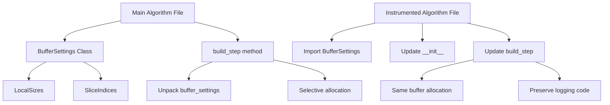

# Buffer Allocation Refactoring - Human Overview

## User Stories

### US1: Instrumented Algorithm Synchronization
**As a** CuBIE developer testing algorithm behavior  
**I want** the instrumented algorithm files to use the same buffer allocation system as the main algorithm files  
**So that** the tests accurately reflect the behavior of the production code

**Acceptance Criteria:**
- All 7 instrumented algorithm files (excluding backwards_euler_predict_correct.py) are updated
- Buffer allocation patterns match the main algorithm files exactly
- All instrumentation/logging code is preserved
- Extra parameters for logging remain in step functions

## Overview

This is a refactoring task to synchronize the instrumented test files with the refactored main algorithm files. The main changes are:

### Key Changes

1. **`__init__` methods** - Need to add buffer location parameters and create buffer settings objects
2. **`build_step` methods** - Need to unpack buffer settings and use the new selective shared/local allocation pattern
3. **Imports** - Need to import buffer settings classes from main modules

### Files to Update

| Instrumented File | Main File |
|------------------|-----------|
| explicit_euler.py | Already synchronized |
| backwards_euler.py | Need to sync |
| crank_nicolson.py | Need to sync |
| generic_erk.py | Need to sync |
| generic_dirk.py | Need to sync |
| generic_firk.py | Need to sync |
| generic_rosenbrock_w.py | Need to sync |

## Architecture

