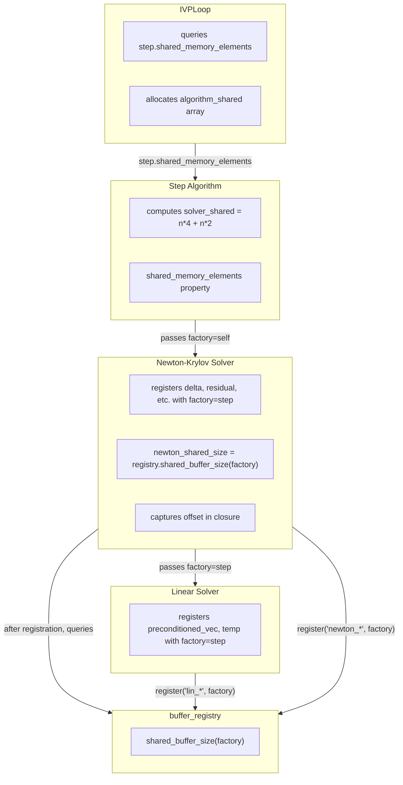

# Buffer Integrations for Step Algorithms - Human Overview

## User Stories

### US-1: Hierarchical Memory Size Propagation
**As a** CuBIE developer  
**I want** step algorithms to expose `shared_memory_elements` and
`persistent_local_elements` properties that include solver memory needs  
**So that** the loop can query total requirements without knowing solver
implementation details

**Acceptance Criteria:**
- Step algorithms expose `solver_shared_elements` property
- Solver memory sizes calculated manually in implicit steps (e.g., Newton
  requires `n * 4` for delta, residual, residual_temp, stage_base_bt;
  Linear requires `n * 2` for preconditioned_vec, temp)
- Step's `shared_memory_elements` returns algorithm buffers + solver buffers
- Loop queries step's property for total memory requirements
- No registry queries for solver sizes (solvers are not CUDAFactory objects)

### US-2: Runtime Slice Allocation
**As a** CuBIE developer  
**I want** parents to allocate buffers and pass slices to children at runtime  
**So that** hierarchical memory allocation works correctly

**Acceptance Criteria:**
- Loop allocates `algorithm_shared` array based on step's property
- Step slices shared array for its buffers and solver scratch
- Newton slices solver scratch for its buffers and linear solver scratch
- Linear solver uses remaining slice for its buffers
- Slice offsets computed at factory build time, captured in closures
- Runtime slicing uses captured constants (not registry calls in device code)

### US-3: Buffer Location Configurability
**As a** CuBIE developer  
**I want** all buffers to remain user-configurable via location parameters  
**So that** users can optimize memory placement for their specific workloads

**Acceptance Criteria:**
- Solver factories accept location parameters (delta_location, etc.)
- Location parameters flow through update/init system
- `buffer_registry.update()` recognizes `*_location` parameters
- Changing location affects allocated memory type (shared vs local)
- No hard-coded buffer locations anywhere

### US-4: Fix Newton-Krylov Slice Bug
**As a** CuBIE developer  
**I want** the linear solver slice offset to be computed at build time  
**So that** the Newton solver works correctly in CUDA execution

**Acceptance Criteria:**
- Remove runtime `buffer_registry.shared_buffer_size(factory)` call from
  newton_krylov.py device function
- Compute Newton's shared buffer size after buffer registration
- Capture offset as compile-time constant in closure
- Linear solver receives `shared_scratch[newton_shared_size:]` using
  captured constant

---

## Executive Summary

This task implements hierarchical buffer management across step algorithms,
matrix-free solvers, and the integration loop. The architecture follows a
consistent pattern with a key constraint: **solvers remain as factory functions
(not CUDAFactory objects)**, so solver memory sizes are calculated manually:

1. **Solvers register their buffers** - Newton and Linear solvers register
   their internal buffers with `factory` parameter (the step algorithm)
2. **Manual size calculation** - Step algorithms compute solver memory needs
   manually: Newton needs `n * 4` (delta, residual, residual_temp,
   stage_base_bt), Linear needs `n * 2` (preconditioned_vec, temp)
3. **Properties expose total sizes** - Step's `solver_shared_elements` returns
   the manually calculated value; Loop queries step's `shared_memory_elements`
4. **Build-time offset computation** - Newton computes its shared buffer size
   after registration and captures it in the closure for runtime slicing
5. **Runtime slicing** - Parents allocate and pass slices to children using
   compile-time captured offsets

---

## Architecture Overview



## Memory Size Flow

```mermaid
sequenceDiagram
    participant Loop as IVPLoop
    participant Step as StepAlgorithm
    participant Newton as NewtonSolver
    participant Linear as LinearSolver
    participant Reg as buffer_registry
    
    Note over Loop,Reg: Build Phase - Registration Order
    
    Step->>Linear: linear_solver_factory(factory=self)
    Linear->>Reg: register('lin_preconditioned_vec', step, n, loc)
    Linear->>Reg: register('lin_temp', step, n, loc)
    Linear-->>Step: returns linear_solver function
    
    Step->>Newton: newton_krylov_factory(factory=self, linear_solver)
    Newton->>Reg: register('newton_delta', step, n, loc)
    Newton->>Reg: register('newton_residual', step, n, loc)
    Newton->>Reg: register('newton_residual_temp', step, n, loc)
    Newton->>Reg: register('newton_stage_base_bt', step, n, loc)
    Newton->>Reg: shared_buffer_size(step) → newton_shared_size
    Note over Newton: Captures offset in closure
    Newton-->>Step: returns newton_solver function
    
    Note over Loop,Reg: Query Phase
    
    Loop->>Step: step.shared_memory_elements
    Step-->>Loop: algorithm_shared + solver_shared (manual calc)
    
    Note over Loop,Reg: Runtime Phase
    
    Loop->>Step: shared_array[0:step_size]
    Step->>Newton: solver_scratch = shared[:solver_shared_elements]
    Newton->>Linear: lin_shared = solver_scratch[newton_shared_size:]
```

## Key Technical Decisions

### 1. Solvers Register with Step as Factory
Solvers register their buffers with the step algorithm as the factory (not
themselves). This is because solvers are factory functions, not CUDAFactory
objects. The step algorithm "owns" all solver buffers in the registry.

### 2. Manual Size Calculation (Temporary)
Since solvers are not CUDAFactory objects, step algorithms cannot query the
registry for solver sizes. Instead, solver memory needs are calculated
manually:
- Newton: `n * 4` (delta, residual, residual_temp, stage_base_bt)
- Linear: `n * 2` (preconditioned_vec, temp)
- Total solver shared: `n * 6` when all buffers are shared

This will be replaced with registry queries when solvers become CUDAFactory
objects in a future task.

### 3. Build-Time Offset Computation
Newton must compute the slice offset for linear solver at build time (after
buffer registration) and capture it in the closure. Runtime registry calls
in device functions are not allowed.

### 4. Location Parameters Preserved
Buffer locations (shared/local) remain user-configurable through factory
parameters. The registry respects these choices when computing sizes.

---

## Files Impacted

| File | Changes |
|------|---------|
| `newton_krylov.py` | Fix runtime registry call - compute offset at build time |
| `ode_implicitstep.py` | Pass `factory=self` to solver factories |
| `backwards_euler.py` | No changes needed (inherits from base) |
| `backwards_euler_predict_correct.py` | No changes needed |
| `crank_nicolson.py` | No changes needed |
| `generic_dirk.py` | Already passes `factory=self` - no changes |
| `generic_firk.py` | Already passes `factory=self` - no changes |
| `generic_rosenbrock_w.py` | Already passes `factory=self` - no changes |
| `ode_loop.py` | Already correct - no changes needed |
| Instrumented files | Independent - no changes needed |

---

## Trade-offs Considered

### Alternative: Convert Solvers to CUDAFactory (DEFERRED)
Making Newton-Krylov and Linear solvers into CUDAFactory subclasses would
allow:
- Registry queries for solver sizes
- Clean hierarchical composition
- Automatic cache invalidation on settings changes

This is deferred to a separate task because:
- Requires significant restructuring of solver factories
- Current approach works with manual size calculation
- Parallel development stream will handle this conversion

### Alternative: Runtime Registry Queries (REJECTED)
The previous plan attempted to call `buffer_registry.shared_buffer_size()`
from within CUDA device functions. This was rejected because:
- Python object methods cannot be called from CUDA device code
- Causes compilation failures or runtime errors

### Selected Approach: Build-Time Computation + Manual Sizes
- Newton computes its shared size after registration, captures in closure
- Step algorithms manually calculate solver needs (`n * 4` + `n * 2`)
- This is temporary until solvers become CUDAFactory objects
- Correctly handles the constraint that solvers are factory functions

---

## Expected Impact

1. **Bug Fix**: Newton-Krylov solver will work correctly (no runtime registry
   calls)
2. **User Control**: Buffer locations remain configurable via location params
3. **Correctness**: Memory sizes propagate through the hierarchy via properties
4. **Future Ready**: Architecture supports clean transition when solvers
   become CUDAFactory objects
