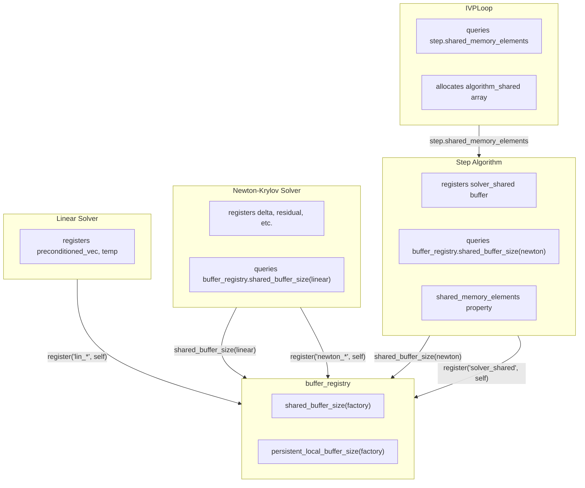

# Buffer Integrations for Step Algorithms - Human Overview

## User Stories

### US-1: Solver Buffer Registration
**As a** CuBIE developer  
**I want** Newton-Krylov and linear solvers to register their internal buffers
with the buffer_registry using themselves as the factory  
**So that** buffer locations remain user-configurable and memory sizes flow
correctly through the hierarchy

**Acceptance Criteria:**
- Newton-Krylov registers buffers (delta, residual, residual_temp,
  stage_base_bt) with `buffer_registry.register(..., factory=self, ...)`
- Linear solver registers buffers (preconditioned_vec, temp) with
  `buffer_registry.register(..., factory=self, ...)`
- Location parameters (delta_location, residual_location, etc.) are added
  to solver factory signatures, allowing users to choose shared/local
- The existing `factory` parameter is retained and used for registration
- Buffer allocators are obtained via `buffer_registry.get_allocator()`

### US-2: Hierarchical Memory Size Queries
**As a** CuBIE developer  
**I want** step algorithms to query solver memory requirements through the
buffer_registry  
**So that** memory sizes propagate correctly from children to parents

**Acceptance Criteria:**
- Step algorithm queries `buffer_registry.shared_buffer_size(nonlinear_solver)`
  to get the Newton solver's total shared memory needs
- Step algorithm queries
  `buffer_registry.persistent_local_buffer_size(nonlinear_solver)` for
  persistent local needs
- Step registers a `solver_shared` buffer with the queried shared size
- Step registers a `solver_persistent` buffer with the queried persistent size
- The step's own `shared_memory_elements` property includes step buffers
  plus solver buffers

### US-3: Loop Memory Allocation
**As a** CuBIE developer  
**I want** IVPLoop to query the step algorithm for total memory requirements  
**So that** the loop allocates sufficient shared/persistent memory for all
children

**Acceptance Criteria:**
- Loop queries step's `shared_memory_elements` property (which aggregates
  step's own + solver buffers)
- Loop allocates `algorithm_shared` array of the returned size
- At runtime, step slices this array and passes appropriate portions to
  the solver via its `solver_shared` allocator
- Same pattern applies to persistent local memory

### US-4: Property-Based Memory Propagation
**As a** CuBIE developer  
**I want** memory requirements to flow UP through properties  
**So that** each factory can query its children's needs without inline
computation

**Acceptance Criteria:**
- Each factory exposes `shared_memory_elements` and
  `persistent_local_elements` properties
- Properties return registry query results for that factory plus all
  registered child aggregation buffers
- Memory info flows DOWN through update/init only when strictly necessary
- No hard-coded buffer sizes in step algorithms or loop

---

## Executive Summary

This task implements hierarchical buffer management across step algorithms,
matrix-free solvers, and the integration loop. The architecture follows a
consistent pattern:

1. **Solvers register their own buffers** - Newton and Linear solvers register
   their internal buffers with the buffer_registry using themselves as the
   factory
2. **Parents query children** - Step algorithms query
   `buffer_registry.shared_buffer_size(solver)` to determine solver needs
3. **Parents register aggregation buffers** - Steps register `solver_shared`
   and `solver_persistent` buffers with the queried sizes
4. **Loop queries step** - Loop queries step's `shared_memory_elements`
   property for total needs
5. **Runtime slicing** - Parents allocate and pass slices to children at
   device execution time

---

## Architecture Overview



## Memory Size Flow

```mermaid
sequenceDiagram
    participant Loop as IVPLoop
    participant Step as StepAlgorithm
    participant Newton as NewtonSolver
    participant Linear as LinearSolver
    participant Reg as buffer_registry
    
    Note over Loop,Reg: Initialization Phase
    
    Linear->>Reg: register('lin_preconditioned_vec', self, n, loc)
    Linear->>Reg: register('lin_temp', self, n, loc)
    Newton->>Reg: register('newton_delta', self, n, loc)
    Newton->>Reg: register('newton_residual', self, n, loc)
    Newton->>Reg: register('newton_residual_temp', self, n, loc)
    Newton->>Reg: register('newton_stage_base_bt', self, n, loc)
    
    Note over Loop,Reg: Build Phase
    
    Step->>Reg: shared_buffer_size(newton)
    Reg-->>Step: newton_shared_size
    Step->>Reg: register('solver_shared', self, newton_shared_size)
    
    Loop->>Step: shared_memory_elements
    Step->>Reg: shared_buffer_size(self)
    Reg-->>Step: step_shared_size
    Step-->>Loop: step_shared_size (includes solver_shared)
    
    Note over Loop,Reg: Runtime Phase
    
    Loop->>Step: shared_array[0:step_size]
    Step->>Newton: solver_shared_allocator(shared)
    Newton->>Linear: lin_shared (remaining slice)
```

## Key Technical Decisions

### 1. Solvers Own Their Buffers
Each solver registers its buffers with the buffer_registry using itself as
the factory. This keeps buffer ownership clear and enables registry queries
to return accurate sizes.

### 2. Registry as Source of Truth
The buffer_registry provides the authoritative size information via
`shared_buffer_size(factory)` and `persistent_local_buffer_size(factory)`.
Parents query these methods rather than computing sizes inline.

### 3. Aggregation Buffers
Parents register aggregation buffers (`solver_shared`, `solver_persistent`)
that reserve space for their children's needs. At runtime, these buffers
provide slices to child solvers.

### 4. Location Parameters
Buffer locations (shared/local/persistent) remain user-configurable through
factory parameters. The registry respects these choices when computing sizes
and generating allocators.

---

## Files Impacted

| File | Changes |
|------|---------|
| `newton_krylov.py` | Keep factory parameter, add location parameters |
| `linear_solver.py` | Keep factory parameter, add location parameters |
| `ode_implicitstep.py` | Query solver sizes, register aggregation buffers |
| `backwards_euler.py` | Use registry allocators for solver buffers |
| `backwards_euler_predict_correct.py` | Same pattern as backwards_euler |
| `crank_nicolson.py` | Same pattern as backwards_euler |
| `generic_dirk.py` | Query solver sizes, pass solver factory correctly |
| `generic_firk.py` | Query solver sizes, pass solver factory correctly |
| `generic_rosenbrock_w.py` | Query solver sizes, pass solver factory correctly |
| `ode_loop.py` | Query step for total memory requirements |
| Instrumented files | Mirror source changes with logging additions |

---

## Trade-offs Considered

### Alternative: Remove Factory Parameter (REJECTED)
The previous plan proposed removing the factory parameter and using
`cuda.local.array` for solver buffers. This was rejected because:
- Eliminates user control over buffer locations
- Prevents shared memory optimization for frequently-accessed buffers
- Breaks the hierarchical size propagation pattern

### Alternative: Inline Size Computation (REJECTED)
Computing sizes inline in step algorithms was rejected because:
- Duplicates size logic across multiple files
- Makes buffer sizes harder to track and update
- Registry queries provide a single source of truth

### Selected Approach: Registry-Based Hierarchy
- Solvers register their own buffers
- Parents query registry for child sizes
- Parents register aggregation buffers
- Properties expose total requirements
- This maintains user configurability while enabling proper size propagation

---

## Expected Impact

1. **User Control**: Buffer locations remain configurable via location params
2. **Correctness**: Memory sizes propagate correctly through the hierarchy
3. **Maintainability**: Registry is single source of truth for buffer sizes
4. **Flexibility**: Adding new buffers only requires registry updates
