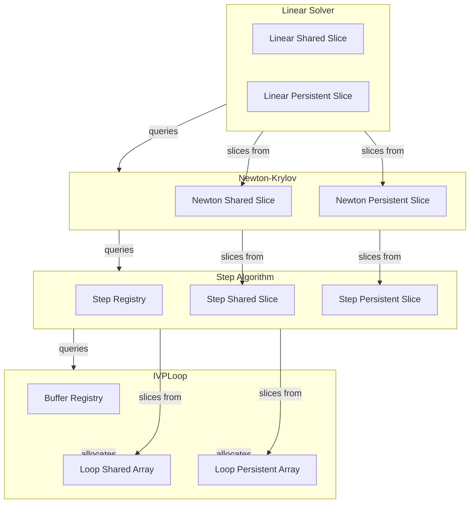

# Buffer Integrations for Step Algorithms - Human Overview

## User Stories

### US-1: Hierarchical Solver Memory Management
**As a** CuBIE developer  
**I want** step algorithms to dynamically query child solver memory requirements  
**So that** parent components can allocate appropriately-sized buffers that update when children are invalidated

**Acceptance Criteria:**
- Steps call `get_shared_elements(nonlinear_solver)` to determine required size
- Nonlinear solvers call `get_shared_elements(linear_solver)` for their children
- Buffer sizes update automatically when child factories rebuild
- No hard-coded `solver_scratch` slices in step functions

### US-2: Remove Factory Parameter from Solver Factories
**As a** CuBIE developer  
**I want** Newton-Krylov and linear solver factories to not receive a `factory` parameter  
**So that** buffer management follows the hierarchical parent-child pattern

**Acceptance Criteria:**
- `newton_krylov_solver_factory` does not accept `factory` parameter
- `linear_solver_factory` does not accept `factory` parameter
- Solvers receive pre-allocated shared/persistent arrays from parent
- Buffer registration happens in the parent step algorithm

### US-3: Base Step Compile Settings Memory Query Methods
**As a** CuBIE developer  
**I want** base step algorithm and compile settings to provide methods for querying memory needs  
**So that** the loop can obtain total requirements without coupling to specific implementations

**Acceptance Criteria:**
- `BaseStepConfig` has methods to query shared and persistent needs from registry
- `BaseAlgorithmStep` exposes these through pass-through properties
- Query methods return registry values for the step's registered buffers

### US-4: Streamlined IVPLoop Parameter Management
**As a** CuBIE developer  
**I want** IVPLoop parameters to be simplified  
**So that** the long explicit parameter list is less cumbersome

**Acceptance Criteria:**
- `SingleIntegratorRunCore` manages IVPLoop buffer sizes via registry queries
- Memory sizes computed from child components flow through dependency injection
- No redundant size parameters passed explicitly to IVPLoop

---

## Executive Summary

This task (Task 3 of 3) addresses the integration of buffer settings across step algorithms, matrix-free solvers, and the integration loop. The primary goals are:

1. **Fix solver_scratch hard-coding**: Remove incorrect hard-coded `solver_scratch` slices from step functions
2. **Implement hierarchical memory pattern**: Parents request child memory sizes and allocate buffers, children slice into parent-provided arrays
3. **Remove factory parameter kludge**: Solver factories should not receive factory instances for buffer management
4. **Add query methods**: Base step algorithm and compile settings provide memory query methods
5. **Streamline IVPLoop**: Reduce parameter clutter through dependency injection

---

## Architecture Overview



## Hierarchical Memory Flow

```mermaid
sequenceDiagram
    participant Loop as IVPLoop
    participant Step as StepAlgorithm
    participant Newton as NewtonSolver
    participant Linear as LinearSolver
    
    Note over Loop,Linear: Build Phase (compile time)
    
    Loop->>Step: get_shared_elements()
    Step->>Newton: get_shared_elements()
    Newton->>Linear: get_shared_elements()
    Linear-->>Newton: 2n (precond_vec, temp)
    Newton-->>Step: 4n + 2n (delta, residual, temp, base) + linear
    Step-->>Loop: algorithm_shared + solver_shared
    
    Note over Loop,Linear: Run Phase (device execution)
    
    Loop->>Step: shared_scratch[0:total]
    Step->>Newton: shared_scratch[algo_start:solver_end]
    Newton->>Linear: shared_scratch[newton_start:linear_end]
```

## Key Technical Decisions

### 1. No Parent-Child Links at Registry Level
The buffer registry does not maintain parent-child relationships. Instead:
- Parent factories call child factories' size query methods directly
- Size information flows through the object hierarchy, not the registry
- This keeps the registry simple and focused on allocation

### 2. Build-Time Size Updates
When a child is invalidated:
1. Child's cache is marked invalid
2. On next access, child rebuilds and may have different sizes
3. Parent must re-query sizes before allocating
4. The `cache_valid` property and lazy evaluation pattern handles this

### 3. Solver Receives Pre-Sliced Arrays
Instead of:
```python
def newton_krylov_solver_factory(factory, ...):
    buffer_registry.register('newton_delta', factory, n, ...)
```

The pattern becomes:
```python
def newton_krylov_solver_factory(shared_elements, ...):
    # shared_elements provided by caller based on get_shared_elements()
```

The parent step algorithm:
1. Queries Newton's shared/persistent needs
2. Registers its own buffers (including solver space)
3. Passes slices to Newton at device execution time

### 4. Solver Scratch Pattern

**Current (incorrect):**
```python
solver_scratch = shared[: solver_shared_elements]  # Hard-coded slice
```

**Correct pattern:**
```python
# In step algorithm at build time:
solver_shared = self.get_solver_shared_elements()
solver_persistent = self.get_solver_persistent_elements()

# At device runtime:
solver_shared_slice = shared[algo_shared_end : algo_shared_end + solver_shared]
solver_persistent_slice = persistent[algo_pers_end : algo_pers_end + solver_pers]
```

---

## Files Impacted

| File | Changes |
|------|---------|
| `base_algorithm_step.py` | Add query methods to BaseStepConfig and BaseAlgorithmStep |
| `ode_implicitstep.py` | Update solver invocation pattern, remove factory parameter |
| `backwards_euler.py` | Use registry for buffer allocation, fix solver_scratch |
| `backwards_euler_predict_correct.py` | Same pattern as backwards_euler |
| `crank_nicolson.py` | Same pattern as backwards_euler |
| `generic_dirk.py` | Update to hierarchical pattern |
| `generic_firk.py` | Update to hierarchical pattern |
| `generic_rosenbrock_w.py` | Update to hierarchical pattern |
| `newton_krylov.py` | Remove factory parameter, receive pre-allocated arrays |
| `linear_solver.py` | Remove factory parameter, receive pre-allocated arrays |
| `ode_loop.py` | Query step for total memory needs |
| `SingleIntegratorRunCore.py` | Manage size queries as part of dependency injection |
| `BatchSolverKernel.py` | Ensure memory sizes flow through correctly |
| Instrumented files | Mirror all source changes with logging additions |

---

## Trade-offs Considered

### Alternative: Full Registry Hierarchy
We could have the registry track parent-child relationships and automatically sum child needs. Rejected because:
- Adds complexity to registry
- Registry becomes coupled to component relationships
- Harder to reason about invalidation cascades

### Alternative: Compile Settings Store Sizes
We could store computed sizes in compile settings. Current approach:
- Registry is the single source of truth for sizes
- Compile settings hold configuration, not computed values
- Query methods access registry directly

---

## Expected Impact

1. **Correctness**: Fixes the solver_scratch hard-coding bug
2. **Maintainability**: Clear parent-child memory delegation pattern
3. **Flexibility**: Buffer sizes update automatically on rebuild
4. **Simplicity**: Removes factory parameter kludge from solver factories
