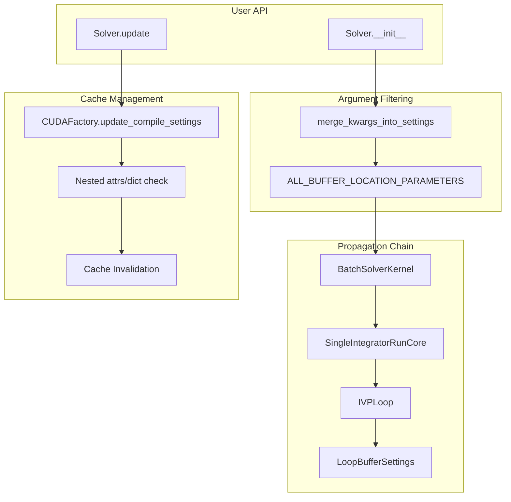
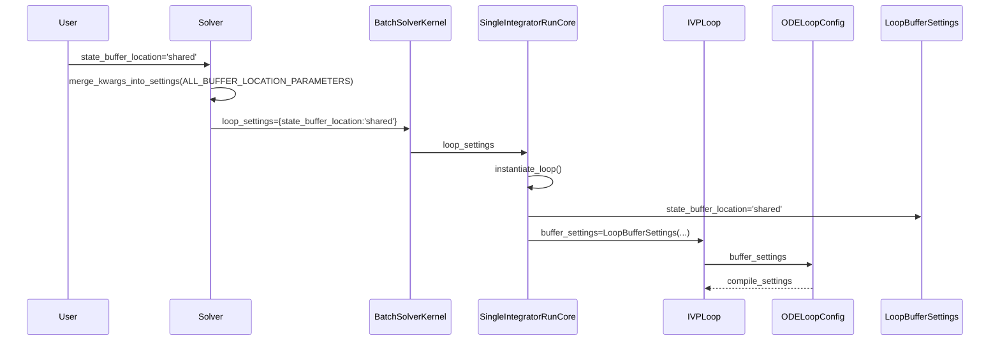

# Buffer Location Argument Filtering - Human Overview

## User Stories

### US-1: Solver-Level Buffer Location Configuration
**As a** CuBIE user  
**I want to** specify buffer memory locations (local or shared) at Solver instantiation  
**So that** I can optimize GPU memory usage without understanding the internal hierarchy

**Acceptance Criteria:**
- User can pass `state_buffer_location='shared'` to `Solver()` or `solve_ivp()`
- User can pass any `*_location` parameter defined in `LoopBufferSettings` at the top level
- Unknown location parameters raise appropriate errors when `strict=True`
- Buffer location changes are reflected in the compiled kernel

### US-2: Runtime Buffer Location Updates
**As a** CuBIE user  
**I want to** update buffer locations after solver instantiation via `solver.update()`  
**So that** I can experiment with memory configurations without recreating the solver

**Acceptance Criteria:**
- `solver.update(state_buffer_location='shared')` succeeds and is recognized
- The update triggers cache invalidation and recompilation when settings change
- Updates return the set of recognized parameter names

### US-3: Nested Compile Settings Updates
**As a** CuBIE developer  
**I want** `CUDAFactory.update_compile_settings()` to check nested attrs classes  
**So that** buffer location parameters inside nested settings are properly recognized

**Acceptance Criteria:**
- `update_compile_settings(state_buffer_location='shared')` recognizes the parameter
- Nested updates invalidate the cache when values change
- Both dict and attrs class nested attributes are supported

---

## Executive Summary

This feature enables users to configure buffer memory locations (local vs shared) at the highest level of abstraction (Solver) without requiring explicit parameter lists at that level. The implementation follows existing CuBIE patterns for argument filtering using `ALL_*_PARAMETERS` sets and `merge_kwargs_into_settings()`.

## Architecture Overview



## Data Flow: Buffer Location Arguments



## Key Technical Decisions

### 1. Parameter Set Definition
A new constant `ALL_BUFFER_LOCATION_PARAMETERS` will be defined in `ode_loop.py` containing all `*_location` attributes from `LoopBufferSettings`. This mirrors the pattern of `ALL_LOOP_SETTINGS`.

### 2. Argument Filtering at Solver Level
Following the established pattern:
```python
# In solver.py
buffer_settings, buffer_recognized = merge_kwargs_into_settings(
    kwargs=kwargs, 
    valid_keys=ALL_BUFFER_LOCATION_PARAMETERS,
    user_settings=loop_settings  # Buffer settings merged into loop_settings
)
```

### 3. Nested Update Checking in CUDAFactory
The `update_compile_settings()` method will be enhanced to:
1. Check if any attribute in `_compile_settings` is a dict or attrs class
2. If so, recursively check those nested structures for matching keys
3. Update nested values and track recognition/changes
4. Invalidate cache if any nested values changed

### 4. No Special Factory Functions
Per requirements, no special factory methods will be added to `BufferSettings` or parent classes. All changes flow through:
- Metadata (`ALL_BUFFER_LOCATION_PARAMETERS`)
- Parent methods (`update_compile_settings`)
- Constructor parameters

## Trade-offs Considered

| Approach | Pros | Cons | Selected |
|----------|------|------|----------|
| Separate `buffer_settings` dict at Solver | Explicit grouping | Extra nesting for user | No |
| Flat kwargs merged into `loop_settings` | Simple API, matches existing patterns | Keys may collide | **Yes** |
| Custom factory in BufferSettings | Encapsulation | Violates requirements | No |

## Impact on Existing Architecture

1. **solver.py**: Add import for `ALL_BUFFER_LOCATION_PARAMETERS`, add filtering call
2. **CUDAFactory.py**: Enhance `update_compile_settings()` with nested checking
3. **ode_loop.py**: Add `ALL_BUFFER_LOCATION_PARAMETERS` constant
4. **SingleIntegratorRunCore.py**: Pass buffer location kwargs to `LoopBufferSettings`
5. **No changes** to `BufferSettings.py` base class

## References

- Existing pattern: `ALL_LOOP_SETTINGS` in `ode_loop.py`
- Existing pattern: `merge_kwargs_into_settings()` in `_utils.py`
- Related code: `LoopBufferSettings` attrs class in `ode_loop.py`
