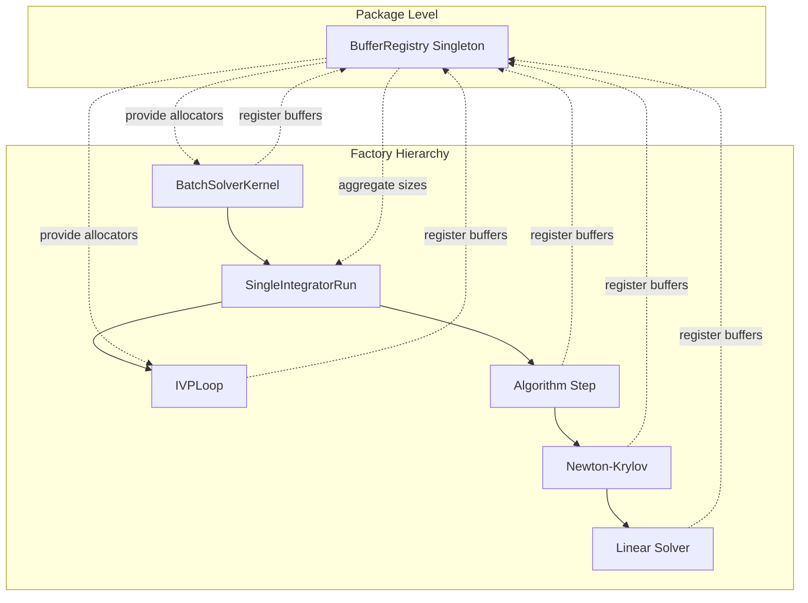
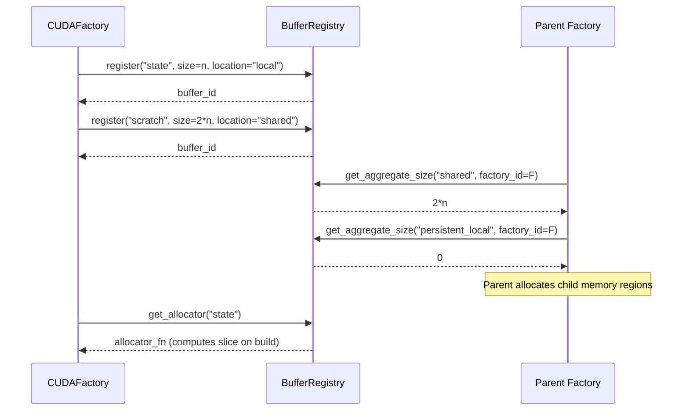
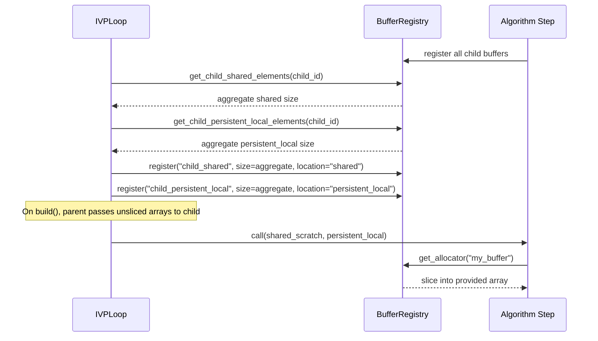

# Buffer Registry Refactoring: Human Overview

## User Stories

### US-1: Developer wants simplified buffer registration
**As a** CUDAFactory developer  
**I want to** register buffers with a centralized registry using only name, size, and location  
**So that** I don't need to manually instantiate or manage buffer objects  

**Acceptance Criteria:**
- Registration requires only: buffer name, size (int), and location (shared/local/persistent_local)
- Registry instantiates and manages buffer objects internally
- Registration returns a handle/identifier for later reference

### US-2: Developer wants automatic memory layout calculation
**As a** CUDAFactory developer  
**I want to** request allocators for registered buffers without computing slice offsets  
**So that** I can focus on algorithm logic rather than memory bookkeeping  

**Acceptance Criteria:**
- Allocator retrieval automatically computes slice indices based on registered buffers
- Layout calculation occurs on build(), not on registration
- No manual slice offset calculation required in factory code

### US-3: Parent factory needs aggregate child buffer sizes
**As a** parent CUDAFactory (e.g., IVPLoop, DIRKStep)  
**I want to** query total shared and persistent_local elements required by child factories  
**So that** I can allocate appropriately-sized memory regions for children  

**Acceptance Criteria:**
- Parent receives aggregate size per location type (shared, local, persistent_local)
- No access to individual child buffer details
- Default child_shared and child_persistent_local buffers sized to zero when no children

### US-4: Developer wants update() integration for buffer locations
**As a** BatchSolverKernel user  
**I want to** change buffer locations via update() calls (e.g., `"state_buffer_location": "shared"`)  
**So that** I can tune memory layout without rebuilding from scratch  

**Acceptance Criteria:**
- Registry spots location and size keys in update requests
- Updates propagate through existing update_compile_settings mechanism
- Changes trigger recalculation on next build()

### US-5: System eliminates layout flag kludges
**As a** CuBIE maintainer  
**I want** the buffer system designed such that `_layout_generated` flags are unnecessary  
**So that** the architecture is clean and self-explanatory  

**Acceptance Criteria:**
- No `_layout_generated` or similar flags protecting against out-of-order operations
- Buffer operations naturally enforce correct sequencing
- Registration → Build → Allocate flow is self-evident from API

---

## Executive Summary

This refactoring replaces the current distributed `BufferSettings` / `SliceIndices` pattern with a centralized, package-wide `BufferRegistry` singleton. The registry follows the established patterns of `SummaryMetrics` and `MemoryManager`, providing a single point of coordination for buffer memory management across all CUDAFactory subclasses.

### Key Design Decision: Centralized Singleton vs Per-Factory Registry

After evaluating both approaches, **centralized singleton registry is recommended** for the following reasons:

| Aspect | Centralized Singleton | Per-Factory Registry |
|--------|----------------------|---------------------|
| Update propagation | Single point receives `update()` calls and distributes | Each factory must be individually updated |
| Parent-child coordination | Natural parent→registry→child flow | Factories must explicitly merge child registries |
| Memory bookkeeping | One source of truth for aggregate sizes | Multiple sources, manual aggregation needed |
| Existing pattern alignment | Matches SummaryMetrics, MemoryManager | Would be novel pattern |
| Code complexity | Simpler factory implementations | More code in each factory |
| Testing | Mock single singleton | Mock multiple registry instances |

**Tradeoff consideration**: A per-factory registry offers better encapsulation and would prevent cross-talk between unrelated factories. However, CUDAFactories already share context through the compile settings pattern, and the parent-child buffer relationship naturally requires coordination. The centralized approach aligns with existing architectural patterns and simplifies the update() integration requirement.

---

## Architecture Overview



### Data Flow: Buffer Registration



### Data Flow: Parent-Child Buffer Relationship



---

## Three Memory Location Types

The registry must support all three memory location types:

| Location | Description | Scope |
|----------|-------------|-------|
| **shared** | Per-block shared memory | Fresh each kernel call, shared across threads in block |
| **local** | Per-thread local arrays | Fresh each function call, private to thread |
| **persistent_local** | Per-thread persistent memory | Persists across calls within a step, private to thread |

### Allocation Strategy

- **shared**: Allocated once per block, sliced per-thread from shared array passed to device function
- **local**: Allocated via `cuda.local.array()` within device function
- **persistent_local**: Passed as slice of parent's persistent array, maintains state between calls

---

## Update Pattern Integration

The registry integrates with existing `update()` patterns:

```python
# User calls at BatchSolverKernel level
solver.update(state_buffer_location="shared")

# Flow:
# 1. BatchSolverKernel.update() receives request
# 2. Request propagated to registry
# 3. Registry identifies location key, updates buffer entry
# 4. Registry marks layout as stale
# 5. Next build() recalculates slice indices
```

**Key insight**: The registry uses the same `update_compile_settings` pattern, recognizing buffer-related keys and updating internal state accordingly.

---

## Design Decisions

### Eliminating _layout_generated Flags

Current code uses `_layout_generated` flags to protect against accessing slice indices before layout calculation. The new design eliminates this need through:

1. **Lazy computation**: Slice indices computed on first access after registration changes
2. **Version tracking**: Registry maintains a version number incremented on any change
3. **Build-time calculation**: All layouts calculated during `build()` phase, never during registration
4. **Immutable allocators**: Allocators returned are closures that capture computed offsets

### Buffer Object Ownership

- CUDAFactories do NOT instantiate buffer objects
- Registry creates and owns `BufferEntry` objects internally
- Factories receive allocator functions, not buffer objects
- Allocator functions are closures capturing slice indices computed at build time

---

## Expected Impact on Existing Architecture

### Files Requiring Modification

1. **New file**: `src/cubie/BufferRegistry.py` - Central registry singleton
2. **Modified**: `src/cubie/BufferSettings.py` - Simplified to thin wrapper or deprecated
3. **Modified**: `src/cubie/CUDAFactory.py` - Add registry interaction methods
4. **Modified**: `src/cubie/integrators/loops/ode_loop.py` - Use registry instead of LoopBufferSettings
5. **Modified**: `src/cubie/integrators/algorithms/generic_dirk.py` - Use registry for DIRK buffers
6. **Modified**: `src/cubie/integrators/matrix_free_solvers/newton_krylov.py` - Use registry for solver buffers
7. **Modified**: `src/cubie/integrators/matrix_free_solvers/linear_solver.py` - Use registry for linear solver buffers

### Backwards Compatibility

- Old `BufferSettings` classes can be kept as configuration containers
- Registry can consume existing BufferSettings for migration period
- Gradual migration: factories can adopt registry incrementally

---

## References

- **SummaryMetrics pattern**: `src/cubie/outputhandling/summarymetrics/metrics.py`
- **MemoryManager pattern**: `src/cubie/memory/mem_manager.py`
- **Current buffer implementation**: `src/cubie/BufferSettings.py`
- **Parent-child example**: `src/cubie/integrators/algorithms/generic_dirk.py`

---

## Trade-offs Considered

### Alternative: Per-Factory Registry
**Pros**: Better encapsulation, no global state, clearer ownership  
**Cons**: Requires explicit registry passing, harder update propagation, doesn't match existing patterns  
**Decision**: Rejected in favor of centralized singleton to align with SummaryMetrics/MemoryManager patterns

### Alternative: Factory-Managed Buffer Objects
**Pros**: Simpler mental model, factories own their buffers  
**Cons**: Duplicates bookkeeping logic, harder to aggregate, current pain point  
**Decision**: Rejected per design requirements
