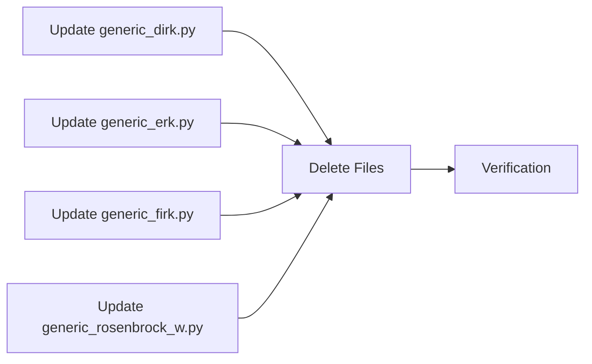

# BufferRegistry Final Cleanup - Agent Plan

## Overview

This plan details the technical specification for completing the BufferSettings to buffer_registry migration. Task Groups 3-6 are complete; this plan covers Task Groups 7-9.

---

## Task Group 7: Update Instrumented Tests

### Context
The instrumented test files in `tests/integrators/algorithms/instrumented/` are logging-enabled copies of the source algorithm files. They were created to test internal algorithm behavior by recording intermediate values. These files still use the old BufferSettings classes and must be migrated to use buffer_registry.

### File: `tests/integrators/algorithms/instrumented/generic_dirk.py`

**Current State:**
- Imports `DIRKBufferSettings` from source `generic_dirk.py`
- `DIRKStepConfig` has `buffer_settings: Optional[DIRKBufferSettings]` field
- `__init__` creates `DIRKBufferSettings` instance
- `build_step` extracts slices and local sizes from buffer_settings

**Required Changes:**

1. **Remove DIRKBufferSettings import:**
   - Remove: `from cubie.integrators.algorithms.generic_dirk import DIRKBufferSettings`

2. **Add buffer_registry import:**
   - Add: `from cubie.buffer_registry import buffer_registry`

3. **Update DIRKStepConfig class:**
   - Remove `buffer_settings` field entirely
   - Add location string fields matching source:
     ```python
     stage_increment_location: str = attrs.field(default='local')
     stage_base_location: str = attrs.field(default='local')
     accumulator_location: str = attrs.field(default='local')
     ```

4. **Update `__init__` method:**
   - Remove: `buffer_settings = DIRKBufferSettings(n=n, stage_count=tableau.stage_count)`
   - Add buffer registration calls matching source `generic_dirk.py`:
     ```python
     buffer_registry.clear_factory(self)
     
     # Register buffers
     buffer_registry.register('dirk_stage_increment', self, n, 'local', precision=precision)
     buffer_registry.register('dirk_accumulator', self, accumulator_length, 'local', precision=precision)
     buffer_registry.register('dirk_stage_base', self, n, 'local', precision=precision)
     buffer_registry.register('dirk_solver_scratch', self, 2*n, 'shared', precision=precision)
     buffer_registry.register('dirk_rhs_cache', self, n, 'shared', aliases='dirk_solver_scratch', precision=precision)
     buffer_registry.register('dirk_increment_cache', self, n, 'shared', aliases='dirk_solver_scratch', precision=precision)
     ```
   - Update config_kwargs to include location strings instead of buffer_settings

5. **Update `build_step` method:**
   - Remove all buffer_settings extraction code
   - Add allocator retrieval:
     ```python
     alloc_stage_increment = buffer_registry.get_allocator('dirk_stage_increment', self)
     alloc_accumulator = buffer_registry.get_allocator('dirk_accumulator', self)
     alloc_stage_base = buffer_registry.get_allocator('dirk_stage_base', self)
     alloc_solver_scratch = buffer_registry.get_allocator('dirk_solver_scratch', self)
     ```
   - Update device function to use allocators:
     ```python
     stage_increment = alloc_stage_increment(shared, persistent_local)
     stage_accumulator = alloc_accumulator(shared, persistent_local)
     stage_base = alloc_stage_base(shared, persistent_local)
     solver_scratch = alloc_solver_scratch(shared, persistent_local)
     ```

6. **Update memory property methods:**
   - Change `shared_memory_required` to: `return buffer_registry.shared_buffer_size(self)`
   - Change `local_scratch_required` to: `return buffer_registry.local_buffer_size(self)`
   - Change `persistent_local_required` to: `return buffer_registry.persistent_local_buffer_size(self)`

### File: `tests/integrators/algorithms/instrumented/generic_erk.py`

**Current State:**
- Imports `ERKBufferSettings` from source `generic_erk.py`
- Similar pattern to DIRK

**Required Changes:**
Mirror the changes made in source `generic_erk.py`:

1. Remove ERKBufferSettings import
2. Add buffer_registry import
3. Update ERKStepConfig to use location strings
4. Update `__init__` to register buffers:
   - `erk_stage_rhs`: size n, local
   - `erk_stage_accumulator`: size accumulator_length, local
   - `erk_stage_cache`: size n, local persistent (or aliased)
5. Update `build_step` to use allocators
6. Update memory properties

### File: `tests/integrators/algorithms/instrumented/generic_firk.py`

**Current State:**
- Imports `FIRKBufferSettings` from source `generic_firk.py`
- Similar pattern to DIRK

**Required Changes:**
Mirror the changes made in source `generic_firk.py`:

1. Remove FIRKBufferSettings import
2. Add buffer_registry import  
3. Update FIRKStepConfig to use location strings
4. Update `__init__` to register buffers:
   - `firk_stage_increment`: size all_stages_n, local/shared
   - `firk_stage_driver_stack`: size stage_count * n_drivers, local/shared
   - `firk_stage_state`: size n, local/shared
   - `firk_solver_scratch`: size 3 * all_stages_n, shared
5. Update `build_step` to use allocators
6. Update memory properties

### File: `tests/integrators/algorithms/instrumented/generic_rosenbrock_w.py`

**Current State:**
- Imports `RosenbrockBufferSettings` from source `generic_rosenbrock_w.py`
- Similar pattern to DIRK

**Required Changes:**
Mirror the changes made in source `generic_rosenbrock_w.py`:

1. Remove RosenbrockBufferSettings import
2. Add buffer_registry import
3. Update RosenbrockWStepConfig to use location strings
4. Update `__init__` to register buffers:
   - `rosenbrock_stage_rhs`: size n, local/shared
   - `rosenbrock_stage_store`: size stage_count * n, local/shared
   - `rosenbrock_cached_auxiliaries`: size varies, local/shared
5. Update `build_step` to use allocators
6. Update memory properties

---

## Task Group 8: Delete Old Files

### File: `src/cubie/BufferSettings.py`
**Action:** DELETE entirely

This file contains:
- `LocalSizes` class (deprecated base)
- `SliceIndices` class (deprecated base)
- `BufferSettings` class (deprecated abstract base)

All concrete implementations have been removed. The base classes served only for type hints and inheritance; with all subclasses removed, these bases have no purpose.

### File: `tests/test_buffer_settings.py`
**Action:** DELETE entirely

This file tests:
- `LocalSizes` base class exists
- `SliceIndices` base class exists  
- `BufferSettings` is abstract

With the source file deleted, these tests will fail and have no purpose.

### File: `tests/integrators/matrix_free_solvers/test_buffer_settings.py`
**Action:** DELETE entirely

This file tests `LinearSolverBufferSettings`, `LinearSolverLocalSizes`, and `LinearSolverSliceIndices`. These classes no longer exist in the source (already migrated to buffer_registry).

### File: `tests/integrators/matrix_free_solvers/test_newton_buffer_settings.py`
**Action:** DELETE entirely

This file tests `NewtonBufferSettings`, `NewtonLocalSizes`, and `NewtonSliceIndices`. These classes no longer exist in the source (already migrated to buffer_registry).

### File: `tests/integrators/algorithms/test_buffer_settings.py`
**Action:** DELETE entirely

This is a placeholder file with a skipped test class indicating BufferSettings migration is complete. It serves no testing purpose.

---

## Task Group 9: Verification

### Step 1: Search for Remaining References

Execute comprehensive search:
```bash
grep -r "BufferSettings" src/ --include="*.py"
grep -r "BufferSettings" tests/ --include="*.py"
grep -r "from cubie.BufferSettings" . --include="*.py"
grep -r "LocalSizes" src/ tests/ --include="*.py" | grep -v buffer_registry
grep -r "SliceIndices" src/ tests/ --include="*.py" | grep -v buffer_registry
```

All searches should return zero matches (or only matches in documentation/comments explaining the migration).

### Step 2: Verify No Import Errors

```bash
python -c "import cubie"
python -c "from cubie.integrators.algorithms.generic_dirk import DIRKStep"
python -c "from cubie.integrators.algorithms.generic_erk import ERKStep"
python -c "from cubie.integrators.algorithms.generic_firk import FIRKStep"
python -c "from cubie.integrators.algorithms.generic_rosenbrock_w import GenericRosenbrockWStep"
```

All imports should succeed without errors.

### Step 3: Run Test Suite

```bash
pytest -m "not nocudasim and not cupy" tests/integrators/algorithms/instrumented/
pytest -m "not nocudasim and not cupy" --ignore=tests/integrators/algorithms/instrumented/
```

Tests should pass (or failures should be unrelated to BufferSettings migration).

---

## Dependencies Between Tasks



Task Group 7 must complete before Task Group 8 because the instrumented files import from source files that reference deleted BufferSettings classes.

Task Group 8 must complete before Task Group 9 because verification searches for any remaining references.

---

## Code Pattern Reference

### Source Pattern (Already Migrated)
```python
# In __init__
buffer_registry.clear_factory(self)
buffer_registry.register('buffer_name', self, size, 'local', precision=precision)

# In build_step
alloc_buffer = buffer_registry.get_allocator('buffer_name', self)

# In device function
buffer = alloc_buffer(shared, persistent_local)
```

### BufferSettings Pattern (To Be Removed)
```python
# In __init__
buffer_settings = SomeBufferSettings(n=n, ...)

# In build_step
shared_indices = buffer_settings.shared_indices
local_sizes = buffer_settings.local_sizes
buffer_slice = shared_indices.buffer
buffer_local_size = local_sizes.nonzero('buffer')

# In device function
if use_shared:
    buffer = shared[buffer_slice]
else:
    buffer = cuda.local.array(buffer_local_size, precision)
```

---

## Edge Cases

### Instrumented Solver Factories
The instrumented files use `inst_linear_solver_factory` and `inst_newton_krylov_solver_factory` from `tests/integrators/algorithms/instrumented/matrix_free_solvers.py`. These factories may need updates if they still reference BufferSettings.

**Check:** Examine `matrix_free_solvers.py` for any BufferSettings usage.

### Aliased Buffers
Some buffers alias others (e.g., `dirk_rhs_cache` aliases `dirk_solver_scratch`). Ensure aliasing is preserved in instrumented versions.

### Precision Handling
Buffer registration requires `precision` parameter. Ensure this is passed correctly from config/compile_settings.

---

## File List Summary

### Files to MODIFY (Task Group 7):
1. `tests/integrators/algorithms/instrumented/generic_dirk.py`
2. `tests/integrators/algorithms/instrumented/generic_erk.py`
3. `tests/integrators/algorithms/instrumented/generic_firk.py`
4. `tests/integrators/algorithms/instrumented/generic_rosenbrock_w.py`

### Files to DELETE (Task Group 8):
1. `src/cubie/BufferSettings.py`
2. `tests/test_buffer_settings.py`
3. `tests/integrators/matrix_free_solvers/test_buffer_settings.py`
4. `tests/integrators/matrix_free_solvers/test_newton_buffer_settings.py`
5. `tests/integrators/algorithms/test_buffer_settings.py`

### Verification Commands (Task Group 9):
1. `grep -r "BufferSettings" src/ tests/`
2. `python -c "import cubie"`
3. `pytest -m "not nocudasim and not cupy"`
