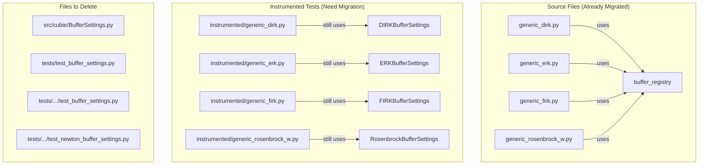

# BufferRegistry Final Cleanup - Human Overview

## User Stories

### US-1: Complete Instrumented Test Migration
**As a** developer maintaining CuBIE test infrastructure  
**I want** the instrumented test files to use the buffer_registry API  
**So that** the instrumented tests mirror the source algorithm implementations exactly

**Acceptance Criteria:**
- [ ] `tests/integrators/algorithms/instrumented/generic_dirk.py` uses buffer_registry instead of DIRKBufferSettings
- [ ] `tests/integrators/algorithms/instrumented/generic_erk.py` uses buffer_registry instead of ERKBufferSettings
- [ ] `tests/integrators/algorithms/instrumented/generic_firk.py` uses buffer_registry instead of FIRKBufferSettings
- [ ] `tests/integrators/algorithms/instrumented/generic_rosenbrock_w.py` uses buffer_registry instead of RosenbrockBufferSettings
- [ ] Instrumented tests continue to pass after migration

### US-2: Delete Deprecated BufferSettings Infrastructure
**As a** developer maintaining CuBIE  
**I want** all deprecated BufferSettings files and classes removed  
**So that** the codebase has no legacy buffer management code

**Acceptance Criteria:**
- [ ] `src/cubie/BufferSettings.py` is deleted
- [ ] No imports from `cubie.BufferSettings` exist anywhere in the codebase
- [ ] Test files that test deleted classes are removed or rewritten

### US-3: Verify Complete Removal
**As a** developer maintaining CuBIE  
**I want** verification that no BufferSettings references remain  
**So that** the migration is fully complete

**Acceptance Criteria:**
- [ ] Full codebase search returns zero matches for "BufferSettings"
- [ ] Full test suite passes (or existing failures are unrelated to migration)
- [ ] No imports reference deleted modules

---

## Executive Summary

This plan completes the BufferSettings to buffer_registry migration by:
1. Updating instrumented test files to mirror source algorithm implementations
2. Deleting deprecated BufferSettings base classes
3. Removing or rewriting obsolete test files
4. Verifying complete removal across the codebase

The instrumented test files in `tests/integrators/algorithms/instrumented/` are copies of algorithm files used for logging during tests. They must be updated to match the source files which now use `buffer_registry` instead of `*BufferSettings` classes.

---

## Architecture Overview

---

## Files to Modify

### Task Group 7: Instrumented Tests
| File | Action | Description |
|------|--------|-------------|
| `tests/integrators/algorithms/instrumented/generic_dirk.py` | MODIFY | Remove DIRKBufferSettings, use buffer_registry |
| `tests/integrators/algorithms/instrumented/generic_erk.py` | MODIFY | Remove ERKBufferSettings, use buffer_registry |
| `tests/integrators/algorithms/instrumented/generic_firk.py` | MODIFY | Remove FIRKBufferSettings, use buffer_registry |
| `tests/integrators/algorithms/instrumented/generic_rosenbrock_w.py` | MODIFY | Remove RosenbrockBufferSettings, use buffer_registry |

### Task Group 8: Delete Old Files
| File | Action | Description |
|------|--------|-------------|
| `src/cubie/BufferSettings.py` | DELETE | Base classes no longer needed |
| `tests/test_buffer_settings.py` | DELETE | Tests deprecated classes |
| `tests/integrators/matrix_free_solvers/test_buffer_settings.py` | DELETE | Tests LinearSolverBufferSettings (removed) |
| `tests/integrators/matrix_free_solvers/test_newton_buffer_settings.py` | DELETE | Tests NewtonBufferSettings (removed) |
| `tests/integrators/algorithms/test_buffer_settings.py` | DELETE | Placeholder test file |

### Task Group 9: Verification
| Task | Description |
|------|-------------|
| Search verification | `grep -r "BufferSettings" src/ tests/` should return 0 matches |
| Import verification | No imports from `cubie.BufferSettings` |
| Test suite | Full test suite passes |

---

## Key Technical Decisions

### Instrumented Test Migration Pattern
The instrumented tests should mirror the source files exactly, except for:
1. Additional logging arrays in function parameters
2. Snapshot recording within iteration loops
3. Use of instrumented solver factories (`inst_linear_solver_factory`, etc.)

The buffer allocation logic must match the source files:
- Import `buffer_registry` from `cubie.buffer_registry`
- Register buffers during `__init__`
- Get allocators during `build_step`
- Use allocators in device function instead of BufferSettings slices

### No Backward Compatibility
This migration removes ALL BufferSettings infrastructure. There is no deprecation period or backward compatibility layer. The `src/cubie/BufferSettings.py` file with its "DEPRECATED" docstring will be deleted entirely.

---

## Risk Assessment

| Risk | Mitigation |
|------|------------|
| Instrumented tests break | Mirror source file changes exactly |
| Missing BufferSettings references | Comprehensive grep search |
| Test failures after deletion | Run full test suite before/after |
| External code dependencies | No external API exposed BufferSettings |

---

## Success Metrics

1. Zero matches for "BufferSettings" in codebase search
2. All instrumented tests pass
3. No import errors when running tests
4. Clean test suite run (or only pre-existing failures)
