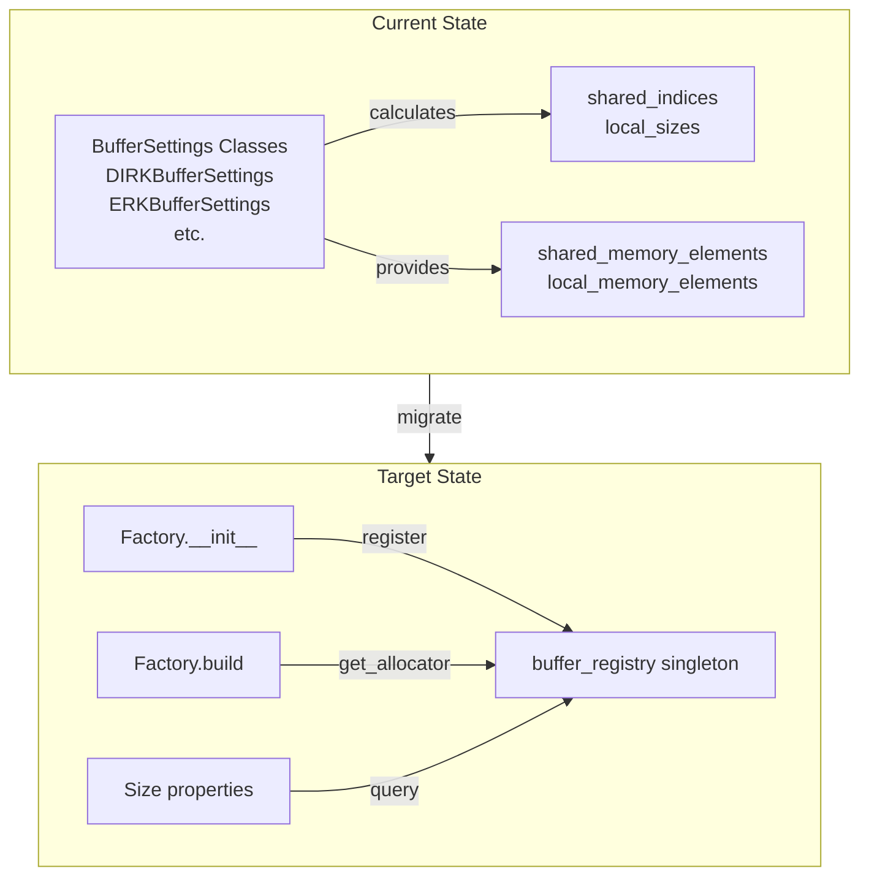
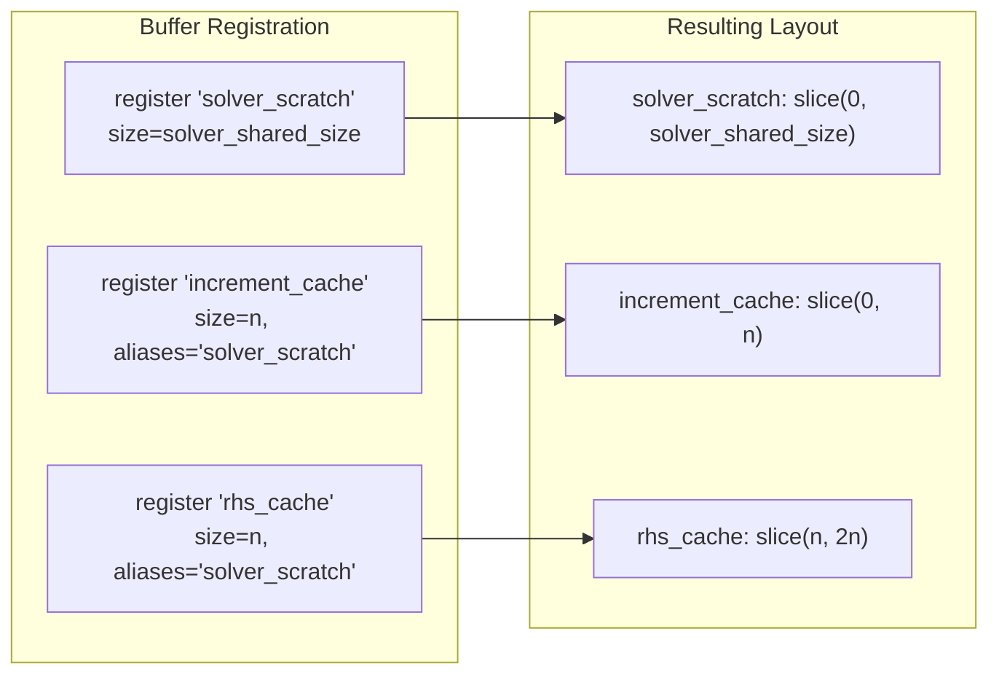

# Buffer Registry Migration: Tasks 3-9 Plan Update

## User Stories

### US-1: Complete Migration to BufferRegistry
**As a** CuBIE developer  
**I want** all CUDA factories to register buffers with the central BufferRegistry  
**So that** buffer management is unified, enabling future optimizations like cross-factory aliasing.

**Acceptance Criteria:**
- [ ] All algorithm files use `buffer_registry.register()` in `__init__`
- [ ] All algorithm files use `buffer_registry.get_allocator()` in `build()`
- [ ] Size properties delegate to `buffer_registry.shared_buffer_size()`, etc.
- [ ] No *BufferSettings classes remain in algorithm/loop/solver files

### US-2: Complete Removal of Old System
**As a** CuBIE developer  
**I want** the old BufferSettings system completely removed  
**So that** there is no duplicate code or confusion about which system to use.

**Acceptance Criteria:**
- [ ] `src/cubie/BufferSettings.py` deleted entirely
- [ ] `tests/test_buffer_settings.py` deleted or rewritten for buffer_registry
- [ ] No file imports from `cubie.BufferSettings`
- [ ] No deprecation warnings or stubs - complete removal

### US-3: Aliasing for Conditional Allocations
**As a** CuBIE developer  
**I want** DIRK's increment_cache/rhs_cache to alias solver_scratch  
**So that** memory is efficiently reused for FSAL optimization.

**Acceptance Criteria:**
- [ ] DIRK registers increment_cache with `aliases='solver_scratch'`
- [ ] DIRK registers rhs_cache with `aliases='solver_scratch'`
- [ ] Aliased buffers share parent space correctly
- [ ] FSAL optimization continues to work

---

## Executive Summary

This document updates the migration plan for Tasks 3-9 of the Buffer Registry Refactor. 

### Current State
- **BufferRegistry infrastructure (Tasks 1-2)**: COMPLETE
  - `src/cubie/buffer_registry.py` fully implemented with:
    - BufferEntry, BufferContext, BufferRegistry classes
    - Lazy cached layout computation
    - CUDA allocator generation with ForceInline=True
    - Cross-type aliasing validation
    - Precision validation
  - `tests/test_buffer_registry.py` has comprehensive tests (433 lines)
  
- **Migration (Tasks 3-8)**: NOT STARTED
  - Each file now has local base classes (`LocalSizes`, `SliceIndices`, `BufferSettings`)
  - **No file imports from `cubie.BufferSettings`** (import dependency removed)
  - Existing `*BufferSettings` classes (DIRKBufferSettings, ERKBufferSettings, etc.) still exist
  - These classes do NOT use buffer_registry - they're self-contained with full implementations
  - `src/cubie/BufferSettings.py` exists as deprecation stub (can be deleted)

### What Was Done Previously
The previous work:
1. Created the complete BufferRegistry infrastructure
2. Removed import dependency on `cubie.BufferSettings` by defining local base classes
3. Left *BufferSettings classes unchanged (DIRKBufferSettings, etc. still exist and work)

This was Phase 1 (infrastructure). Phase 2 (actual migration) was not started.

### What Needs to Be Done
Tasks 3-9 require **replacing the *BufferSettings classes with buffer_registry calls**:
1. Remove DIRKBufferSettings, ERKBufferSettings, etc.
2. Add `buffer_registry.register()` calls in `__init__`
3. Use `buffer_registry.get_allocator()` in `build()`
4. Update size properties to use registry queries

---

## Migration Architecture



---

## File Migration Mapping

### Matrix-Free Solvers (Task 3)

| File | Current | Target |
|------|---------|--------|
| linear_solver.py | LinearSolverBufferSettings class | buffer_registry calls |
| newton_krylov.py | NewtonBufferSettings class | buffer_registry calls |

### Algorithm Files (Task 4)

| File | Current | Target |
|------|---------|--------|
| generic_dirk.py | DIRKBufferSettings class | buffer_registry with aliasing |
| generic_erk.py | ERKBufferSettings class | buffer_registry calls |
| generic_firk.py | FIRKBufferSettings class | buffer_registry calls |
| generic_rosenbrock_w.py | RosenbrockBufferSettings class | buffer_registry calls |

### Loop Files (Task 5)

| File | Current | Target |
|------|---------|--------|
| ode_loop.py | LoopBufferSettings class | buffer_registry calls |

### Instrumented Tests (Task 7)

All instrumented test files import from source modules, so they will work after source migration.

---

## Migration Pattern

### Before (Current)
```python
# In __init__
buffer_settings = DIRKBufferSettings(
    n=n,
    stage_count=stage_count,
    stage_increment_location='shared',
    ...
)
config = DIRKStepConfig(..., buffer_settings=buffer_settings)

# In build()
shared_indices = buffer_settings.shared_indices
local_sizes = buffer_settings.local_sizes
# Then use slices directly in device function
```

### After (Target)
```python
# In __init__
from cubie.buffer_registry import buffer_registry

buffer_registry.register(
    'stage_increment', self, n, stage_increment_location,
    precision=precision
)
buffer_registry.register(
    'stage_base', self, n, stage_base_location,
    precision=precision
)
# ... register all buffers

# In build()
alloc_stage_increment = buffer_registry.get_allocator('stage_increment', self)
alloc_stage_base = buffer_registry.get_allocator('stage_base', self)
# Then use allocators in device function:
# stage_increment = alloc_stage_increment(shared, persistent_local)

# Size properties
@property
def shared_memory_required(self) -> int:
    return buffer_registry.shared_buffer_size(self)
```

---

## DIRK Aliasing Example



---

## Key Technical Decisions

### 1. Factory Instance as Registry Key
Using `self` as the registry key allows direct registration without tracking IDs.

### 2. Location Parameters Remain in Constructor
Location parameters (`stage_increment_location`, etc.) are still passed to constructors. They're forwarded to `buffer_registry.register()` instead of BufferSettings.

### 3. No BufferSettings in CompileSettings
The `compile_settings` attrs class will no longer contain a `buffer_settings` field. Instead, the factory queries the registry directly.

### 4. Allocators Called with (shared, persistent_local)
All generated allocator functions take two parent arrays and return the appropriate slice or local allocation.

---

## Files to Delete

- `src/cubie/BufferSettings.py` - Entire file (deprecation stub)
- Local base classes in each migrated file:
  - `LocalSizes`, `SliceIndices`, `BufferSettings` base classes
  - `*LocalSizes`, `*SliceIndices`, `*BufferSettings` concrete classes

---

## Risk Assessment

### Low Risk
- ERK migration (simple buffer structure)
- Explicit Euler (minimal buffers)

### Medium Risk
- Newton/Linear solver chain (nested buffer registration)
- Loop buffers (many buffers, various locations)

### High Risk
- DIRK aliasing (FSAL optimization depends on correct aliasing)
- FIRK (coupled stage systems, complex buffer interactions)

---

## Expected Impact

1. **Compile Settings** - Simpler without buffer_settings field
2. **Memory Management** - Centralized, easier to optimize
3. **Build Methods** - Use allocators instead of manual slicing
4. **Test Fixtures** - May need updates for new registration pattern
