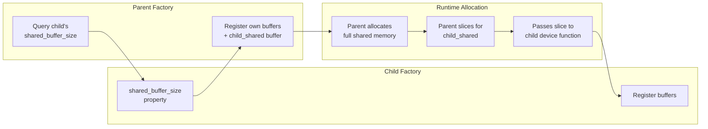

# Buffer Registry Refactor: Unified Buffer Management System

## User Stories

### US-1: Centralized Buffer Registration
**As a** CuBIE developer  
**I want** a single package-wide BufferRegistry singleton  
**So that** all CUDA factories register their buffer requirements in one place, eliminating duplicate merge functions and inconsistent buffer management across subsystems.

**Acceptance Criteria:**
- [ ] BufferRegistry singleton accessible globally (like SummaryMetrics)
- [ ] Factory instances used as keys (not factory IDs)
- [ ] No merge functions or aggregate child buffer methods
- [ ] Registry silently ignores update requests from factories with no registered contexts

### US-2: Buffer Aliasing Support
**As a** CuBIE developer  
**I want** buffers to support aliasing other buffers  
**So that** conditional allocations (like increment_cache and rhs_cache in DIRK) can share memory efficiently without duplicating storage.

**Acceptance Criteria:**
- [ ] Buffers can specify an alias to another buffer by name
- [ ] Aliasing respects the parent buffer's location (shared or local)
- [ ] Alias tally tracks how much of each array is already aliased
- [ ] When aliasing shared: slice from shared if size permits
- [ ] When aliasing local: place aliasing array in local or persistent_local based on persistent flag

### US-3: Simplified Location Model
**As a** CuBIE developer  
**I want** only two explicit location values ("shared" and "local")  
**So that** the buffer configuration is simpler, with a separate `persistent` flag determining if a "local" buffer goes to local or persistent_local.

**Acceptance Criteria:**
- [ ] Only "shared" and "local" as location values
- [ ] `persistent: bool = False` flag controls local vs persistent_local
- [ ] persistent_local is a property of local buffers, not a separate location
- [ ] Error if persistent local requested but parent doesn't support it

### US-4: Lazy Cached Build Pattern
**As a** CuBIE developer  
**I want** the registry to use lazy cached builds for slice/layout objects  
**So that** there is no version tracking overhead, and layouts are regenerated only when needed.

**Acceptance Criteria:**
- [ ] No version tracking in the registry
- [ ] Slice/layout objects set to None when any buffer is changed
- [ ] On fetch of slices, regenerate if None
- [ ] Consistent with CUDAFactory's lazy build pattern

### US-5: CUDA-Compatible Allocator Functions
**As a** CuBIE developer  
**I want** the registry to provide CUDA-compatible allocator functions  
**So that** buffers can be allocated at runtime using the exact pattern required by Numba CUDA.

**Acceptance Criteria:**
- [ ] Allocator functions follow the exact pattern specified (see Architecture)
- [ ] Compile-time branching based on location flags
- [ ] Support for shared, persistent_local, and local allocations
- [ ] Returns inline CUDA device function

### US-6: Complete Migration
**As a** CuBIE developer  
**I want** all traces of old BufferSettings removed  
**So that** the codebase is clean without deprecated code or backward compatibility shims.

**Acceptance Criteria:**
- [ ] All CUDAFactories use new BufferRegistry
- [ ] Old BufferSettings classes removed from source
- [ ] Tests updated or removed as appropriate
- [ ] No deprecation warnings - complete replacement

---

## Executive Summary

This refactoring replaces the distributed BufferSettings system with a centralized BufferRegistry singleton. The current approach has each subsystem (loops, algorithms, linear solvers) maintaining its own buffer settings, requiring complex merge functions and duplicating buffer management logic.

The new architecture provides:
1. **Single source of truth** - One registry manages all buffer metadata
2. **Buffer aliasing** - Efficient memory reuse for conditional allocations
3. **Simplified location model** - Two locations (shared/local) with a persistent flag
4. **Lazy cached builds** - No version tracking, regenerate on demand
5. **CUDA-compatible allocators** - Device functions that allocate from correct memory

---

## Architecture Overview

```mermaid
flowchart TB
    subgraph Singleton["BufferRegistry Singleton"]
        BR[BufferRegistry]
        BC[BufferContexts<br/>Dict[factory, List[BufferEntry]]]
        SL[SliceLayouts<br/>cached, nullable]
    end
    
    subgraph Factories["CUDAFactory Hierarchy"]
        BSK[BatchSolverKernel]
        SIR[SingleIntegratorRun]
        LOOP[IVPLoop]
        ALGO[Algorithm Steps]
        NS[Newton Solver]
        LS[Linear Solver]
    end
    
    BSK -->|register buffers| BR
    SIR -->|register buffers| BR
    LOOP -->|register buffers| BR
    ALGO -->|register buffers| BR
    NS -->|register buffers| BR
    LS -->|register buffers| BR
    
    BR -->|get_allocator| BSK
    BR -->|get_allocator| SIR
    BR -->|shared_buffer_size| LOOP
    BR -->|local_buffer_size| LOOP
```

---

## Parent-Child Buffer Relationship



---

## Aliasing System

```mermaid
flowchart TB
    subgraph Registration
        B1[Register 'solver_scratch'<br/>size=100, location=shared]
        B2[Register 'stage_rhs'<br/>size=n, aliases='solver_scratch']
        B3[Register 'increment_cache'<br/>size=n, aliases='solver_scratch']
    end
    
    subgraph AliasTracking["Alias Tracking"]
        T1[solver_scratch: offset=0, size=100]
        T2[stage_rhs: offset=0, size=n<br/>aliases solver_scratch[0:n]]
        T3[increment_cache: offset=n, size=n<br/>aliases solver_scratch[n:2n]]
    end
    
    B1 --> T1
    B2 --> T2
    B3 --> T3
    
    subgraph Result["Resulting Slices"]
        S1[solver_scratch: slice(0, 100)]
        S2[stage_rhs: slice(0, n)]
        S3[increment_cache: slice(n, 2n)]
    end
    
    T1 --> S1
    T2 --> S2
    T3 --> S3
```

---

## Memory Location Flow

```mermaid
flowchart TD
    REG[Register Buffer<br/>name, size, location, persistent, aliases]
    
    REG --> LOC{location?}
    
    LOC -->|shared| SHARED[Add to shared pool]
    LOC -->|local| PERS{persistent?}
    
    PERS -->|True| PERSISTENT[Add to persistent_local pool]
    PERS -->|False| LOCAL[Add to local pool]
    
    SHARED --> SIZE1[shared_buffer_size += size]
    PERSISTENT --> SIZE2[persistent_local_buffer_size += size]
    LOCAL --> SIZE3[local_buffer_size += max(size, 1)]
```

---

## CUDA Allocator Pattern

The allocator functions must follow this exact pattern for CUDA compatibility:

```python
def allocate(self):
    # Compile-time constants from buffer entry
    _shared = self.location == 'shared'
    _local = self.location == 'local' and not self.persistent
    _persistent = self.location == 'local' and self.persistent

    # Pre-computed values
    shared_slice = self.shared_slice
    persistent_local_slice = self.persistent_local_slice
    local_size = int(self.local_size)
    precision = self.precision

    @cuda.jit(device=True, inline=True, ForceInline=True, **compile_kwargs)
    def allocate_buffer(shared_parent, persistent_parent):
        if _shared:
            array = shared_parent[shared_slice]
        elif _persistent:
            array = persistent_parent[persistent_local_slice]
        else:
            array = cuda.local.array(local_size, precision)
        return array
    
    return allocate_buffer
```

---

## Key Technical Decisions

### 1. Factory Instance as Key
Using the factory instance (not ID) as the registry key allows functions to use `self` directly when interacting with the registry. This is cleaner than requiring factories to track their own IDs.

### 2. Three Separate Size Properties
Instead of a parameterized `buffer_size(location)` method, provide three explicit properties:
- `shared_buffer_size`
- `local_buffer_size`
- `persistent_local_buffer_size`

This matches the distinct use cases for each memory type and avoids runtime branching.

### 3. No Merge Functions
Parent factories query child size properties directly and register their own `child_shared` buffer with that size. No registry-level merge or aggregate functions.

### 4. Silent Ignore for Unregistered Updates
The registry silently ignores update requests from factories with no registered contexts, preventing errors during partial initialization sequences.

### 5. Trust Parent for Persistent Local
If an object is in persistent_local, it trusts the parent has properly allocated space. Error only if access fails, not during registration.

---

## Trade-offs Considered

| Approach | Pros | Cons | Decision |
|----------|------|------|----------|
| Per-factory BufferSettings | Encapsulated | Merge complexity, duplication | Reject |
| Centralized registry with factory ID | Clear ownership | Requires ID tracking | Reject |
| Centralized registry with factory instance | Self-referential | Relies on identity | **Accept** |
| Version tracking for cache | Explicit invalidation | Overhead, complexity | Reject |
| Lazy cached build | Simple, on-demand | Potential rebuild cost | **Accept** |

---

## Files to Migrate (Complete List)

### Core Infrastructure
- `src/cubie/BufferSettings.py` → Remove entirely

### New Files
- `src/cubie/buffer_registry.py` → New centralized registry

### Algorithm Files
- `src/cubie/integrators/algorithms/backwards_euler.py`
- `src/cubie/integrators/algorithms/backwards_euler_predict_correct.py`
- `src/cubie/integrators/algorithms/crank_nicolson.py`
- `src/cubie/integrators/algorithms/explicit_euler.py`
- `src/cubie/integrators/algorithms/generic_dirk.py`
- `src/cubie/integrators/algorithms/generic_erk.py`
- `src/cubie/integrators/algorithms/generic_firk.py`
- `src/cubie/integrators/algorithms/generic_rosenbrock_w.py`
- `src/cubie/integrators/algorithms/ode_explicitstep.py`
- `src/cubie/integrators/algorithms/ode_implicitstep.py`

### Instrumented Test Copies
- `tests/integrators/algorithms/instrumented/` (all files)

### Matrix-Free Solvers
- `src/cubie/integrators/matrix_free_solvers/linear_solver.py`
- `src/cubie/integrators/matrix_free_solvers/newton_krylov.py`

### Loop Files
- `src/cubie/integrators/loops/ode_loop.py`
- `src/cubie/integrators/loops/ode_loop_config.py`

### Batch Solving
- `src/cubie/batchsolving/BatchSolverKernel.py`
- `src/cubie/batchsolving/solver.py`
- `src/cubie/batchsolving/SystemInterface.py`

### Output Handling
- `src/cubie/outputhandling/output_functions.py`

### Integrator Core
- `src/cubie/integrators/SingleIntegratorRun.py`
- `src/cubie/integrators/SingleIntegratorRunCore.py`

---

## Expected Impact on Existing Architecture

1. **CUDAFactory base class** - No changes needed; registry is independent
2. **Compile settings** - May simplify as buffer locations move to registry
3. **Memory management** - Registry coordinates with MemoryManager for shared memory sizing
4. **Build methods** - Factories call `registry.get_allocator(name, self)` instead of managing slices directly
5. **Test fixtures** - Update to work with registry pattern

---

## References

- Current BufferSettings: `src/cubie/BufferSettings.py`
- SummaryMetrics pattern: `src/cubie/outputhandling/summarymetrics/metrics.py`
- MemoryManager pattern: `src/cubie/memory/mem_manager.py`
- DIRK aliasing example: `src/cubie/integrators/algorithms/generic_dirk.py`
