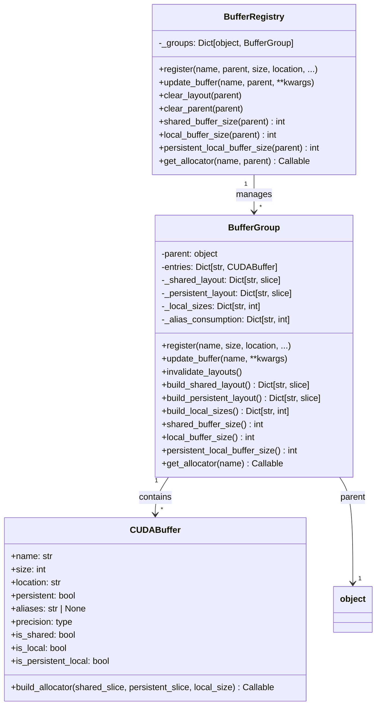
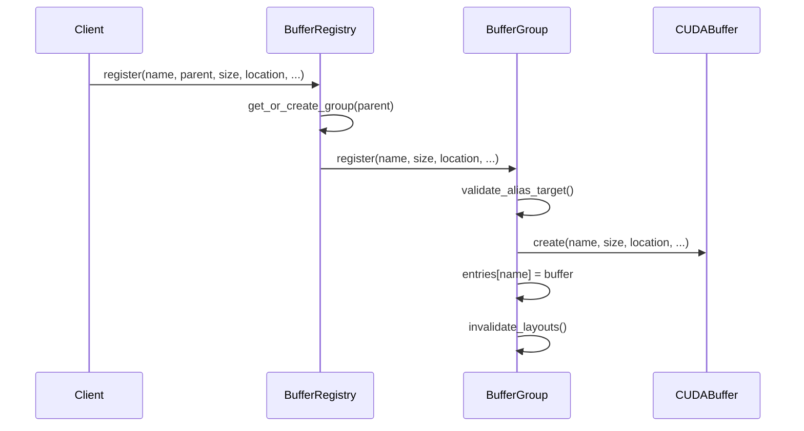
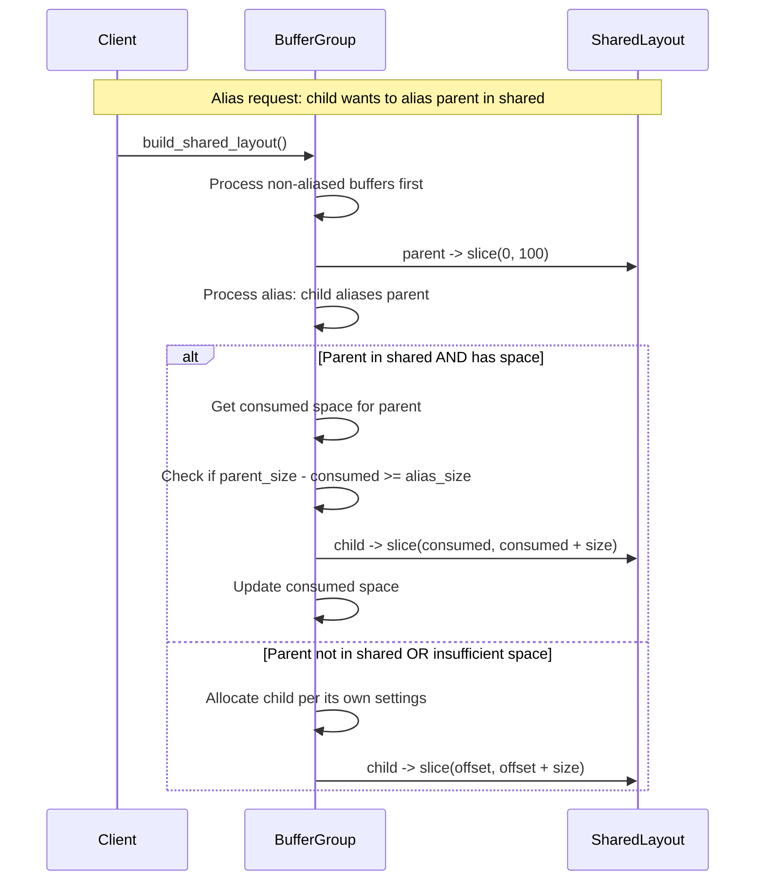

# Buffer Registry Architecture Refactor - Human Overview

## User Stories

### US-1: Clearer Buffer Class Naming
**As a** developer working with CUDA buffer management  
**I want** class names that accurately describe their purpose  
**So that** I can understand the buffer management system at a glance

**Acceptance Criteria:**
- BufferEntry is renamed to CUDABuffer
- BufferContext is renamed to BufferGroup
- All references in the codebase are updated

### US-2: Decoupled Buffer Ownership
**As a** developer  
**I want** buffer metadata to not contain references to their owning factory  
**So that** buffers are simpler data objects without circular dependencies

**Acceptance Criteria:**
- CUDABuffer (formerly BufferEntry) does not have a `factory` attribute
- Ownership is tracked at the BufferGroup level
- The attribute referencing the owning object is named `parent` instead of `factory`

### US-3: Logical Method Organization
**As a** developer maintaining the buffer system  
**I want** buffer operations to live on the objects they naturally belong to  
**So that** the code follows proper object-oriented design

**Acceptance Criteria:**
- Layout building methods (`_build_shared_layout`, `_build_persistent_layout`, `_build_local_sizes`) live on BufferGroup
- Size calculation methods (`shared_buffer_size`, `local_buffer_size`, `persistent_local_buffer_size`) live on BufferGroup
- Allocation logic (`get_allocator`) core functionality lives on CUDABuffer
- BufferRegistry provides thin wrapper methods that find the appropriate group and delegate

### US-4: Cross-Location Aliasing Support
**As a** developer using buffer aliasing  
**I want** to alias any parent buffer regardless of memory location  
**So that** I have flexibility in buffer reuse patterns

**Acceptance Criteria:**
- An alias can reference a parent buffer in any location (shared or local)
- If the parent is shared and large enough, the alias is allocated as a slice of the parent
- If the parent is shared but not large enough, the alias is allocated according to its own location/persistent settings
- If the parent is local, the alias is allocated according to its own location/persistent settings
- Multiple aliases of the same parent are allocated first-come-first-serve within the parent's space
- Alias consumption is tracked to determine if subsequent aliases fit within the parent

---

## Executive Summary

This refactor restructures the buffer registry system to improve naming clarity, follow object-oriented design principles, and fix the aliasing logic. The changes are purely internal to `buffer_registry.py` - this is Task 1 of 3 and does not touch integrations or solver plumbing.

## Architecture Diagram

## Data Flow: Registration

## Data Flow: Aliasing with New Logic

## Key Technical Decisions

### 1. Factory → Parent Rename
The term "factory" is confusing because it doesn't accurately describe the relationship. The owning object is a "parent" of the buffer group. This is a pure naming change with no semantic difference.

### 2. BufferGroup Does Not Need factory Field
After investigation, the BufferGroup's `factory` field is used only to pass the factory reference when creating BufferEntry objects. Since we're removing the factory from CUDABuffer, BufferGroup also doesn't need to store it explicitly - it's the key in the registry's `_groups` dict.

However, we need the parent reference for error messages and for the delegate pattern where BufferRegistry wrappers call group methods. The `parent` field will be retained on BufferGroup for these purposes.

### 3. Aliasing Logic Overhaul
The current logic has several constraints that don't match the desired behavior:
- Current: Aliasing shared requires child to be shared
- Current: Aliasing local requires child to be local (or compatible persistent)
- Desired: Any buffer can alias any parent, with fallback allocation when aliasing isn't possible

The new logic:
1. Store alias reference on CUDABuffer regardless of parent/child locations
2. At layout build time, check if aliasing is feasible (parent in shared, sufficient space)
3. If feasible, allocate alias as slice of parent
4. If not feasible, allocate according to the buffer's own location/persistent settings

### 4. Method Placement
Methods move from BufferRegistry to BufferGroup:
- `_build_shared_layout` → `build_shared_layout` (public)
- `_build_persistent_layout` → `build_persistent_layout` (public)  
- `_build_local_sizes` → `build_local_sizes` (public)
- `shared_buffer_size` → stays on both (registry wraps group)
- `local_buffer_size` → stays on both (registry wraps group)
- `persistent_local_buffer_size` → stays on both (registry wraps group)
- `get_allocator` → core logic moves to CUDABuffer.build_allocator, orchestration stays on BufferGroup

### 5. Allocator Logic Split
The `get_allocator` method currently does:
1. Find context (registry responsibility)
2. Ensure layouts are computed (group responsibility)
3. Look up slices/sizes (group responsibility)
4. Compile CUDA device function (buffer responsibility)

After refactor:
- `BufferRegistry.get_allocator(name, parent)` → finds group, calls `group.get_allocator(name)`
- `BufferGroup.get_allocator(name)` → ensures layouts computed, gets slices, calls `buffer.build_allocator(...)`
- `CUDABuffer.build_allocator(shared_slice, persistent_slice, local_size)` → compiles and returns the device function

## Trade-offs and Alternatives

### Alternative: Keep factory on CUDABuffer
**Rejected** because:
- Creates circular dependency (buffer → factory → registry → buffer)
- Factory reference is never used by buffer methods
- Violates single responsibility - buffer is just metadata

### Alternative: Make aliasing validation strict at registration time
**Rejected** because:
- Desired behavior allows any buffer to alias any other
- Runtime layout building is the appropriate place for feasibility checks
- Registration should just record intent; layout building resolves actual allocation

### Alternative: Pass parent reference through all methods
**Rejected** because:
- Verbose and error-prone
- BufferGroup already knows its parent (stored at creation)
- Key is implicitly the parent in the registry dict

## Expected Impact on Architecture

1. **No external API changes** - `buffer_registry.register()` signature stays the same (except factory → parent parameter name)
2. **Internal reorganization** - Methods move between classes but behavior is equivalent (except aliasing)
3. **Aliasing behavior change** - More flexible aliasing with fallback allocation
4. **Test updates required** - Tests reference old class names and will need updates

## Files Modified

This task modifies only:
- `src/cubie/buffer_registry.py`
- `tests/test_buffer_registry.py`

Task 2 and Task 3 will handle:
- Integration with algorithm files
- Solver.py plumbing
- Loop files
- Matrix-free solvers

## Research Notes

### Current Usage Patterns
- Algorithms register buffers during `__init__`
- `buffer_registry.clear_factory(self)` called before re-registering
- Allocators obtained via `buffer_registry.get_allocator(name, self)` in `build()` methods
- Size queries via `buffer_registry.shared_buffer_size(self)` etc.

### Aliasing Current Behavior
- Registration validates type compatibility (shared→shared, local→local)
- Layout building processes non-aliased first, then aliases
- Aliases slice into parent starting at consumed offset
- No overflow checking - alias can exceed parent size (bug)

### Aliasing Desired Behavior  
- Registration allows any alias relationship
- Layout building checks parent location and available space
- If parent is shared and has space: allocate as slice
- Otherwise: allocate according to alias's own settings
- First-come-first-serve consumption tracking
