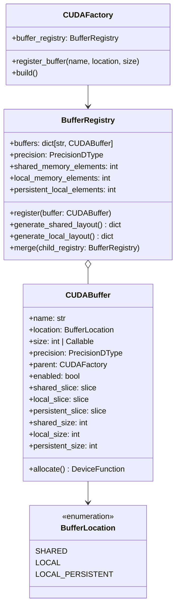
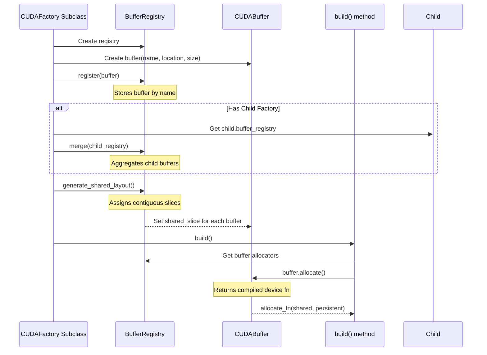
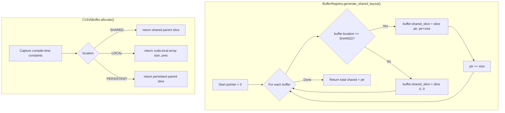

# Buffer Registry Refactor - Human Overview

## User Stories

### US-1: As a CuBIE developer, I want a unified buffer abstraction so that I can define buffer requirements without duplicating memory location logic across multiple BufferSettings subclasses.

**Acceptance Criteria:**
- Single `CUDABuffer` class encapsulates all buffer metadata (size, location, slices)
- Buffer location (shared/local/local_persistent) is specified once per buffer
- Size calculation is deferred and callable, not hardcoded
- Buffer can generate its own shared/local slice indices

### US-2: As a CuBIE developer, I want a centralized buffer registry so that composite components can aggregate their children's buffer requirements automatically.

**Acceptance Criteria:**
- `BufferRegistry` collects buffers from parent and child components
- Registry provides aggregate `shared_memory_elements` and `local_memory_elements`
- Registry generates contiguous slice layouts for shared memory
- Nested buffer requirements (e.g., DIRK → Newton → LinearSolver) are handled transparently

### US-3: As a CuBIE developer, I want buffer allocation to compile down to a single CUDA instruction so that there is zero performance overhead.

**Acceptance Criteria:**
- `CUDABuffer.allocate()` returns a JIT-compiled device function
- The allocation function branches on compile-time constants only
- No runtime conditionals in the hot path after compilation
- Generated PTX shows single allocation per buffer (verifiable via Numba inspection)

### US-4: As a CUDAFactory implementer, I want simple helpers to register and retrieve buffers so that factory subclasses have minimal boilerplate.

**Acceptance Criteria:**
- CUDAFactory gains a `buffer_registry` property (lazy-initialized)
- Simple `register_buffer()` method or declarative pattern for defining buffers
- Child factories can pass their registries to parent for composition
- Backward-compatible fallback for factories not using new system initially

### US-5: As an algorithm author, I want to specify conditional buffer allocation so that optional buffers (e.g., DIRK increment_cache for FSAL) only consume memory when needed.

**Acceptance Criteria:**
- Buffers support a `condition` or `enabled` callback for conditional allocation
- Disabled buffers contribute zero to memory totals
- Conditional logic is resolved at build time, not runtime
- Existing conditional patterns (e.g., `has_rhs_in_scratch`) migrate cleanly

---

## Executive Summary

This refactor replaces the scattered `BufferSettings` hierarchy with a unified `CUDABuffer` + `BufferRegistry` system. The current system suffers from:

1. **Duplication**: Each algorithm/solver defines its own BufferSettings subclass with nearly identical patterns
2. **Coupling**: Buffer slicing logic is embedded in multiple locations
3. **Complexity**: Nested buffer requirements (DIRK → Newton → Linear) require manual threading of settings
4. **Boilerplate**: 12+ location attributes per class, with repetitive boolean properties and size calculations

The new system introduces:
- **CUDABuffer**: Single class representing any buffer with location, size, and slice generation
- **BufferRegistry**: Aggregates buffers, computes totals, and generates slice layouts
- **Compile-time allocation**: `allocate()` returns device functions with constants baked in

---

## Architecture Overview



---

## Data Flow: Buffer Registration and Allocation



---

## Memory Layout Generation



---

## Key Technical Decisions

### 1. Size as Callable vs Integer

**Decision**: Support both `int` and `Callable[[], int]` for size specification.

**Rationale**: 
- Simple buffers have fixed sizes known at definition time
- Complex buffers (e.g., accumulator = `(stage_count - 1) * n`) need deferred calculation
- Callable form allows size to depend on other config attributes

**Example**:
```python
# Fixed size
CUDABuffer(name="state", size=n, ...)

# Deferred size - evaluated when registry generates layout
CUDABuffer(name="accumulator", size=lambda: (self.stage_count - 1) * self.n, ...)
```

### 2. Enum vs String for Location

**Decision**: Use `BufferLocation` enum instead of string literals.

**Rationale**:
- Type safety prevents typos ('sahred' instead of 'shared')
- Enables IDE autocompletion
- Clear extension point for future location types
- Compatible with existing validators pattern

### 3. Registry Composition Strategy

**Decision**: Parent registries merge child registries via `merge()` method.

**Rationale**:
- DIRK needs Newton needs LinearSolver buffers
- Each component owns its buffer definitions
- Parent merges children to get aggregate totals
- Slices are generated after all merges complete

### 4. Allocation Device Function Generation

**Decision**: `allocate()` returns a device function with baked-in constants.

**Rationale**:
- All branching happens at compile time via closure capture
- No performance overhead - compiles to single instruction
- Matches existing pattern in ode_loop.py (lines 954-1046)

---

## Trade-offs and Alternatives Considered

### Alternative 1: Inheritance-based BufferSettings (Current)

**Pros**: Already implemented, explicit about each buffer
**Cons**: Massive duplication, 6+ subclasses with similar code

### Alternative 2: Decorator-based Buffer Declaration

```python
@buffer("state", location="local", size_attr="n")
@buffer("accumulator", location="shared", size_expr="(stage_count-1)*n")
class DIRKStep(ODEImplicitStep):
    ...
```

**Pros**: Very declarative, minimal boilerplate
**Cons**: Metaclass complexity, harder to debug, doesn't compose well for nested buffers

### Alternative 3: Mixin-based Buffer Traits

**Pros**: Composable via multiple inheritance
**Cons**: Diamond inheritance issues, unclear precedence for slicing

**Selected Approach**: Composition via BufferRegistry (Alternative implicit in proposal)
- Explicit registration is clearer than decorators
- Composition handles nesting better than inheritance
- Maintains compatibility with existing CUDAFactory pattern

---

## Migration Path

### Phase 1: Core Infrastructure
- Implement `CUDABuffer` and `BufferRegistry` in new module
- Keep existing BufferSettings working unchanged

### Phase 2: CUDAFactory Integration  
- Add `buffer_registry` property to CUDAFactory base
- Add helper methods for registration

### Phase 3: Algorithm Migration (one at a time)
1. LinearSolver → simple, 2 buffers
2. Newton → depends on LinearSolver
3. ERK → explicit only, no solver nesting
4. DIRK → implicit, tests nested composition
5. FIRK, Rosenbrock → similar to DIRK
6. LoopBufferSettings → most complex, 12+ buffers

### Phase 4: Cleanup
- Remove old BufferSettings classes
- Update tests

---

## Impact on Existing Architecture

### Minimal Changes
- CUDAFactory gains optional buffer_registry property
- Existing factories not using buffers are unaffected

### Removed
- `BufferSettings` base class and all subclasses
- `LocalSizes` and `SliceIndices` subclasses
- Scattered `calculate_shared_indices()` implementations

### Preserved
- Device function compilation pattern
- Compile-time constant capture
- Memory location concept (shared/local/persistent)
- Nested buffer composition (DIRK → Newton → Linear)

---

## References

- Current BufferSettings: `src/cubie/BufferSettings.py`
- Loop buffer pattern: `src/cubie/integrators/loops/ode_loop.py` (lines 154-611)
- Proposed partial implementation in issue description
- CUDAFactory base: `src/cubie/CUDAFactory.py`
