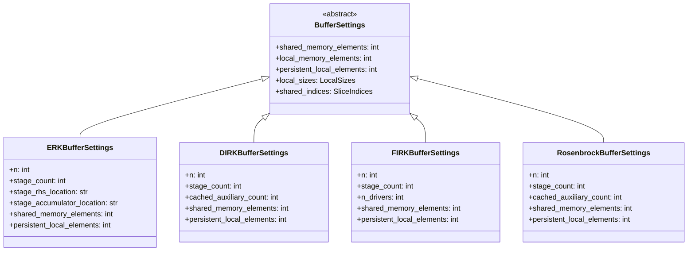
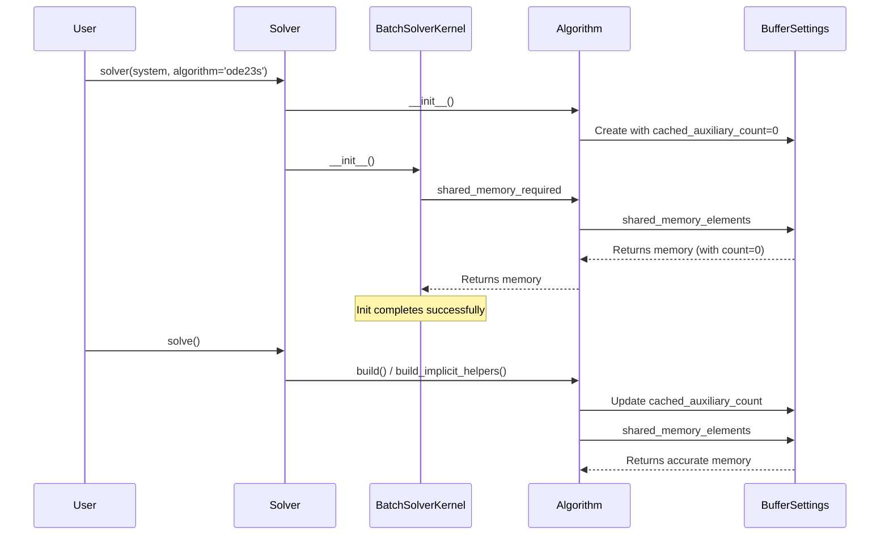

# Buffer Settings Memory Delegation

## User Stories

### Story 1: Rosenbrock Solver Initialization
**As a** CuBIE user  
**I want to** instantiate a Rosenbrock solver using `cubie.solver(system, algorithm='ode23s')`  
**So that** I can run Rosenbrock-W integration without initialization errors

**Acceptance Criteria:**
- Solver instantiation completes without errors
- Memory requirements are correctly calculated at init time (with cached_auxiliary_count=0)
- Memory requirements remain accurate after build (with actual cached_auxiliary_count)
- CUDA kernels compile and run correctly with calculated shared memory

### Story 2: Consistent Memory Property Pattern
**As a** CuBIE developer  
**I want to** have all implicit algorithm classes (DIRK, FIRK, Rosenbrock) follow the same memory delegation pattern as ERK  
**So that** memory calculations are consistent and maintainable across all algorithm types

**Acceptance Criteria:**
- `shared_memory_required` properties delegate to `buffer_settings.shared_memory_elements`
- `persistent_local_required` properties delegate to `buffer_settings.persistent_local_elements`
- No manual memory calculations duplicated across algorithm properties and BufferSettings

### Story 3: Accurate Memory at Init vs Build Time
**As a** CuBIE developer  
**I want to** ensure memory queries work correctly at both init time and build time  
**So that** BatchSolverKernel can correctly allocate memory before the algorithm is fully built

**Acceptance Criteria:**
- At init time: cached_auxiliary_count defaults to 0, memory returns minimal safe value
- At build time: cached_auxiliary_count is set to actual value, memory is accurate
- Buffer settings are updated when cached_auxiliary_count is determined

---

## Overview

### Executive Summary

The current implementation has an inconsistency in how memory requirements are calculated across different algorithm types. ERK correctly delegates to `buffer_settings.shared_memory_elements`, but DIRK, FIRK, and Rosenbrock calculate memory manually in their `shared_memory_required` properties. This creates:

1. **Maintenance burden**: Two places to update when memory logic changes
2. **Potential mismatches**: Manual calculations may not match BufferSettings calculations
3. **Init-time errors**: BatchSolverKernel queries memory before build, but cached_auxiliary_count isn't available until build

### Architecture Overview

### Data Flow

### Key Technical Decisions

1. **Add persistent_local_elements to BufferSettings ABC**: The base class should define this abstract property for consistency.

2. **Add cached_auxiliary_count to DIRKBufferSettings**: DIRK also uses cached auxiliaries but its BufferSettings doesn't include them (unlike Rosenbrock).

3. **Update memory properties to delegate**: Change `shared_memory_required` and `persistent_local_required` in DIRK, FIRK, and Rosenbrock to simply return the values from `buffer_settings`.

4. **Ensure BufferSettings updates are propagated**: When `build_implicit_helpers()` sets `_cached_auxiliary_count`, it must also update `buffer_settings.cached_auxiliary_count`.

### Trade-offs Considered

**Option A: Delegate all memory to BufferSettings (Chosen)**
- Pros: Single source of truth, consistent pattern, easier maintenance
- Cons: BufferSettings must be complete and accurate

**Option B: Keep manual calculations**
- Pros: Algorithm has direct control over memory
- Cons: Duplicated logic, maintenance burden, potential mismatches

### Expected Impact

- **DIRK, FIRK, Rosenbrock algorithms**: Properties simplified to single-line delegation
- **BufferSettings classes**: May need persistent_local_elements property added
- **BatchSolverKernel**: No changes needed - already queries algorithm properties
- **Instrumented test algorithms**: Must be updated to match source changes

### References

- Issue describes testing bug where using buffer_settings caused "invalid address" errors
- This suggests possible mismatch between BufferSettings calculation and actual needs
- Investigation needed: verify BufferSettings calculations match manual calculations exactly
