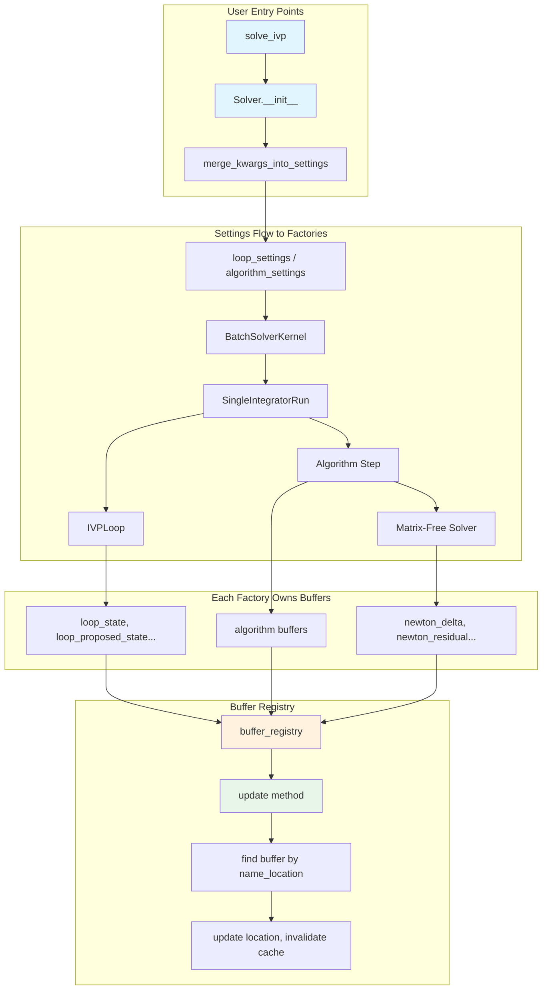
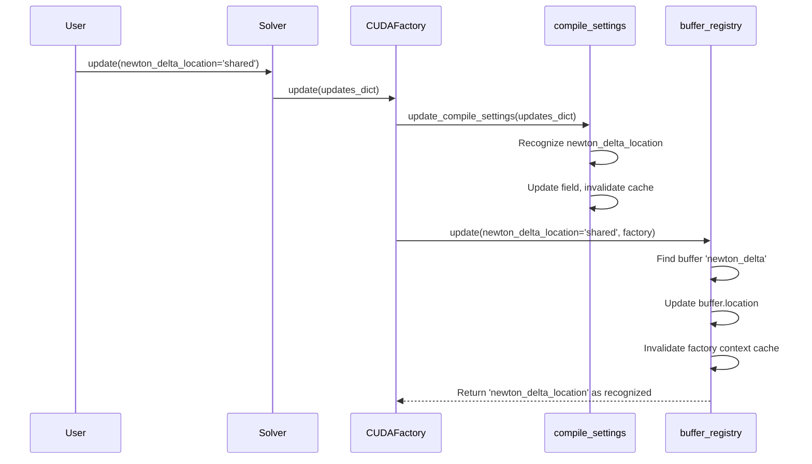

# Buffer Settings Plumbing - Human Overview

## User Stories

### US-1: User-Specified Buffer Locations via solve_ivp
**As a** CuBIE user  
**I want** to specify buffer memory locations (shared vs local) through keyword arguments to `solve_ivp()` and `Solver()`  
**So that** I can optimize memory usage for my specific hardware and problem size without editing internal code

**Acceptance Criteria:**
- Keywords like `state_location='shared'` can be passed to `solve_ivp()` and `Solver()`
- These keywords flow through to the buffer registry during compilation
- Invalid location values raise clear error messages
- Each CUDAFactory subclass owns its buffers and recognizes its own location keywords

### US-2: Integration with Argument Filtering System
**As a** CuBIE developer  
**I want** buffer location keywords to use the existing argument-filtering utilities (`split_applicable_settings`, `merge_kwargs_into_settings`)  
**So that** they follow the same patterns as other solver parameters without introducing new handling logic

**Acceptance Criteria:**
- Buffer location keywords are joined to each CUDAFactory's existing arguments (not in a separate dict)
- Keywords are recognized by existing utility functions and flow through properly
- `solver.update(state_location='local')` works identically to `solver.update(dt_save=0.01)`
- No separate "buffer location kwargs" dict; locations are normal compile settings

### US-3: Each CUDAFactory Owns Its Buffers
**As a** CuBIE developer  
**I want** each CUDAFactory subclass to own its own buffers and their location settings  
**So that** the buffer registry holds per-factory information and location updates flow through the standard `update_compile_settings()` mechanism

**Acceptance Criteria:**
- Only IVPLoop-assigned buffers have location keywords exposed at the IVPLoop level
- Algorithm buffers have location keywords exposed at the algorithm level (compile settings)
- Matrix-free solver buffers have location keywords exposed at the solver factory level
- The `update()` method in BufferRegistry handles location changes identically to `update_compile_settings()`

### US-4: Unified Update Pattern via BufferRegistry.update()
**As a** CuBIE developer  
**I want** buffer location updates to use a new `update()` method on BufferRegistry that mirrors `update_compile_settings()`  
**So that** location parameters are not treated differently from other compile settings

**Acceptance Criteria:**
- BufferRegistry has an `update()` method that:
  - Finds CUDABuffer objects where a keyword matches `[buffer.name]_location`
  - Updates the buffer's location
  - Invalidates that context's cache
  - Returns the keyword as recognized
- The pattern matches existing `update()` and `update_compile_settings()` logic exactly
- No cluttered `if location is not None:` checks in `__init__` methods

---

## Executive Summary

This task implements the plumbing that allows users to specify buffer memory locations through the solver API. The scope extends to **ALL CUDAFactory subclasses** that register buffers:

1. **IVPLoop** (`src/cubie/integrators/loops/ode_loop.py`) - loop-level buffers
2. **Algorithm step classes** (`src/cubie/integrators/algorithms/`) - algorithm buffers
3. **Matrix-free solvers** (`src/cubie/integrators/matrix_free_solvers/`) - solver buffers
4. **BatchSolverKernel** (`src/cubie/batchsolving/BatchSolverKernel.py`) - kernel-level coordination
5. **Instrumented test versions** (`tests/integrators/algorithms/instrumented/`) - mirrored changes

## CRITICAL Design Principle

**Buffer location parameters are NOT a separate thing from other compile settings (like `dt_save`). Ownership, init, and update should match exactly.**

This means:
1. Do NOT create separate buffer-location keyword arg dicts
2. Do NOT clutter `__init__` with `if state_location is not None:` noise
3. Do NOT have a separate location-param-to-buffer mapping dict
4. DO join buffer location kwargs to each factory's existing argument filtering
5. DO use existing `split_applicable_settings()` and `merge_kwargs_into_settings()` utilities
6. DO add an `update()` method to BufferRegistry that mirrors compile settings update pattern

## Architecture Diagram



## Data Flow: Buffer Location Update



## Scope: All CUDAFactory Subclasses

### 1. IVPLoop (`src/cubie/integrators/loops/ode_loop.py`)
**Buffers owned:**
- `loop_state`, `loop_proposed_state`
- `loop_parameters`, `loop_drivers`, `loop_proposed_drivers`
- `loop_observables`, `loop_proposed_observables`
- `loop_error`, `loop_counters`
- `loop_state_summary`, `loop_observable_summary`

**Location keywords exposed:** All 11 loop buffer locations

### 2. Algorithm Step Classes (`src/cubie/integrators/algorithms/`)
**Files:**
- `backwards_euler.py`, `backwards_euler_predict_correct.py`
- `crank_nicolson.py`, `explicit_euler.py`
- `generic_dirk.py`, `generic_erk.py`, `generic_firk.py`
- `generic_rosenbrock_w.py`
- `ode_explicitstep.py`, `ode_implicitstep.py`

**Buffers:** Algorithm-specific scratch buffers (varies per algorithm)

### 3. Matrix-Free Solvers (`src/cubie/integrators/matrix_free_solvers/`)
**Files:**
- `linear_solver.py` - GMRES/Krylov buffers
- `newton_krylov.py` - Newton iteration buffers

**Buffers owned (newton_krylov.py example):**
- `newton_delta`, `newton_residual`
- `newton_residual_temp`, `newton_stage_base_bt`

### 4. BatchSolverKernel (`src/cubie/batchsolving/BatchSolverKernel.py`)
**Role:** Coordinates settings flow; delegates to SingleIntegratorRun

### 5. Instrumented Test Versions (`tests/integrators/algorithms/instrumented/`)
**Files (must mirror source changes):**
- `backwards_euler.py`, `backwards_euler_predict_correct.py`
- `crank_nicolson.py`, `explicit_euler.py`
- `generic_dirk.py`, `generic_erk.py`, `generic_firk.py`
- `generic_rosenbrock_w.py`, `matrix_free_solvers.py`

## Key Technical Decisions

### 1. BufferRegistry Gets an `update()` Method

The new method:
```python
def update(
    self,
    factory: object,
    updates_dict: dict = None,
    **kwargs
) -> Set[str]:
    """Update buffer locations from keyword arguments.
    
    For each key of form '[buffer_name]_location', finds the buffer
    and updates its location. Returns set of recognized keywords.
    Invalidates factory context cache when locations change.
    """
```

This copies the pattern from `CUDAFactory.update_compile_settings()`.

### 2. Each Factory Joins Location Args to Existing Filtering

Instead of:
```python
# BAD: Separate handling
buffer_location_kwargs = {k: v for k, v in kwargs.items() 
                          if k in ALL_BUFFER_LOCATION_PARAMETERS}
```

Use:
```python
# GOOD: Join to existing args
applicable, _, _ = split_applicable_settings(self.__init__, {
    **existing_settings,
    # Location kwargs naturally included in signature
})
```

### 3. No Default Scattered Across Codebase

Factory `__init__` signatures have location parameters with defaults:
```python
def __init__(
    self,
    ...,
    delta_location: str = 'local',
    residual_location: str = 'local',
    ...
):
```

The compile_settings attrs class holds the same defaults. This is acceptable because:
- attrs classes ARE the compile settings
- The `__init__` default matches the attrs field default
- No duplication; just consistent defaults

### 4. Location Updates Use Dual Path

When `solver.update(newton_delta_location='shared')` is called:
1. `update_compile_settings()` recognizes and updates the field in compile_settings
2. `buffer_registry.update()` finds the buffer and updates its location
3. Both paths invalidate cache; the rebuild uses the new location

## Trade-offs and Alternatives Considered

### Alternative: Central location keyword registry
**Rejected** because:
- Each factory should own its own buffer locations
- Central registry would require factories to declare keywords externally
- Goes against "each factory owns its buffers" principle

### Alternative: Separate BufferLocationSettings container
**Rejected** because:
- User feedback explicitly says "do NOT treat buffer location parameters as separate"
- Compile settings already handle the pattern

### Alternative: Auto-derive location kwargs from buffer names
**Considered but complex** because:
- Would need runtime introspection of registered buffers
- Factories register buffers in `__init__`, but kwargs are needed before that
- Simpler to explicitly list location parameters in signature

## Expected Impact

### Files Modified

**Source files (`src/cubie/`):**
1. `buffer_registry.py` - Add `update()` method
2. `integrators/loops/ode_loop.py` - Ensure location fields in compile settings
3. `integrators/loops/ode_loop_config.py` - Add location fields to ODELoopConfig
4. `integrators/algorithms/backwards_euler.py`
5. `integrators/algorithms/backwards_euler_predict_correct.py`
6. `integrators/algorithms/crank_nicolson.py`
7. `integrators/algorithms/explicit_euler.py`
8. `integrators/algorithms/generic_dirk.py`
9. `integrators/algorithms/generic_erk.py`
10. `integrators/algorithms/generic_firk.py`
11. `integrators/algorithms/generic_rosenbrock_w.py`
12. `integrators/algorithms/ode_explicitstep.py`
13. `integrators/algorithms/ode_implicitstep.py`
14. `integrators/matrix_free_solvers/linear_solver.py`
15. `integrators/matrix_free_solvers/newton_krylov.py`
16. `batchsolving/BatchSolverKernel.py`

**Instrumented test files (`tests/integrators/algorithms/instrumented/`):**
17. `backwards_euler.py`
18. `backwards_euler_predict_correct.py`
19. `crank_nicolson.py`
20. `explicit_euler.py`
21. `generic_dirk.py`
22. `generic_erk.py`
23. `generic_firk.py`
24. `generic_rosenbrock_w.py`
25. `matrix_free_solvers.py`

### Backwards Compatibility
Per project guidelines, no backwards compatibility is maintained.
