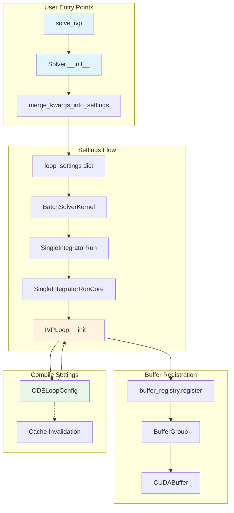
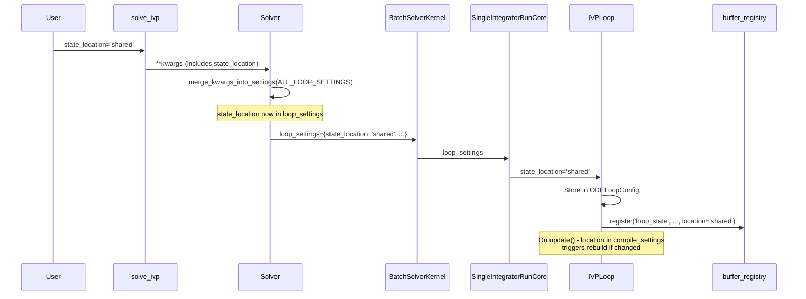

# Buffer Settings Plumbing - Human Overview

## User Stories

### US-1: User-Specified Buffer Locations via solve_ivp
**As a** CuBIE user  
**I want** to specify buffer memory locations (shared vs local) through keyword arguments to `solve_ivp()` and `Solver()`  
**So that** I can optimize memory usage for my specific hardware and problem size without editing internal code

**Acceptance Criteria:**
- Keywords like `state_location='shared'` can be passed to `solve_ivp()` and `Solver()`
- These keywords flow through to the buffer registry during compilation
- Invalid location values raise clear error messages

### US-2: Integration with Argument Filtering System
**As a** CuBIE developer  
**I want** buffer location keywords to be integrated with the existing argument-filtering system  
**So that** they follow the same patterns as other solver parameters and can be updated via `solver.update()`

**Acceptance Criteria:**
- Buffer location keywords are added to `ALL_BUFFER_LOCATION_PARAMETERS` in SingleIntegratorRunCore
- Keywords are recognized by `merge_kwargs_into_settings()` and flow through properly
- `solver.update(state_location='local')` works correctly
- Buffer locations follow the same underscore/property pattern as other compile settings where applicable

### US-3: Compile Settings as Source of Truth
**As a** CuBIE developer  
**I want** buffer location settings to be stored in compile settings objects  
**So that** cache invalidation works automatically when locations change

**Acceptance Criteria:**
- Buffer location settings are stored in appropriate compile settings attrs classes
- Changing a location triggers cache invalidation
- The default location behavior defers to the compile settings level default
- No default arguments are scattered across the codebase; compile_settings is the single source of truth

### US-4: Removal of Aliasing Logic from CUDAFactory Classes
**As a** CuBIE developer  
**I want** aliasing logic to be handled entirely by the buffer registry (Task 1)  
**So that** CUDAFactory classes focus on their core responsibility without duplicating aliasing code

**Acceptance Criteria:**
- No buffer aliasing logic remains in `ode_loop.py`, `SingleIntegratorRunCore.py`, or other CUDAFactory subclasses
- Buffers are registered with their intended location; aliasing decisions are made by the registry
- The registration calls pass location preferences that may be overridden by aliasing in the registry

---

## Executive Summary

This task (Task 2 of 3) implements the plumbing that allows users to specify buffer memory locations through the top-level solver API. The work focuses on the argument flow from `Solver` and `solve_ivp()` down to the `IVPLoop` where buffer registration occurs.

The key changes are:
1. Add buffer location keywords to the recognized parameter sets
2. Ensure these keywords flow through the settings dictionaries at each layer
3. Store location preferences in compile settings for proper cache invalidation
4. Remove any aliasing logic from CUDAFactory classes (aliasing is now handled by the registry)

## Architecture Diagram



## Data Flow: Buffer Location Keyword



## Key Technical Decisions

### 1. ALL_BUFFER_LOCATION_PARAMETERS Lives in SingleIntegratorRunCore

The set `ALL_BUFFER_LOCATION_PARAMETERS` is already defined in SingleIntegratorRunCore.py. This is the appropriate location because:
- SingleIntegratorRunCore is where buffer locations are extracted and passed to IVPLoop
- It follows the pattern of other `ALL_*_PARAMETERS` sets
- It's importable by solver.py for merge_kwargs_into_settings

### 2. Buffer Locations Flow Through loop_settings

Buffer location keywords are treated as loop settings because:
- They are consumed by IVPLoop during buffer registration
- They don't affect algorithm steps, controllers, or output functions
- They follow the same path as dt_save, dt_summarise, etc.

### 3. No Default in IVPLoop.__init__ Signature

The IVPLoop.__init__ signature currently has default values like `state_location: str = 'local'`. Per requirements:
- These defaults should be removed from the signature
- The compile settings should provide the default
- If no value is provided in kwargs, the compile settings default is used

However, this creates a chicken-and-egg problem: we need a value to create the compile settings. The solution:
- ODELoopConfig has class-level defaults as attrs field defaults
- IVPLoop.__init__ extracts location from kwargs OR uses None
- If None, the compile settings default is used

### 4. Keyword Matching for solver.update()

When `solver.update(state_location='shared')` is called:
- The keyword must be recognized by ALL_BUFFER_LOCATION_PARAMETERS
- It must flow to SingleIntegratorRunCore.update()
- SingleIntegratorRunCore.update() must pass it to IVPLoop.update()
- IVPLoop.update() must update compile_settings.state_location
- This triggers cache invalidation and rebuild with new location

### 5. No Aliasing Logic in IVPLoop

Currently IVPLoop registers buffers with explicit location parameters. Under the new design:
- IVPLoop registers buffers with their "preferred" location
- The buffer registry handles aliasing decisions
- IVPLoop does NOT calculate alias offsets or shared layout
- All of that is encapsulated in buffer_registry (Task 1)

## Trade-offs and Alternatives Considered

### Alternative: Store locations in a separate BufferSettings object
**Rejected** because:
- Adds another object to pass through the init chain
- Compile settings already handle cache invalidation
- Buffer locations are compile-critical (they affect CUDA compilation)

### Alternative: Let each CUDAFactory subclass handle its own buffer defaults
**Rejected** because:
- Violates single source of truth principle
- Makes it hard for users to override defaults
- Compile settings should be the single authority for all compile-time values

### Alternative: Keep aliasing logic in IVPLoop for specific use cases
**Rejected** because:
- Task 1 establishes the buffer registry as the authority on aliasing
- Duplicating logic leads to bugs and maintenance burden
- Registry has all the information needed to make aliasing decisions

## Expected Impact

### Files Modified
This task modifies:
- `src/cubie/batchsolving/solver.py` - Add buffer locations to recognized kwargs
- `src/cubie/integrators/SingleIntegratorRunCore.py` - Pass locations through, update() support
- `src/cubie/integrators/loops/ode_loop.py` - Store locations in compile settings
- `src/cubie/integrators/loops/ode_loop_config.py` - Add location fields to ODELoopConfig

### Files NOT Modified (handled by other tasks)
- `src/cubie/buffer_registry.py` - Task 1
- Algorithm files, matrix-free solvers - Task 3

### Backwards Compatibility
Per project guidelines, no backwards compatibility is maintained. Any code using hardcoded buffer locations will need to be updated.

## Research Notes

### Current State of ALL_BUFFER_LOCATION_PARAMETERS

From SingleIntegratorRunCore.py:
```python
ALL_BUFFER_LOCATION_PARAMETERS = {
    "state_location",
    "state_proposal_location",
    "parameters_location",
    "drivers_location",
    "drivers_proposal_location",
    "observables_location",
    "observables_proposal_location",
    "error_location",
    "counters_location",
    "state_summary_location",
    "observable_summary_location",
}
```

This set already exists but is not yet integrated into the solver-level argument filtering.

### Current IVPLoop.__init__ Signature

IVPLoop.__init__ already accepts location parameters with defaults:
```python
state_location: str = 'local',
state_proposal_location: str = 'local',
...
```

These need to be updated to not have defaults (or have None defaults with compile settings providing the actual default).

### Current merge_kwargs_into_settings Usage in solver.py

The solver currently merges:
- ALL_OUTPUT_FUNCTION_PARAMETERS → output_settings
- ALL_MEMORY_MANAGER_PARAMETERS → memory_settings
- ALL_STEP_CONTROLLER_PARAMETERS → step_settings
- ALL_ALGORITHM_STEP_PARAMETERS → algorithm_settings
- ALL_LOOP_SETTINGS → loop_settings

Buffer locations need to be added to one of these. The natural choice is loop_settings since locations are consumed by IVPLoop.

### Existing ALL_LOOP_SETTINGS

From ode_loop.py:
```python
ALL_LOOP_SETTINGS = {
    "dt_save",
    "dt_summarise",
    "dt0",
    "dt_min",
    "dt_max",
    "is_adaptive",
}
```

This is where buffer location parameters should be added OR ALL_BUFFER_LOCATION_PARAMETERS should be unioned with it during merge_kwargs_into_settings.
