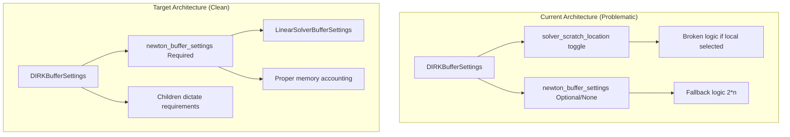
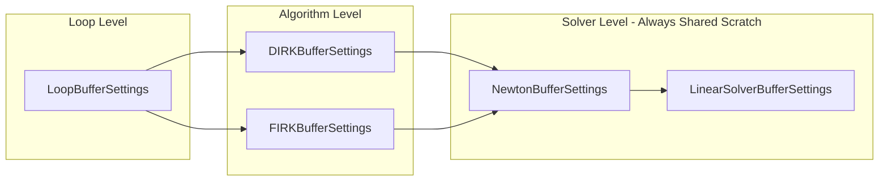

# BufferSettings Review Fixes - Architectural Plan

## User Stories

### User Story 1: newton_buffer_settings Required with Default
**As a** developer using DIRK/FIRK algorithms  
**I want** newton_buffer_settings to be required with a sensible default  
**So that** memory accounting is always accurate and I don't have to explicitly provide settings for basic use cases

**Acceptance Criteria:**
- [ ] newton_buffer_settings is not Optional in DIRKBufferSettings and FIRKBufferSettings
- [ ] newton_buffer_settings has a factory default that creates appropriate settings
- [ ] If memory locations are updated, newton_buffer_settings is updated accordingly
- [ ] No None checks or fallback logic exists for newton_buffer_settings

### User Story 2: Remove solver_scratch_location Toggle
**As a** developer maintaining the buffer allocation system  
**I want** solver_scratch to always be shared memory  
**So that** the memory allocation logic is consistent and not broken by conflicting toggle states

**Acceptance Criteria:**
- [ ] solver_scratch_location attribute is removed from DIRKBufferSettings
- [ ] solver_scratch_location attribute is removed from FIRKBufferSettings
- [ ] use_shared_solver_scratch property is removed (always shared)
- [ ] Related parameters removed from ALL_DIRK_BUFFER_LOCATION_PARAMETERS and ALL_FIRK_BUFFER_LOCATION_PARAMETERS
- [ ] Child buffer settings (Newton, linear) dictate their requirements

### User Story 3: residual_temp Toggleable Location
**As a** developer optimizing memory usage  
**I want** residual_temp in NewtonBufferSettings to be toggleable between shared and local  
**So that** I can optimize memory allocation for different use cases

**Acceptance Criteria:**
- [ ] NewtonSliceIndices includes residual_temp slice
- [ ] NewtonBufferSettings has residual_temp_location attribute
- [ ] use_shared_residual_temp property added
- [ ] shared_memory_elements and local_memory_elements correctly account for residual_temp location

### User Story 4: Direct Access Properties on Compile Settings
**As a** developer working with implicit solvers  
**I want** direct access properties for newton_buffer_settings and linear_solver_buffer_settings  
**So that** I don't have to dig through nested attributes

**Acceptance Criteria:**
- [ ] DIRKStepConfig has newton_buffer_settings property
- [ ] DIRKStepConfig has linear_solver_buffer_settings property  
- [ ] FIRKStepConfig has newton_buffer_settings property
- [ ] FIRKStepConfig has linear_solver_buffer_settings property
- [ ] build_implicit_helpers methods use these direct properties

### User Story 5: Clean Import Organization
**As a** developer maintaining code quality  
**I want** all imports at module header level  
**So that** the code follows Python best practices and is easier to maintain

**Acceptance Criteria:**
- [ ] Imports in generic_dirk.py __init__ method moved to module header
- [ ] Imports in generic_firk.py __init__ method moved to module header
- [ ] No imports inside function or method bodies

### User Story 6: Clean Test Organization
**As a** a developer maintaining test code  
**I want** all test imports at module level  
**So that** tests follow Python best practices

**Acceptance Criteria:**
- [ ] All test imports moved to module header
- [ ] Tests for removed optional behavior deleted
- [ ] Tests for default values removed (as defaults may change)
- [ ] Pointless tests removed
- [ ] Tests validate shared_memory_elements property, not internal indices

---

## Overview

This plan addresses code review feedback for the BufferSettings stocktake implementation. The changes follow a clear pattern: simplify the architecture by removing unnecessary optionality and toggles, while ensuring all arrays that can be toggled between shared/local memory have proper configuration options.

### Key Design Changes

1. **newton_buffer_settings Required**: Use attrs factory to provide a default, removing Optional typing and all None checks/fallbacks.

2. **Remove solver_scratch_location**: solver_scratch is always shared because it's passed from shared memory. Newton and linear solver settings control their internal buffer locations.

3. **Add residual_temp Toggleability**: The residual_temp array is instantiated and must be toggleable. Add location attribute and update indices/sizes calculations.

4. **Direct Access Properties**: Add properties on compile settings classes to access nested buffer settings without attribute drilling.

### Memory Hierarchy After Changes

### Impact Assessment

- **Breaking Change**: Yes - solver_scratch_location parameter removed
- **API Impact**: Minimal - default behavior unchanged for most users
- **Test Impact**: Several tests need modification or removal

---

## References

- Code review comments from @ccam80
- Original BufferSettings implementation in src/cubie/BufferSettings.py
- Newton buffer settings in src/cubie/integrators/matrix_free_solvers/newton_krylov.py
- Linear solver settings in src/cubie/integrators/matrix_free_solvers/linear_solver.py
