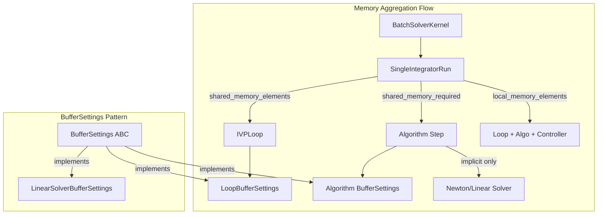
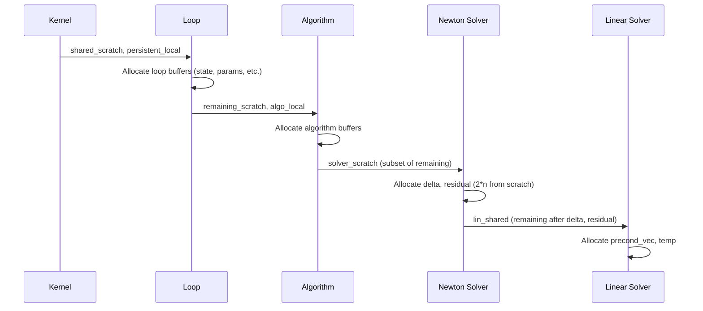

# BufferSettings Stocktake: Human Overview

## User Stories

### US-1: Accurate Shared Memory Allocation
**As a** cubie developer deploying integrators on GPU,
**I want** BufferSettings classes to correctly calculate shared memory requirements,
**So that** the allocated shared memory buffer is exactly the size needed for all arrays.

**Acceptance Criteria:**
- [ ] `shared_memory_elements` returns the sum of all arrays configured for shared memory
- [ ] Each array's contribution matches its actual allocation size in device functions
- [ ] No memory overlap or gaps occur between allocated buffers

### US-2: Accurate Local Memory Allocation
**As a** cubie developer deploying integrators on GPU,
**I want** BufferSettings classes to correctly calculate local memory requirements,
**So that** per-thread local memory is appropriately sized for all local arrays.

**Acceptance Criteria:**
- [ ] `local_memory_elements` returns the sum of all arrays configured for local memory
- [ ] Each array's contribution matches its actual allocation size in device functions
- [ ] Persistent local memory requirements are correctly tracked separately

### US-3: Correct Slice Indices for Shared Memory
**As a** cubie developer writing CUDA device functions,
**I want** SliceIndices to provide non-overlapping slices for all shared memory buffers,
**So that** device functions can safely access their buffer regions without corruption.

**Acceptance Criteria:**
- [ ] All slices are contiguous and non-overlapping
- [ ] Slice boundaries match the actual buffer sizes
- [ ] Local buffers receive empty slices (slice(0, 0))
- [ ] `local_end` property reflects the total shared memory used by all buffers

### US-4: Complete Buffer Representation
**As a** cubie developer maintaining BufferSettings,
**I want** every array allocated in a device function to be represented in BufferSettings,
**So that** memory requirements can be calculated and configured correctly.

**Acceptance Criteria:**
- [ ] All `cuda.local.array` calls have corresponding BufferSettings entries
- [ ] All `shared_scratch[slice]` accesses have corresponding BufferSettings entries
- [ ] Each buffer has a configurable location toggle ('local' or 'shared')

### US-5: Solver Memory Integration
**As a** cubie developer using implicit algorithms,
**I want** Newton and linear solver memory requirements included in step BufferSettings,
**So that** the total memory footprint is accurately reported to the batch kernel.

**Acceptance Criteria:**
- [ ] Linear solver buffer requirements (preconditioned_vec, temp) are accounted for
- [ ] Newton solver buffer requirements (delta, residual) are accounted for
- [ ] Solver BufferSettings can be passed to solver factories
- [ ] Total memory requirements aggregate correctly through SingleIntegratorRun

---

## Executive Summary

The BufferSettings infrastructure provides centralized memory configuration for CUDA device functions. Currently, the calculations for shared and local memory requirements are incorrect, causing memory crashes on GPU execution. This stocktake will audit each BufferSettings class to ensure complete and accurate representation of all device memory allocations.

## Architecture Overview

## Memory Flow in Device Functions

## Key Technical Decisions

### 1. Hierarchical Buffer Composition
Each level (Loop → Algorithm → Solver) consumes a prefix of shared memory and passes the remainder to nested components. The `local_end` property marks where each level's allocations end.

### 2. Aliasing Strategy
Several buffers alias onto larger allocations to reduce memory usage:
- ERK: `stage_cache` aliases `stage_rhs` or `stage_accumulator`
- DIRK: `stage_base` aliases first slice of `accumulator`
- Newton: `delta` and `residual` are carved from `solver_scratch`

### 3. Persistent Local vs Scratch
- **Persistent local**: Survives across step invocations (FSAL caches)
- **Scratch**: Reused within a single step invocation

## Component Audit Summary

| Component | BufferSettings Class | Status | Key Issues |
|-----------|---------------------|--------|------------|
| IVPLoop | LoopBufferSettings | Needs audit | proposed_counters handling |
| ERKStep | ERKBufferSettings | Needs audit | stage_cache aliasing |
| DIRKStep | DIRKBufferSettings | Needs audit | solver_scratch carving |
| FIRKStep | FIRKBufferSettings | Needs audit | stage_driver_stack |
| RosenbrockStep | RosenbrockBufferSettings | Needs audit | cached_auxiliaries lazy init |
| Linear Solver | LinearSolverBufferSettings | Needs audit | Not wired to algorithms |
| Newton Solver | (none) | Missing | Uses implicit 2*n carving |

## Expected Impact

1. **Immediate**: Fix GPU memory crashes for all algorithms
2. **Development**: Clearer separation of memory concerns
3. **Maintenance**: Single source of truth for buffer layouts
4. **Future**: Enable memory optimization heuristics (Issue #329)

## Trade-offs Considered

### Option A: BufferSettings per Component (Chosen)
Each component (loop, algorithm, solver) has its own BufferSettings. Memory is composed hierarchically.

**Pros:** Encapsulation, independent testing, clear ownership
**Cons:** More classes, composition logic needed

### Option B: Single Unified BufferSettings
One class tracks all buffers across all components.

**Pros:** Simpler composition, single point of truth
**Cons:** Coupling, changes cascade, harder to test

### Option C: No BufferSettings (Direct Calculation)
Calculate memory inline where needed.

**Pros:** No abstraction overhead
**Cons:** Duplication, error-prone, no configurability

---

## References

- Issue #329: Heuristics for memory locations
- `src/cubie/BufferSettings.py`: Base classes
- `src/cubie/integrators/loops/ode_loop.py`: LoopBufferSettings reference implementation
