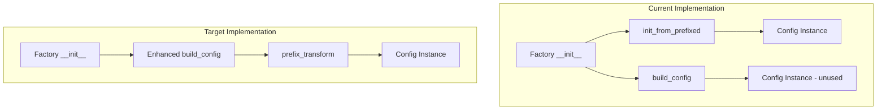
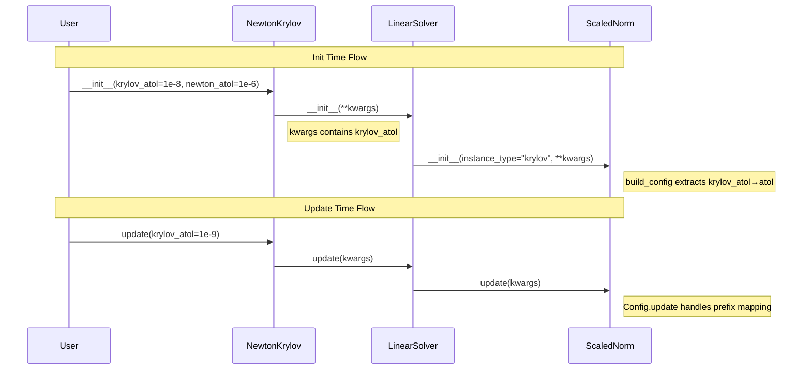

# MultipleInstance build_config Integration Overview

## User Stories

### US-1: Unified Config Construction Pattern
**As a** developer creating MultipleInstanceCUDAFactory subclasses
**I want** build_config to work seamlessly with MultipleInstanceCUDAFactoryConfig classes
**So that** I can use the same config construction pattern for both regular and prefixed configurations

**Acceptance Criteria:**
- build_config accepts MultipleInstanceCUDAFactoryConfig classes
- Prefixed parameters (e.g., "krylov_atol") are correctly mapped before config construction
- The instance_label is correctly passed and stored in the config
- No duplicate or conflicting config construction code in factory __init__ methods

### US-2: Automatic Nested Parameter Propagation
**As a** developer configuring nested solver hierarchies (e.g., NewtonKrylov -> LinearSolver -> ScaledNorm)
**I want** prefixed parameters passed at init time to automatically propagate to nested objects
**So that** I can configure the entire hierarchy with a single set of prefixed parameters

**Acceptance Criteria:**
- Parameters like "krylov_atol" passed to NewtonKrylov reach the nested LinearSolver's ScaledNorm
- Parameters like "krylov_max_iters" passed to NewtonKrylov reach the nested LinearSolver's config
- The propagation works both at init time and via update() calls
- No manual key filtering is needed in any class

### US-3: Transparent Prefix Handling in update()
**As a** developer updating solver configurations at runtime
**I want** update() to automatically route prefixed parameters to the correct nested object
**So that** I don't need to know the internal structure to update nested configurations

**Acceptance Criteria:**
- Calling `newton.update(krylov_atol=1e-8)` updates the nested LinearSolver's norm
- Calling `newton.update(newton_atol=1e-6)` updates the Newton solver's own norm
- Both init time and update() use the same prefix resolution mechanism
- The update() method returns recognized keys in their original prefixed form

---

## Executive Summary

This refactoring integrates `MultipleInstanceCUDAFactoryConfig` with `build_config` to eliminate code duplication and enable automatic nested parameter propagation. The current implementation has two parallel code paths for config construction: `init_from_prefixed()` on config classes and `build_config()` for regular configs. These need to be unified.

The key insight is that prefix transformation belongs in `build_config`, not in a separate classmethod. By enhancing `build_config` to handle prefixed parameters, we can eliminate the `init_from_prefixed()` method and simplify factory constructors.

## Architecture Diagram

## Data Flow for Nested Propagation

## Key Technical Decisions

### 1. Enhance build_config with Prefix Support
Rather than maintaining separate `init_from_prefixed()` classmethods, we enhance `build_config()` to:
- Accept an optional `instance_label` parameter
- Transform prefixed keys before field filtering
- Pass `instance_label` to the config constructor

### 2. Config-Level Prefix Handling
The `MultipleInstanceCUDAFactoryConfig.update()` method already handles prefix transformation. This pattern should be:
- Preserved for runtime updates
- Mirrored in build_config for init-time construction

### 3. No Manual Key Filtering
Classes should never manually filter keys. Instead:
- build_config filters to valid fields automatically
- update() uses silent=True to ignore unrecognized keys
- Nested objects receive full kwargs and extract their own

### 4. Forward All Parameters to Nested Objects
Factories should pass all kwargs to nested objects:
- NewtonKrylov passes all kwargs to LinearSolver constructor
- LinearSolver passes all kwargs to ScaledNorm constructor
- Each level extracts what it needs via build_config/update

## Trade-offs Considered

### Option A: Enhance build_config (Chosen)
- **Pro**: Single code path for config construction
- **Pro**: Consistent with existing build_config pattern
- **Pro**: No new abstractions needed
- **Con**: Slightly more complex build_config implementation

### Option B: Keep init_from_prefixed as Primary Path
- **Pro**: No changes to build_config
- **Con**: Two parallel config construction patterns
- **Con**: Duplication in factory constructors
- **Con**: Harder to maintain consistency

### Option C: Factory-Level Prefix Resolution
- **Pro**: Keeps config classes simple
- **Con**: Every factory needs prefix handling code
- **Con**: Inconsistent with current config.update() pattern

## Impact on Existing Architecture

1. **build_config in _utils.py**: Enhanced with optional `instance_label` parameter
2. **CUDAFactory.py**: `init_from_prefixed()` can be deprecated or removed
3. **matrix_free_solvers/**: Simplified __init__ methods using unified build_config
4. **norms.py**: Uses enhanced build_config for ScaledNormConfig
5. **Tests**: Updated to verify prefix propagation through nested hierarchies

## References

- Current `build_config` implementation: `src/cubie/_utils.py:714-792`
- MultipleInstanceCUDAFactoryConfig: `src/cubie/CUDAFactory.py:559-660`
- Existing solver hierarchy: `matrix_free_solvers/newton_krylov.py`, `linear_solver.py`, `base_solver.py`
- ScaledNorm with prefixes: `src/cubie/integrators/norms.py`
