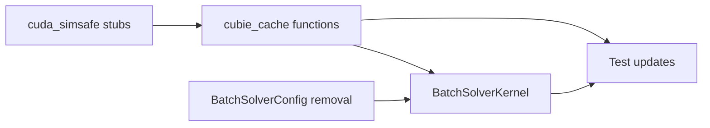

# Cache Decontamination - Agent Plan

## Overview

This plan details the refactoring of CuBIE's caching infrastructure to move cache configuration and operations out of BatchSolverKernel/BatchSolverConfig and into the cache module (cubie_cache.py).

## Component 1: cubie_cache.py Module Functions

### Expected Behavior

The cache module should provide two new module-level functions that consolidate cache creation and invalidation logic:

#### `create_cache()`
- Accepts: system (BaseODE), cache_arg (bool/str/Path), config_hash (str)
- Parses cache_arg using CacheConfig.from_user_setting()
- Returns CUBIECache instance if caching enabled and not in CUDASIM mode
- Returns None if caching disabled or in CUDASIM mode
- Handles all CUBIECache construction internally

#### `invalidate_cache()`
- Accepts: system (BaseODE), cache_arg (bool/str/Path), config_hash (str)
- Only acts when mode is "flush_on_change"
- Creates temporary CUBIECache and calls flush_cache()
- Silent failure on errors (cache flush is best-effort)
- No-op in CUDASIM mode

### Integration Points
- Called from BatchSolverKernel.build_kernel() for cache creation
- Called from BatchSolverKernel._invalidate_cache() for flush operations

### Dependencies
- cubie.cuda_simsafe.is_cudasim_enabled
- cubie.odesystems.baseODE.BaseODE (for system info extraction)

## Component 2: BatchSolverConfig Changes

### Expected Behavior

Remove the `cache_config` field entirely from BatchSolverConfig:

**Before:**
```python
cache_config: CacheConfig = attrs.field(
    factory=CacheConfig,
    validator=attrs.validators.instance_of(CacheConfig),
    eq=False,
)
```

**After:**
- Field removed completely
- No cache-related fields in BatchSolverConfig
- BatchSolverConfig only contains compile-critical settings

### Integration Points
- BatchSolverKernel no longer passes cache_config to BatchSolverConfig
- Tests referencing config.cache_config must be updated

## Component 3: BatchSolverKernel Changes

### Raw Cache Argument Storage

Add a private attribute to store the raw cache argument:

```python
self._cache_arg: Union[bool, str, Path] = cache
```

This stores exactly what the user passed, with no parsing.

### cache_config Property Removal

Remove the `cache_config` property that delegated to compile_settings:

**Before:**
```python
@property
def cache_config(self) -> "CacheConfig":
    return self.compile_settings.cache_config
```

**After:**
- Property removed entirely
- Replace with `cache_enabled`, `cache_mode`, `cache_dir` properties that parse on-demand if needed
- Or simply expose `_cache_arg` via property

### _invalidate_cache Method

Update to delegate to cache module:

**Before:**
```python
def _invalidate_cache(self) -> None:
    super()._invalidate_cache()
    cache_config = self.compile_settings.cache_config
    if cache_config.enabled and cache_config.mode == "flush_on_change" ...:
        # instantiate CUBIECache here
        cache = CUBIECache(...)
        cache.flush_cache()
```

**After:**
```python
def _invalidate_cache(self) -> None:
    super()._invalidate_cache()
    invalidate_cache(
        system=self.single_integrator.system,
        cache_arg=self._cache_arg,
        config_hash=self.config_hash,
    )
```

### build_kernel Method

Update to use cache module function:

**Before:**
```python
cache_config = self.cache_config
if cache_config.enabled and not is_cudasim_enabled():
    cache = CUBIECache(
        system_name=system_name,
        system_hash=system_hash,
        config_hash=self.config_hash,
        max_entries=cache_config.max_entries,
        mode=cache_config.mode,
        custom_cache_dir=cache_config.cache_dir,
    )
    integration_kernel._cache = cache
```

**After:**
```python
cache = create_cache(
    system=self.single_integrator.system,
    cache_arg=self._cache_arg,
    config_hash=self.config_hash,
)
if cache is not None:
    integration_kernel._cache = cache
```

### set_cache_dir Method

Update to work with raw cache argument or remove if no longer needed:

**Current behavior** sets cache_config.cache_dir and invalidates. 
**New behavior** could update _cache_arg if it's a Path-like, or this method may need redesign.

Consider: Users calling `set_cache_dir()` want to change the cache location. The simplest approach:
- Store the new path in _cache_arg (replacing previous value)
- Call _invalidate_cache()

### instantiate_cache Method

Remove entirely - replaced by module-level create_cache().

### __init__ Changes

Remove CacheConfig creation and BatchSolverConfig cache_config parameter:

**Before:**
```python
cache_config = CacheConfig.from_user_setting(cache)
initial_config = BatchSolverConfig(
    ...
    cache_config=cache_config,
)
```

**After:**
```python
self._cache_arg = cache
initial_config = BatchSolverConfig(
    ...
    # no cache_config parameter
)
```

## Component 4: cuda_simsafe.py Stub Enhancements

### _StubCacheLocator Enhancements

Add more complete stub behavior:
- get_cache_path() should return a valid path string
- Allow subclass implementations to work correctly

### _StubCacheImpl Enhancements

Make check_cachable() return True to match real behavior:
```python
def check_cachable(self, data):
    return True  # Data is always cachable in principle
```

### _StubCUDACache Enhancements

Add support for more operations to enable testing:
- Store initialization parameters for inspection
- Add cache_path property
- Add _max_entries and _mode attributes
- Support flush_cache() method as no-op

```python
class _StubCUDACache:
    def __init__(
        self,
        system_name=None,
        system_hash=None,
        config_hash=None,
        max_entries=10,
        mode="hash",
        custom_cache_dir=None,
    ):
        self._system_name = system_name
        self._system_hash = system_hash
        self._compile_settings_hash = config_hash
        self._max_entries = max_entries
        self._mode = mode
        self._cache_path = str(custom_cache_dir) if custom_cache_dir else ""
        self._enabled = False

    @property
    def cache_path(self):
        return Path(self._cache_path) if self._cache_path else Path()

    def flush_cache(self):
        pass  # No-op in CUDASIM
```

### _StubIndexDataCacheFile Enhancements

No changes needed - current stub is sufficient.

## Component 5: Test Updates

### test_cubie_cache.py

#### Tests to Keep nocudasim
- `test_cubie_cache_init` - creates real CUBIECache
- `test_cubie_cache_index_key` - uses CUBIECache methods
- `test_cubie_cache_path` - uses CUBIECache

#### Tests to Remove nocudasim From
- `test_cache_locator_*` - CUBIECacheLocator works in CUDASIM
- `test_cache_impl_*` - CUBIECacheImpl instantiation works
- `test_cache_locator_instantiation_works` - already works
- `test_cache_impl_instantiation_works` - already works

### test_cache_config.py

#### Tests to Keep nocudasim
- Tests that instantiate CUBIECache with real CUDA requirements
- Tests using enforce_cache_limit, flush_cache (require filesystem ops with real cache)

#### Tests to Remove nocudasim From
- `TestCacheConfigDefaults` - pure Python attrs class testing
- `TestCacheConfigModeValidation` - pure Python validation
- `TestCacheConfigMaxEntriesValidation` - pure Python validation
- `TestCacheConfigCacheDirConversion` - pure Python conversion
- `TestBatchSolverConfigCacheConfig` - **REMOVE ENTIRELY** (no longer relevant)
- `TestParseCacheParam` - tests BatchSolverKernel cache parsing
- `TestKernelCacheConfigProperty` - **UPDATE** to test new interface
- `TestSetCacheDir` - tests set_cache_dir behavior
- `TestSolverCacheParam` - tests Solver cache parameter
- `TestSolverCacheProperties` - tests Solver properties
- `TestSolverSetCacheDir` - tests Solver.set_cache_dir

Many of these test cache configuration parsing which doesn't require CUDA.

### New Tests Needed

Add tests for the new module-level functions:
- `test_create_cache_returns_none_when_disabled`
- `test_create_cache_returns_none_in_cudasim`
- `test_create_cache_returns_cache_when_enabled`
- `test_invalidate_cache_no_op_when_hash_mode`
- `test_invalidate_cache_flushes_when_flush_mode`

## Component 6: Comment Cleanup

### cubie_cache.py

Remove these "Implementation Note" comments:

**Line ~385 (enforce_cache_limit):**
```python
# Implementation Note: Custom LRU eviction based on filesystem mtime.
# Numba's IndexDataCacheFile has _load_index() and _save_index() methods
# that could be used for entry-level removal, but these are private APIs.
# ...
```

**Line ~448 (flush_cache):**
```python
# Implementation Note: Full directory removal via shutil.rmtree.
# Numba's Cache.flush() only clears the index file, leaving orphaned
# .nbc data files. For "flush_on_change" mode, complete cache removal
# is intentional to ensure a clean slate when settings change.
# ...
```

Replace with concise functional comments if needed:
```python
# Uses filesystem mtime for LRU ordering
```

## Edge Cases

### 1. set_cache_dir with Different Cache Arg Types

When _cache_arg is `True` and user calls `set_cache_dir(path)`:
- Should this update _cache_arg to the path?
- Or should we track cache_dir separately?

**Recommendation:** Update _cache_arg to the new path. The path implies `enabled=True, mode="hash"`.

### 2. Calling set_cache_dir When cache=False

If user created kernel with `cache=False` then calls `set_cache_dir()`:
- Currently: sets cache_dir but caching is still disabled
- Expected: should this enable caching?

**Recommendation:** set_cache_dir implies wanting caching. Update _cache_arg to the path (which parses as enabled).

### 3. CUDASIM Mode Cache Creation

In CUDASIM mode, create_cache() returns None. This is correct behavior - no file caching is possible.

### 4. Error Handling in invalidate_cache

Current behavior silently catches exceptions. Maintain this - cache flush is best-effort.

## Dependencies Between Components



**Order of Implementation:**
1. cuda_simsafe.py stub enhancements (independent)
2. cubie_cache.py module functions (depends on stubs)
3. BatchSolverConfig field removal (independent)
4. BatchSolverKernel updates (depends on 2, 3)
5. Test updates (depends on all above)
6. Comment cleanup (independent, can be done anytime)

## Verification

After implementation:
1. Run `pytest tests/test_cubie_cache.py -v` - should pass with fewer nocudasim skips
2. Run `pytest tests/batchsolving/test_cache_config.py -v` - should pass with fewer nocudasim skips
3. Run `pytest -m "not nocudasim and not cupy"` - cache tests should run in CUDASIM mode
4. Verify no "Implementation Note" comments remain in cubie_cache.py
5. Verify BatchSolverConfig has no cache_config field
6. Verify BatchSolverKernel stores raw _cache_arg
