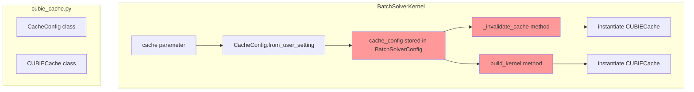
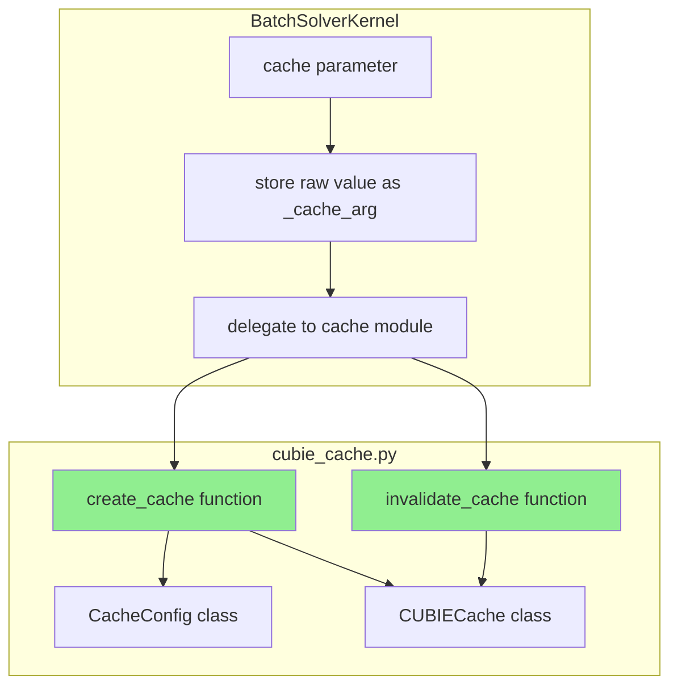
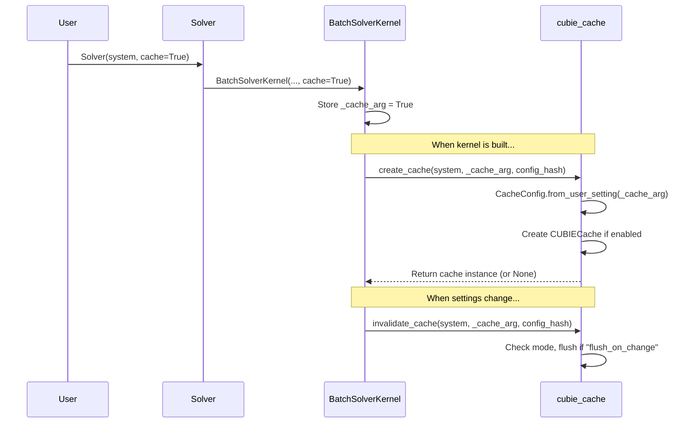

# Cache Decontamination - Human Overview

## User Stories

### Story 1: Clean Cache Configuration Separation
**As a** CuBIE developer  
**I want** cache configuration to live exclusively in the cache module  
**So that** BatchSolverConfig remains focused on compile-critical settings only

**Acceptance Criteria:**
- `cache_config` field is removed from `BatchSolverConfig`
- BatchSolverKernel stores only the raw cache argument (bool/str/Path)
- CacheConfig is created on-demand when needed, inside the Cache object
- No duplication of cache configuration parsing logic

### Story 2: Consolidated Cache Operations in Cache Module
**As a** CuBIE developer  
**I want** all cache operations (invalidation, instantiation) to live in cubie_cache.py  
**So that** BatchSolverKernel delegates to the cache module rather than implementing cache logic itself

**Acceptance Criteria:**
- `_invalidate_cache` override in BatchSolverKernel delegates to cache module
- `instantiate_cache` logic moves to cubie_cache.py
- No duplicated CUBIECache instantiation code between methods
- Cache module provides a single function for creating/managing cache instances

### Story 3: CUDASIM-Compatible Cache Testing
**As a** CuBIE developer  
**I want** most cache tests to run in CUDASIM mode  
**So that** cache logic can be tested without GPU hardware

**Acceptance Criteria:**
- Most tests in test_cubie_cache.py run without `@pytest.mark.nocudasim`
- Most tests in test_cache_config.py run without `@pytest.mark.nocudasim`
- Only compilation/storage tests require nocudasim mark
- Enhanced stub classes in cuda_simsafe.py support testing

### Story 4: Remove Implementation Note Comments
**As a** CuBIE developer  
**I want** implementation history comments removed  
**So that** comments describe current behavior, not implementation decisions

**Acceptance Criteria:**
- "Implementation Note:" comments removed from cubie_cache.py
- Comments follow project style guidelines (describe what code does, not why it changed)

---

## Executive Summary

This refactoring cleans up the cache implementation that was partially done in a previous PR. The key architectural change is moving cache configuration and operations out of BatchSolverKernel/BatchSolverConfig and into the cache module where they belong.

## Current Architecture (Before)

**Problems:**
1. `cache_config` lives in `BatchSolverConfig` - but it's not a compile setting
2. `_invalidate_cache` and `build_kernel` both instantiate CUBIECache (duplication)
3. Cache invalidation logic is in BatchSolverKernel instead of cache module
4. Tests marked `nocudasim` when they don't need real CUDA

## Target Architecture (After)

## Data Flow

## Key Technical Decisions

### 1. Raw Cache Argument Storage
Store the user's original `cache` argument (bool/str/Path) on BatchSolverKernel rather than parsing it into CacheConfig immediately. This:
- Keeps BatchSolverKernel simple
- Defers CacheConfig creation to point of use
- Eliminates the need for cache_config in compile settings

### 2. Cache Module Functions
Add module-level functions to cubie_cache.py:
- `create_cache(system, cache_arg, config_hash)` - Creates CUBIECache from raw args
- `invalidate_cache(system, cache_arg, config_hash)` - Handles flush_on_change mode

These consolidate the duplicated logic currently in `_invalidate_cache` and `build_kernel`.

### 3. Enhanced CUDASIM Stubs
The stub classes in cuda_simsafe.py need more functionality:
- `_StubCUDACache` should support more operations
- `_StubIndexDataCacheFile` should be more complete
- Allow cache config parsing/validation in CUDASIM mode

### 4. Test Updates
Many tests marked `nocudasim` only test cache configuration, not actual compilation. After enhancing stubs, these marks can be removed.

## Files Modified

| File | Changes |
|------|---------|
| `src/cubie/cubie_cache.py` | Add module-level functions, remove Implementation Note comments |
| `src/cubie/batchsolving/BatchSolverConfig.py` | Remove cache_config field |
| `src/cubie/batchsolving/BatchSolverKernel.py` | Store raw cache arg, delegate to cache module |
| `src/cubie/cuda_simsafe.py` | Enhance stub classes for testing |
| `tests/test_cubie_cache.py` | Remove unnecessary nocudasim marks |
| `tests/batchsolving/test_cache_config.py` | Remove unnecessary nocudasim marks, update tests |

## Trade-offs Considered

### Alternative: Keep CacheConfig on Kernel
Instead of storing raw cache arg, could store CacheConfig directly on BatchSolverKernel. Rejected because:
- Creates ambiguity about where cache config lives
- Still requires parsing at init time
- User feedback explicitly requested it live on Cache

### Alternative: Pass CacheConfig to Cache Functions
Could require caller to create CacheConfig and pass it. Rejected because:
- Duplicates parsing logic at call sites
- Cache module should own all cache configuration

## Expected Impact

1. **Cleaner separation of concerns** - BatchSolverConfig only has compile settings
2. **Single source of truth** - Cache configuration owned by cache module
3. **Better testability** - Most cache tests run in CUDASIM mode
4. **Less code duplication** - Single path for cache creation/invalidation
5. **Cleaner comments** - No "implementation note" history comments
