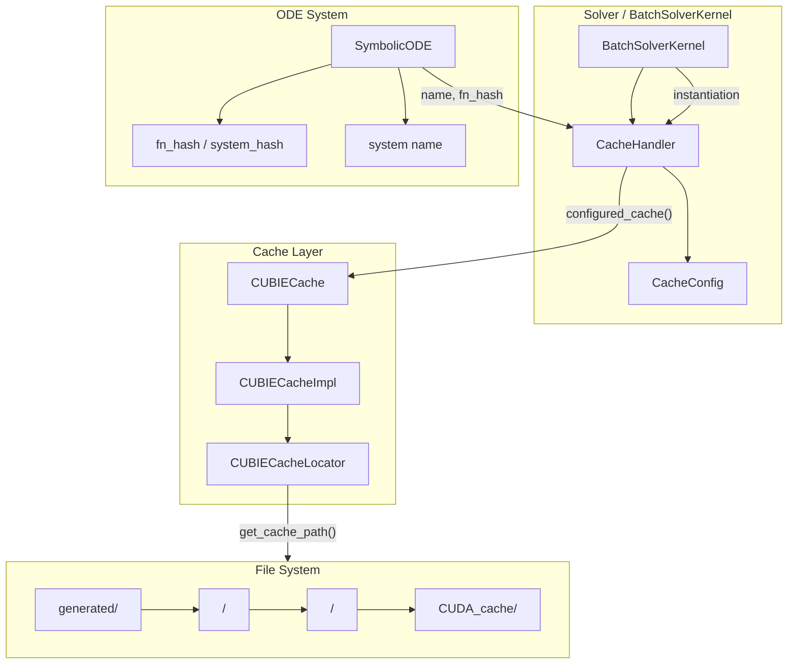
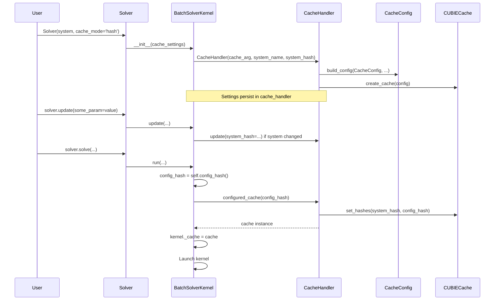

# CacheHandler Refactor for Persistent Cache Interface

## User Stories

### US1: Persistent Cache Configuration
**As a** CuBIE user  
**I want** cache settings to persist across solver runs  
**So that** I don't have to reconfigure caching options each time I call solve()

**Acceptance Criteria:**
- Cache handler stores configuration in BatchSolverKernel.cache_handler
- Cache mode, max_entries, and cache_dir persist between solve() calls
- Cache handler is accessible via batchsolverkernel.cache_handler property

### US2: Cache Settings via Keyword Arguments
**As a** CuBIE user  
**I want** to pass cache configuration via keyword arguments (like `cache_mode`)  
**So that** caching configuration follows the same pattern as other settings

**Acceptance Criteria:**
- Users can pass `cache_mode`, `cache_enabled`, `max_cache_entries`, `cache_dir` as kwargs
- Kwargs are filtered to override CacheConfig defaults
- Pattern matches existing settings handling (e.g., `dt_min`, `save_every`)

### US3: System Hash at Update Time
**As a** CuBIE developer  
**I want** system hash to be updated during cache_handler.update()  
**So that** cache freshness is properly tracked when the ODE system changes

**Acceptance Criteria:**
- System hash is captured from the ODE system during handler instantiation
- System hash updates when cache_handler.update() is called
- System hash represents low-level ODE system definition changes

### US4: Compile Settings Hash at Run Time
**As a** CuBIE developer  
**I want** compile settings hash to be captured just before kernel launch  
**So that** cache keys accurately reflect the current compilation state

**Acceptance Criteria:**
- Compile settings hash is computed at start of run() method
- Hash is passed to configured_cache() before kernel execution
- Different compile settings produce different cache entries

### US5: Hierarchical Cache Directory Structure
**As a** CuBIE user  
**I want** cache files organized under `<system_name>/<system_hash>/` directories  
**So that** cache entries are naturally organized by system version

**Acceptance Criteria:**
- Cache path follows `generated/<system_name>/<system_hash>/CUDA_cache/`
- Each system_hash gets its own subdirectory under system_name
- Compile settings disambiguate entries within a system_hash directory

---

## Executive Summary

This plan refactors the CacheHandler to provide a persistent, updatable cache
interface that integrates seamlessly with the CuBIE ecosystem. The key changes
involve:

1. **Completing CacheHandler integration** with BatchSolverKernel following
   repo patterns
2. **Refactoring cache directory structure** to use hierarchical
   `<system_name>/<system_hash>/` paths
3. **Updating tests** to validate the new structure

## Architecture Overview

## Data Flow

## Key Technical Decisions

### 1. CacheHandler Follows CuBIE Update Pattern
The CacheHandler already has an `update()` method signature matching CuBIE
patterns. The refactor will:
- Accept kwargs that override CacheConfig defaults  
- Use `build_config()` utility for parameter filtering
- Return recognized parameters set from update()

### 2. System Hash Derived from ODE System
- For SymbolicODE: use `system.fn_hash` (already computed)
- For other BaseODE subclasses: compute hash from config_hash
- System name comes from `system.name` or defaults to hash

### 3. Cache Directory Structure Change
Current: `generated/<system_name>/CUDA_cache/`  
New: `generated/<system_name>/<system_hash>/CUDA_cache/`

This groups cache entries by system version, making it easier to:
- Identify which caches belong to which system version
- Clean up caches for outdated system versions
- Debug cache hits/misses

### 4. Timing of Hash Computation
- **System hash**: Computed once at instantiation, updated via update() when
  system changes
- **Compile settings hash**: Computed fresh at each run() call, just before
  kernel launch

## Trade-offs Considered

| Decision | Alternative | Rationale |
|----------|-------------|-----------|
| System hash in subdirectory | Hash in filename only | Clearer organization, easier cleanup |
| Hash at run() time | Hash at update() time | Ensures hash reflects actual compilation state |
| Separate CacheHandler class | Inline in BatchSolverKernel | Follows separation of concerns, testable |

## Expected Impact

- **BatchSolverKernel**: Minor changes to __init__() and run() for cache setup
- **CacheHandler**: Moderate changes to instantiation and update patterns  
- **CUBIECacheLocator**: Cache path construction changes
- **CUBIECache**: Minor adjustments to use new locator paths
- **Tests**: Updates to reflect new directory structure

## Research References

- Current CacheHandler implementation: `src/cubie/cubie_cache.py`
- BatchSolverKernel cache integration: `src/cubie/batchsolving/BatchSolverKernel.py`
- Update pattern examples: `src/cubie/CUDAFactory.py`, `src/cubie/_utils.py` 
  (`build_config` function)
- System hash source: `src/cubie/odesystems/symbolic/symbolicODE.py` (fn_hash)
