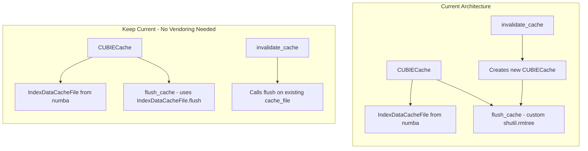
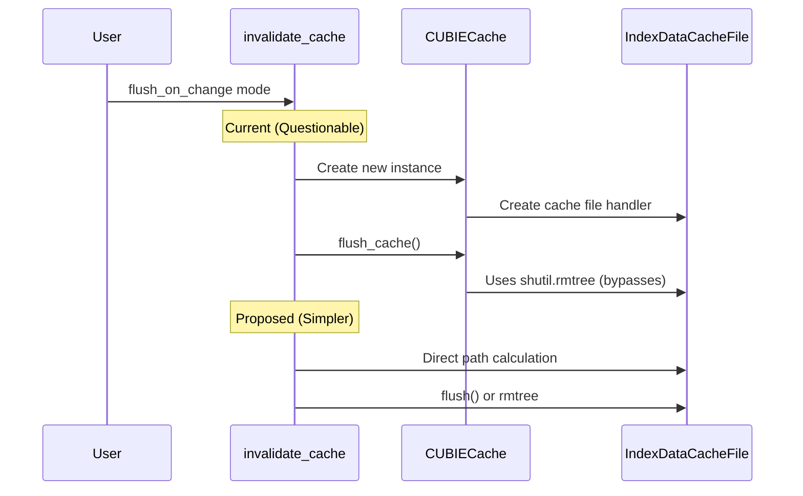

# Cache Review Comments and Architecture Analysis

## User Stories

### User Story 1: Developer Addressing Review Feedback
**As a** developer working on the CuBIE caching PR  
**I want to** address all review comments from PR #485  
**So that** the caching implementation is clean, correct, and follows best practices

**Acceptance Criteria:**
- [ ] Cache imports removed from cuda_simsafe.py (no longer "simsafe")
- [ ] Docstring in create_cache function accurately reflects new behavior
- [ ] test_invalidate_cache_flushes_when_flush_mode has explicit assertions
- [ ] test_batch_solver_kernel_cache_in_cudasim has meaningful assertions or clearer name
- [ ] Commented-out code in cubie_cache.py removed
- [ ] invalidate_cache flush logic is explained or improved

### User Story 2: Maintainer Evaluating Architecture
**As a** project maintainer  
**I want to** understand if vendoring IndexDataCacheFile would improve control and readability  
**So that** I can make informed decisions about cache flushing architecture

**Acceptance Criteria:**
- [ ] Analysis of current cache flushing approach vs vendored approach provided
- [ ] Trade-offs documented with clear recommendation
- [ ] If vendoring recommended, implementation plan outlined

---

## Executive Summary

This plan addresses review comments from PR #485 (caching module CUDASIM refactoring) and critically analyzes whether vendoring the `IndexDataCacheFile` class from numba-cuda would improve the codebase.

### Review Comments Overview

| # | Location | Issue | Priority |
|---|----------|-------|----------|
| 1 | cuda_simsafe.py:169 | Remove non-simsafe cache imports | Medium |
| 2 | cubie_cache.py:480-481 | Fix incorrect docstring | Low |
| 3 | test_cubie_cache.py:320 | Add explicit test assertions | Low |
| 4 | test_cubie_cache.py:186-200 | Fix inconsistent test name/logic | Low |
| 5 | numba_cuda_caching.py:217 | Add explanatory comment | Low |
| 6 | cubie_cache.py:528 | Explain questionable flush logic | High |

### Architecture Decision



### Key Findings

**Regarding Vendoring IndexDataCacheFile:**

After analyzing the numba-cuda `IndexDataCacheFile` class:

1. **Already importable in CUDASIM**: Unlike `Cache` class, `IndexDataCacheFile` imports successfully in CUDASIM mode
2. **Simple flush mechanism**: `flush()` just calls `_save_index({})` - saves empty dict to index file
3. **Current implementation is correct but verbose**: CUBIECache.flush_cache() uses shutil.rmtree which is more aggressive than needed
4. **No vendoring needed**: Can just use `self._cache_file.flush()` instead of custom rmtree logic

**Regarding invalidate_cache creating new cache:**

The current pattern in `invalidate_cache()`:
```python
cache = CUBIECache(...)  # Creates cache object
cache.flush_cache()       # Then immediately flushes it
```

This is **questionable** because:
1. Creates a full CUBIECache object just to call flush
2. CUBIECache constructor creates cache directory if missing
3. Then flush deletes everything in that directory

**Better approach:**
```python
# Just need the cache path and flush it directly
cache_path = GENERATED_DIR / system_name / "CUDA_cache"
if cache_path.exists():
    shutil.rmtree(cache_path)
```

Or even simpler - use `CUBIECache.flush()` which delegates to `IndexDataCacheFile.flush()`.

### Recommendation

**Do NOT vendor IndexDataCacheFile**. Instead:

1. Simplify `invalidate_cache()` to not create a full cache object
2. Use the vendored `Cache.flush()` method which delegates to `IndexDataCacheFile.flush()`
3. Remove the redundant `flush_cache()` method that uses shutil.rmtree

This achieves better control with minimal changes and no additional vendoring.

---

## Data Flow: Cache Invalidation



---

## Trade-offs Considered

| Approach | Pros | Cons |
|----------|------|------|
| **Vendor IndexDataCacheFile** | Full control over flush logic | More code to maintain, unnecessary since it imports fine |
| **Keep current with fixes** | Minimal changes | Still creates cache object just to flush |
| **Simplify invalidate_cache** | Cleaner, no unnecessary object creation | Slight code duplication for path calculation |
| **Use Cache.flush() directly** | Uses existing vendored infrastructure | Requires understanding Cache internals |

**Chosen Approach**: Simplify `invalidate_cache()` to calculate the cache path directly and use shutil.rmtree. This is the cleanest solution that doesn't require vendoring additional code.

---

## Impact on Existing Architecture

- **Minimal changes**: Only modifying `invalidate_cache()` function
- **No new dependencies**: No additional vendoring needed
- **Backwards compatible**: External API unchanged
- **Test updates required**: Tests need meaningful assertions added
