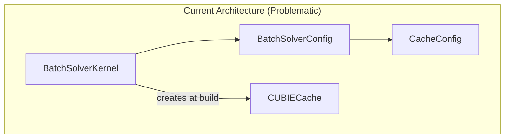
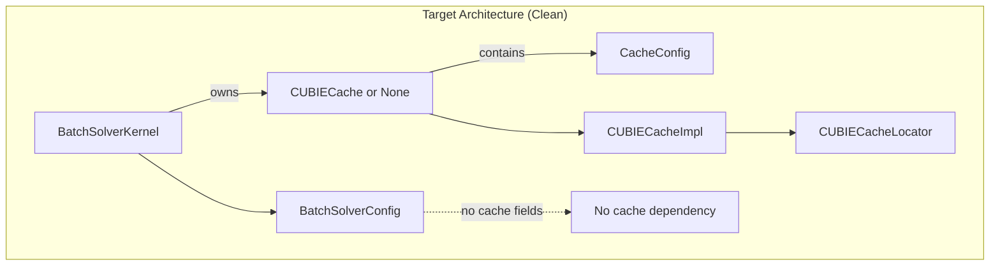
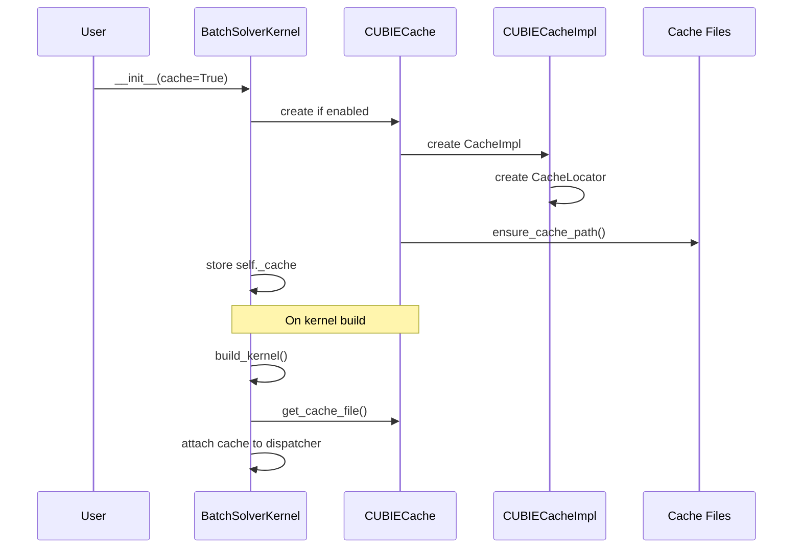

# CuBIE Caching Implementation Refactor - Overview

## User Stories

### Story 1: Clean Cache Ownership
**As a** CuBIE developer,
**I want** cache configuration and management to be cleanly separated from
BatchSolverKernel compile settings,
**So that** caching concerns are encapsulated in dedicated cache classes and
the kernel only holds a reference to a cache instance.

**Acceptance Criteria:**
- CacheConfig is not part of BatchSolverConfig (compile settings)
- BatchSolverKernel owns a CUBIECache instance when caching is enabled
- All cache-related methods on BatchSolverKernel delegate to self.cache
- Cache initialization happens at kernel initialization, not build time

### Story 2: CUDASIM Mode Compatibility
**As a** developer testing CuBIE without a GPU,
**I want** cache functionality to be testable in CUDA simulation mode,
**So that** I can verify hashing, file paths, and cache management without
requiring CUDA hardware.

**Acceptance Criteria:**
- CacheConfig, CUBIECacheLocator, CUBIECacheImpl work in CUDASIM mode
- Only actual kernel save/load operations require real CUDA
- Stub classes in cuda_simsafe enable testing non-CUDA cache operations
- Tests can verify path generation, hash computation, and file operations

### Story 3: Leverage Numba Cache Infrastructure
**As a** CuBIE maintainer,
**I want** the cache implementation to maximize use of existing Numba-CUDA
caching infrastructure,
**So that** we minimize custom code and benefit from upstream improvements.

**Acceptance Criteria:**
- flush_cache uses Numba's IndexDataCacheFile.flush() when available
- enforce_cache_limit uses Numba's cache file mechanics where possible
- CUBIECache properly inherits and wraps (not replaces) Numba behaviors
- Commented super().__init__() issue is resolved with proper initialization

---

## Executive Summary

This refactoring cleans up the caching implementation in CuBIE by:

1. **Decontaminating BatchSolverConfig**: Moving cache configuration out of
   compile settings and into a dedicated ownership pattern
2. **CUDASIM Compatibility**: Adding stub classes that allow testing cache
   logic without CUDA hardware
3. **Numba Integration Review**: Ensuring we leverage Numba's cache
   infrastructure properly rather than reimplementing it

## Architecture Diagram

## Data Flow: Cache Initialization

## Key Technical Decisions

### 1. Cache Ownership Pattern
CUBIECache will be a standalone class that:
- Owns its CacheConfig internally
- Provides cache operations (save, load, flush, enforce_limit)
- Is instantiated by BatchSolverKernel at __init__ time (not build time)
- Can be None when caching is disabled

### 2. CUDASIM Stub Strategy
For CUDASIM mode, we will provide:
- Full CacheConfig (no CUDA dependencies)
- CUBIECacheLocator (path generation is pure Python)
- CUBIECacheImpl without serialize/deserialize (those need CUDA)
- Stub IndexDataCacheFile that allows flush() but not save/load

### 3. Numba Integration
- Use `self._cache_file.flush()` for flush_cache()
- Research IndexDataCacheFile mechanics for entry removal
- Avoid reimplementing what Numba provides

## Trade-offs Considered

| Decision | Pros | Cons |
|----------|------|------|
| Cache owns CacheConfig | Clean separation, single responsibility | Extra indirection |
| Stub classes in CUDASIM | More testable, better coverage | Complexity in cuda_simsafe |
| Wrap vs Override Numba | Less maintenance, upstream benefits | May limit customization |

## Impact on Existing Architecture

- **BatchSolverKernel**: Simplified, delegates to self._cache
- **BatchSolverConfig**: Cleaner, no cache-related fields
- **cubie_cache.py**: Remains primary location for cache classes
- **cuda_simsafe.py**: Enhanced with better cache stubs
- **Tests**: Can verify more cache logic in CUDASIM mode
