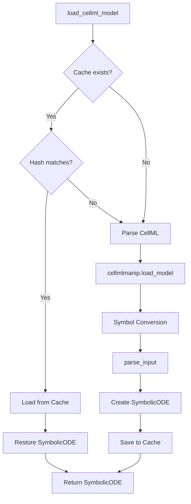
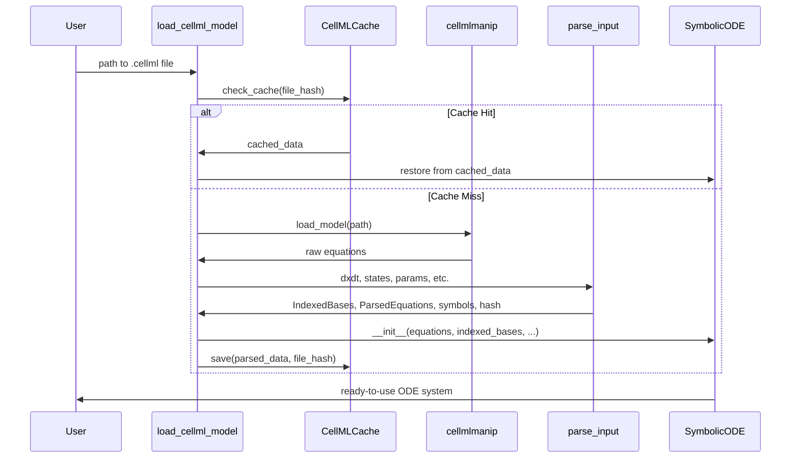

# CellML Object Caching - Human Overview

## User Stories

### User Story 1: Fast CellML Model Reloading
**As a** computational scientist working with large CellML cardiac models  
**I want** to load previously-parsed CellML files from cache instead of re-parsing  
**So that** I can iterate on simulation parameters without waiting 2+ minutes for equation processing

**Acceptance Criteria:**
- First load of a CellML file processes equations and caches the result
- Subsequent loads with identical CellML content use cached data
- Cache invalidates when CellML file content changes (including whitespace)
- Loading from cache completes in under 5 seconds (compared to ~2 minutes for fresh parse)
- Cache stores ParsedEquations, IndexedBases, and related metadata
- System falls back gracefully to re-parsing if cache is corrupted or missing

### User Story 2: Transparent Cache Management
**As a** user of the CuBIE library  
**I want** the caching system to work automatically without requiring manual intervention  
**So that** I can focus on my simulations rather than cache management

**Acceptance Criteria:**
- Cache location is predictable and configurable (default: `generated/<model_name>/`)
- Cache files use human-readable naming that identifies the source CellML file
- No API changes required - `load_cellml_model()` works identically
- Cache hit/miss status logged via existing TimeLogger infrastructure
- Corrupted cache files handled gracefully with automatic re-generation

### User Story 3: Development Workflow Support
**As a** developer modifying CellML models  
**I want** cache invalidation to detect any changes to the source file  
**So that** my edits are always reflected in loaded models

**Acceptance Criteria:**
- Hash-based cache invalidation detects file content changes
- Whitespace changes invalidate cache (sensitivity acceptable per requirements)
- Cache stored separately per CellML filename
- Manual cache clearing available by deleting cache directory

## Overview

This feature implements a disk-based caching layer for parsed CellML objects to eliminate the ~2-minute overhead of equation processing when loading large cardiac models. The solution extends the existing `ODEFile` caching pattern used for generated code.

### High-Level Architecture



### Data Flow



## Key Technical Decisions

### 1. Cache Storage Format: Pickle

**Decision:** Use Python's native `pickle` module for serialization

**Rationale:**
- SymPy expressions and attrs classes pickle cleanly (verified experimentally)
- No additional dependencies required
- Pickle is the standard for Python object serialization
- Performance overhead acceptable given 2-minute baseline
- Binary format more compact than JSON/YAML alternatives

**Alternatives Considered:**
- **JSON/YAML:** Cannot serialize SymPy expressions without custom encoding
- **cloudpickle/dill:** Unnecessary complexity for basic object serialization
- **Custom serialization:** Reinventing the wheel; pickle handles our use case

### 2. Cache Location: Extending `generated/` Directory

**Decision:** Store CellML caches at `generated/<model_name>/cellml_cache.pkl`

**Rationale:**
- Reuses existing `GENERATED_DIR` infrastructure from `odefile.py`
- Consistent with current caching patterns
- One cache directory per model (organized by name)
- Easy to find and clean manually
- Works with existing `.gitignore` patterns

**Structure:**
```
generated/
  beeler_reuter_model_1977/
    beeler_reuter_model_1977.py      # existing codegen cache
    cellml_cache.pkl                  # new: parsed CellML cache
  demir_clark_giles_1999/
    demir_clark_giles_1999.py
    cellml_cache.pkl
```

### 3. Cache Invalidation: File Content Hash

**Decision:** Hash the raw CellML file text using SHA256

**Rationale:**
- Simple and deterministic
- Whitespace sensitivity acceptable per requirements
- Consistent with existing `hash_system_definition()` pattern
- No metadata tracking needed (modification times unreliable)
- Hash stored as first line of cache file for quick validation

**Cache File Format:**
```
#<sha256_hash_of_cellml_file>
<pickled_data>
```

### 4. Cached Data Structure

**Decision:** Cache a dictionary with keys:
```python
{
    'cellml_hash': str,           # SHA256 of source file
    'parsed_equations': ParsedEquations,
    'indexed_bases': IndexedBases,
    'all_symbols': dict[str, sp.Symbol],
    'user_functions': dict[str, Callable] | None,
    'fn_hash': str,
    'precision': np.dtype,
    'name': str,
}
```

**Rationale:**
- Contains all data needed to reconstruct SymbolicODE without re-parsing
- Mirrors the constructor signature of SymbolicODE
- Precision cached to detect changes (though typically constant)
- user_functions may contain non-picklable callables → handled separately

### 5. Integration Point: Within `load_cellml_model()`

**Decision:** Add caching logic directly in `load_cellml_model()` function

**Rationale:**
- Encapsulates CellML-specific caching concerns
- No changes to `parse_input()` or `SymbolicODE` needed
- Easier to test and maintain
- Parallels structure of `ODEFile` usage in `symbolicODE.py`

### 6. TimeLogger Integration

**Decision:** Use `default_timelogger.print_message()` for cache hit/miss notifications

**Rationale:**
- Consistent with existing cache notification pattern in `cubie_cache.py`
- Simple print messages for cache hit/miss (no event registration needed)
- Optionally time cache save operation if useful for diagnostics
- Pattern from `cubie_cache.py`:
  - Cache hit: `print_message("Loaded {name} from CellML cache at: {path}")`
  - Cache miss: `print_message("No CellML cache found for {name}, parsing from source...")`
  - Cache save: Can optionally use `start_event()`/`stop_event()` for timing

## Expected Impact

### Performance Improvement
- **First load:** ~2 minutes (unchanged - must parse)
- **Subsequent loads:** <5 seconds (cache hit)
- **Speedup:** ~24x for cached loads

### Architectural Changes
- **New file:** `src/cubie/odesystems/symbolic/parsing/cellml_cache.py`
  - `CellMLCache` class managing pickle operations
  - Functions: `load_from_cache()`, `save_to_cache()`, `check_cache_valid()`
- **Modified file:** `src/cubie/odesystems/symbolic/parsing/cellml.py`
  - Add cache check/save logic in `load_cellml_model()`
  - Register new TimeLogger events

### Edge Cases Considered
1. **Non-picklable user_functions:** Skip caching if present, warn user
2. **Corrupted cache files:** Catch pickle errors, re-parse, overwrite cache
3. **Concurrent access:** Single-process only; no file locking needed
4. **Disk space:** Typical cache ~100KB-1MB per model (negligible)
5. **Cache poisoning:** Hash validation prevents mismatched cache use

## Research Findings

### SymPy Serialization
- SymPy expressions pickle/unpickle correctly (tested)
- Symbol identity preserved after deserialization
- attrs frozen classes serialize cleanly

### Existing CuBIE Patterns
- `ODEFile` class demonstrates hash-based cache validation
- `hash_system_definition()` provides hash computation pattern
- `GENERATED_DIR` provides standard cache location
- TimeLogger already used for codegen timing events

### CellML Processing Timeline
From `cellml.py` timing events:
1. `codegen_cellml_load_model` - cellmlmanip parsing (~30s)
2. `codegen_cellml_symbol_conversion` - Dummy→Symbol conversion (~10s)
3. `codegen_cellml_equation_processing` - Equation filtering (~20s)
4. `codegen_cellml_sympy_preparation` - SymPy formatting (~10s)
5. `symbolic_ode_parsing` - parse_input execution (~90s)

**Total:** ~160 seconds for large models
**Cache target:** Skip steps 1-5 entirely

## Trade-offs

### Chosen: Simplicity over Flexibility
- Single pickle file per model (not split by component)
- Full re-parse on any cache miss (no partial caching)
- Whitespace-sensitive invalidation

**Benefit:** Easy to implement, test, and debug  
**Cost:** Some re-parsing that could theoretically be avoided

### Chosen: Pickle over Custom Serialization
- Use standard library, accept pickle limitations

**Benefit:** Minimal code, leverages Python ecosystem  
**Cost:** Pickle format changes across Python versions (rare issue)

### Chosen: No Cache Size Management
- No automatic cleanup or size limits
- User responsible for manual cleanup if needed

**Benefit:** Simpler implementation, fewer edge cases  
**Cost:** Disk space could grow (but unlikely to be significant)
