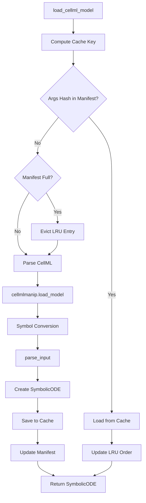
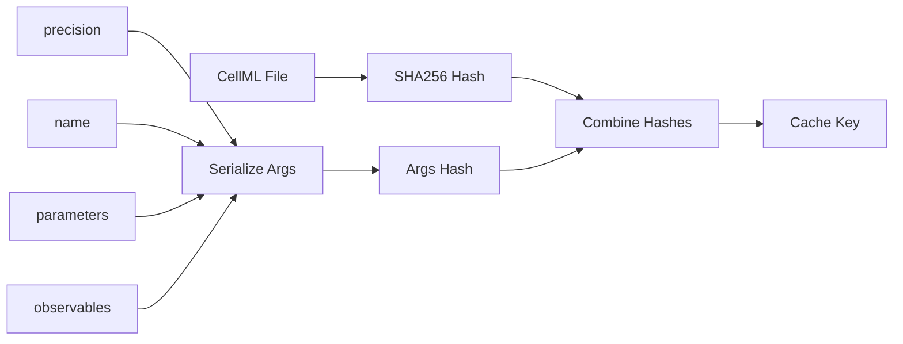
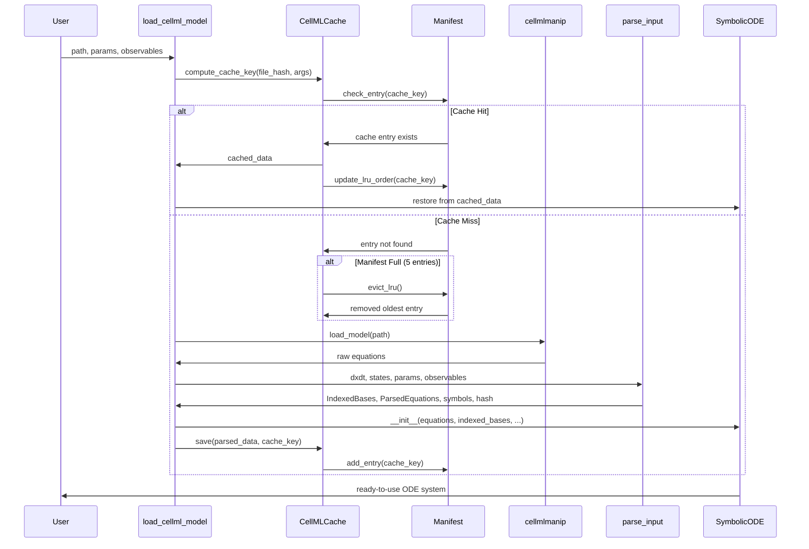

# CellML Object Caching - Human Overview

## User Stories

### User Story 1: Fast CellML Model Reloading with Argument Variations
**As a** computational scientist working with large CellML cardiac models  
**I want** to load previously-parsed CellML files from cache even when I customize parameters or observables  
**So that** I can iterate on different configurations without waiting 2+ minutes for equation processing each time

**Acceptance Criteria:**
- First load with specific arguments (parameters, observables, precision) processes equations and caches the result
- Subsequent loads with identical arguments use cached data
- Cache key includes file content hash AND serialized arguments (parameters, observables, precision, name)
- Different argument combinations create separate cache entries (up to 5 per model)
- Cache invalidates when CellML file content changes OR when arguments differ from any cached entry
- Loading from cache completes in under 5 seconds (compared to ~2 minutes for fresh parse)
- Cache stores ParsedEquations, IndexedBases, and related metadata per argument configuration
- LRU eviction removes least recently used configuration when exceeding 5 entries
- System falls back gracefully to re-parsing if cache is corrupted or missing

### User Story 2: Transparent LRU Cache Management
**As a** user of the CuBIE library  
**I want** the caching system to automatically manage multiple argument configurations  
**So that** I can experiment with different parameters and observables without manual cache management

**Acceptance Criteria:**
- Cache location is predictable and configurable (default: `generated/<model_name>/`)
- Cache manifest tracks up to 5 most recent argument configurations per model
- LRU eviction is automatic and transparent to the user
- No API changes required - `load_cellml_model()` works identically
- Cache hit/miss status logged via existing TimeLogger infrastructure
- Corrupted cache files handled gracefully with automatic re-generation
- Cache manifest shows which configurations are currently cached

### User Story 3: Parameter Experimentation Support
**As a** researcher exploring different model configurations  
**I want** the cache to remember my most recent parameter and observable combinations  
**So that** I can quickly switch between recently-used configurations without re-parsing

**Acceptance Criteria:**
- Cache automatically stores up to 5 different argument configurations per CellML file
- Switching back to a previously-used configuration hits the cache (if still in LRU top-5)
- Changing a parameter from constant to state (or vice versa) creates a new cache entry
- Modifying the observables list creates a new cache entry
- LRU eviction removes oldest unused configuration when limit exceeded
- Hash-based invalidation detects file content changes and invalidates ALL cached configurations
- Manual cache clearing available by deleting cache directory

## Overview

This feature implements a disk-based LRU caching layer for parsed CellML objects with argument-aware cache keys. The solution eliminates the ~2-minute overhead of equation processing when loading large cardiac models with various parameter and observable configurations.

### High-Level Architecture



### Cache Key Generation



### Data Flow



## Key Technical Decisions

### 1. Cache Key: File Hash + Serialized Arguments

**Decision:** Cache key combines SHA256 hash of CellML file with hash of serialized arguments (parameters, observables, precision, name)

**Rationale:**
- Different parameter specifications affect `parse_input()` output (which symbols become parameters vs constants)
- Different observable lists affect which algebraic equations are designated as observables vs auxiliaries
- Each unique combination of arguments produces a different parsing result
- Must cache separately to avoid incorrect cache hits

**Cache Key Computation:**
```python
cache_key = f"{file_hash}_{args_hash}"
where:
  file_hash = SHA256(cellml_file_content)
  args_hash = SHA256(json.dumps({
    'parameters': sorted(parameters.keys()) if parameters else None,
    'observables': sorted(observables) if observables else None,
    'precision': str(precision),
    'name': name
  }, sort_keys=True))
```

**Alternatives Considered:**
- **File hash only:** Would cause incorrect cache hits when arguments change (current problematic behavior)
- **Arguments only:** Would miss cache invalidation when file changes
- **Separate cache per argument:** Would explode cache directory structure

### 2. LRU Cache with Max 5 Entries Per Model

**Decision:** Store up to 5 most recently used argument configurations per CellML file, evicting least recently used when limit exceeded

**Rationale:**
- Most users work with 2-3 common configurations (default, sensitivity analysis variants)
- 5 entries provides headroom for experimentation without excessive disk usage
- LRU eviction ensures recently-used configs stay cached
- Typical cache entry ~100KB-1MB → 5 entries = ~5MB per model (acceptable)

**Alternatives Considered:**
- **Unlimited cache:** Disk usage could grow unbounded
- **Max 3 entries:** Too restrictive for multi-configuration workflows
- **Max 10 entries:** Excessive for typical use cases, harder to manage
- **Time-based expiry:** More complex, less predictable than LRU

### 3. Manifest File for LRU Tracking

**Decision:** Use JSON manifest file (`cellml_cache_manifest.json`) to track cache entries and LRU order

**Rationale:**
- Human-readable format for debugging and inspection
- Stores metadata: cache_key, args_hash, file_hash, last_accessed timestamp
- Enables efficient LRU lookup without loading all cache files
- Atomic reads/writes at JSON level (small file)
- Easy to inspect which configurations are cached

**Manifest Structure:**
```json
{
  "file_hash": "<sha256_of_cellml_file>",
  "entries": [
    {
      "cache_key": "<file_hash>_<args_hash>",
      "args_hash": "<args_hash>",
      "args": {
        "parameters": ["param1", "param2"],
        "observables": ["obs1"],
        "precision": "float32",
        "name": "model_name"
      },
      "last_accessed": 1706198400.0,
      "cache_file": "cache_<args_hash>.pkl"
    }
  ]
}
```

**Alternatives Considered:**
- **Filename encoding:** Fragile, hard to parse, length limits on some filesystems
- **SQLite database:** Over-engineered for 5 entries, external dependency
- **Pickle manifest:** Not human-readable, harder to debug

### 4. Cache Storage Format: Individual Pickle Files

**Decision:** Store each configuration in separate pickle file: `generated/<model_name>/cache_<args_hash>.pkl`

**Rationale:**
- Enables per-configuration eviction without rewriting entire cache
- Smaller individual files for atomic writes
- LRU eviction simply deletes specific pickle file
- Manifest tracks which files belong to which configurations

**Directory Structure:**
```
generated/
  beeler_reuter_model_1977/
    beeler_reuter_model_1977.py          # existing codegen cache
    cellml_cache_manifest.json           # new: LRU manifest
    cache_<args_hash_1>.pkl              # config 1 cache
    cache_<args_hash_2>.pkl              # config 2 cache
    cache_<args_hash_3>.pkl              # config 3 cache
```

### 5. Argument Serialization for Hashing

**Decision:** Serialize arguments to JSON with sorted keys for consistent hashing

**Rationale:**
- Parameters dict: serialize as sorted list of keys (values don't affect parsing, only which symbols are parameters)
- Observables list: serialize as sorted list (order doesn't affect parsing)
- Precision: convert numpy dtype to string (e.g., "float32")
- Name: include as-is (different names should create separate caches)
- Deterministic serialization ensures identical arguments produce identical hash

**Implementation:**
```python
def serialize_args(parameters, observables, precision, name):
    args_dict = {
        'parameters': sorted(parameters.keys()) if parameters else None,
        'observables': sorted(observables) if observables else None,
        'precision': str(precision.dtype if hasattr(precision, 'dtype') else precision),
        'name': name
    }
    return json.dumps(args_dict, sort_keys=True)
```

**Alternatives Considered:**
- **Hash parameter values:** Unnecessary, values don't affect parsing structure
- **Include all load_cellml_model arguments:** Most don't affect parsing output
- **Use pickle for serialization:** Not deterministic across Python versions

### 6. Integration Point: Within `load_cellml_model()`

**Decision:** Add caching logic directly in `load_cellml_model()` function, removing the skip-cache-if-args logic

**Rationale:**
- Encapsulates CellML-specific caching concerns
- No changes to `parse_input()` or `SymbolicODE` needed
- Easier to test and maintain
- Parallels structure of `ODEFile` usage in `symbolicODE.py`
- **Key change:** Remove `use_cache = (parameters is None and observables is None)` bypass logic

### 7. TimeLogger Integration

**Decision:** Use `default_timelogger.print_message()` for cache hit/miss notifications

**Rationale:**
- Consistent with existing cache notification pattern in `cubie_cache.py`
- Simple print messages for cache hit/miss (no event registration needed)
- Optionally time cache save operation if useful for diagnostics
- Pattern from `cubie_cache.py`:
  - Cache hit: `print_message("Loaded {name} from CellML cache (config {args_hash[:8]})")`
  - Cache miss: `print_message("No CellML cache found for {name} with current args, parsing...")`
  - Cache eviction: `print_message("Evicted LRU cache entry for {name}")`

## Expected Impact

### Performance Improvement
- **First load (new config):** ~2 minutes (unchanged - must parse)
- **Subsequent loads (cached config):** <5 seconds (cache hit)
- **Speedup:** ~24x for cached loads
- **Cache overhead:** <100ms for manifest operations and hash computation

### Architectural Changes
- **Modified file:** `src/cubie/odesystems/symbolic/parsing/cellml_cache.py`
  - Add `CellMLCacheManifest` class for LRU tracking
  - Add argument serialization methods
  - Modify cache key generation to include args hash
  - Add LRU eviction logic
- **Modified file:** `src/cubie/odesystems/symbolic/parsing/cellml.py`
  - Remove `use_cache = (parameters is None and observables is None)` logic
  - Pass all arguments to cache key computation
  - Update cache notification messages

### Edge Cases Considered
1. **Concurrent manifest access:** JSON file reads/writes are atomic for small files
2. **Corrupted manifest:** Rebuild from existing cache files or start fresh
3. **Orphaned cache files:** Manifest is source of truth; orphaned files ignored
4. **Disk space:** 5 entries × ~1MB = ~5MB per model (acceptable)
5. **Different argument orders:** Sorted serialization ensures order independence
6. **Cache invalidation when file changes:** All configs evicted when file_hash changes

## Research Findings

### SymPy Serialization
- SymPy expressions pickle/unpickle correctly (tested)
- Symbol identity preserved after deserialization
- attrs frozen classes serialize cleanly

### Existing CuBIE Patterns
- `ODEFile` class demonstrates hash-based cache validation
- `hash_system_definition()` provides hash computation pattern
- `GENERATED_DIR` provides standard cache location
- TimeLogger already used for codegen timing events

### CellML Processing Timeline
From `cellml.py` timing events:
1. `codegen_cellml_load_model` - cellmlmanip parsing (~30s)
2. `codegen_cellml_symbol_conversion` - Dummy→Symbol conversion (~10s)
3. `codegen_cellml_equation_processing` - Equation filtering (~20s)
4. `codegen_cellml_sympy_preparation` - SymPy formatting (~10s)
5. `symbolic_ode_parsing` - parse_input execution (~90s)

**Total:** ~160 seconds for large models
**Cache target:** Skip steps 1-5 entirely

## Trade-offs

### Chosen: Argument-Based Cache Keys over File-Only Keys
- Cache each unique argument combination separately
- Enables caching with custom parameters/observables
- Requires more disk space (up to 5 configs vs 1)

**Benefit:** Users can cache multiple configurations, eliminating 2-minute overhead for each  
**Cost:** ~5MB per model instead of ~1MB (acceptable trade-off)

### Chosen: LRU Eviction with Max 5 Entries
- Limit cache to 5 most recent configurations per model
- Automatic cleanup without user intervention

**Benefit:** Bounded disk usage, automatic management  
**Cost:** Evicts older configurations that might be reused (can be re-parsed if needed)

### Chosen: JSON Manifest over Embedded Metadata
- Separate manifest file tracks LRU order and metadata
- Not embedded in pickle files

**Benefit:** Human-readable, inspectable, efficient lookups  
**Cost:** One extra file per model (minimal overhead)

### Chosen: Sorted Key Serialization over Value Hashing
- Hash sorted lists of parameter/observable names, not their values
- Parameter values don't affect parsing structure

**Benefit:** Same parameter set with different values uses same cache  
**Cost:** None (this is correct behavior)
