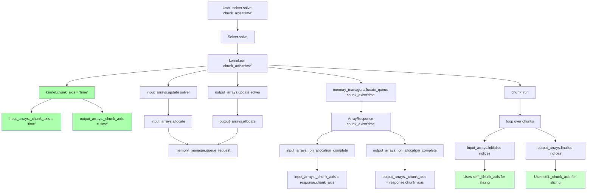
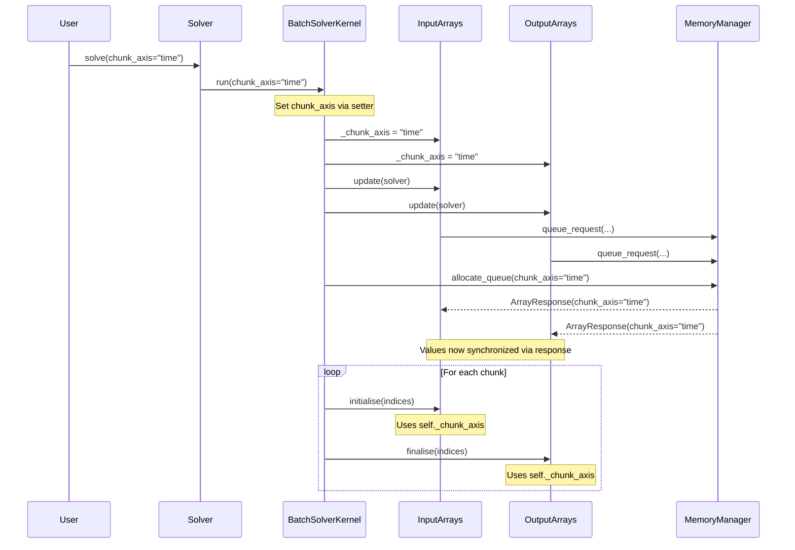

# chunk_axis Refactoring: Human Overview

## User Stories

### US1: Consistent chunk_axis Access
**As a** CuBIE developer  
**I want** `chunk_axis` to have a single source of truth on BaseArrayManager  
**So that** I can avoid stale values and inconsistent state across input and output arrays

**Acceptance Criteria:**
- `BaseArrayManager._chunk_axis` is the authoritative storage location
- All array operations draw `chunk_axis` from `self._chunk_axis`
- Value is synchronized between input and output array managers

### US2: Coordinated Property Access on BatchSolverKernel
**As a** user accessing `kernel.chunk_axis`  
**I want** a property that validates consistency between input and output managers  
**So that** I receive an error if the system is in an inconsistent state

**Acceptance Criteria:**
- `BatchSolverKernel.chunk_axis` is a property (not a public attribute)
- Property reads from both `input_arrays._chunk_axis` and `output_arrays._chunk_axis`
- Property raises an error if values don't match
- Returns the value if they match

### US3: Synchronized Update via Setter
**As a** developer updating `chunk_axis`  
**I want** a setter on BatchSolverKernel that updates both array managers  
**So that** I can set the value in one place and have it propagate consistently

**Acceptance Criteria:**
- `BatchSolverKernel.chunk_axis` setter updates both `input_arrays._chunk_axis` and `output_arrays._chunk_axis`
- Setter is called during `kernel.run()` before array operations
- OR setter is called via `update_from_solver()` on each array manager

### US4: Elimination of Redundant Storage
**As a** maintainer  
**I want** `chunk_axis` stored only on BaseArrayManager instances  
**So that** there's no confusion about which value is authoritative

**Acceptance Criteria:**
- `BatchSolverKernel` no longer has `self.chunk_axis = "run"` in `__init__`
- `Solver.chunk_axis` property continues to work (now via `kernel.chunk_axis` property)
- MemoryManager receives `chunk_axis` via parameter (unchanged)

---

## Executive Summary

This refactoring addresses the issue of multiple storage locations for `chunk_axis` in CuBIE's batch solving system. Currently, the value is stored in 4 locations (BatchSolverKernel, BaseArrayManager instances, ArrayResponse, and passed through MemoryManager), creating potential for stale values and inconsistencies.

The user's requirement modifies the proposal in the analysis document (Diagram 3) to:
1. **Keep BaseArrayManager as the source of truth** (not BatchSolverKernel)
2. **Add validation property on BatchSolverKernel** that checks consistency between input and output managers
3. **Add synchronized setter** that updates both managers atomically

---

## Architectural Flow Diagram

**Legend:**
- Green boxes: Source of truth updates and reads
- Light green: Array operations using the source of truth

---

## Data Flow Diagram

---

## Key Technical Decisions

### Decision 1: BaseArrayManager as Source of Truth
**Rationale:** The `_chunk_axis` attribute already exists on BaseArrayManager. Array operations (initialise, finalise, check_sizes) already read from `self._chunk_axis`. Making this the authoritative source minimizes code changes.

**Alternative Considered:** Moving source of truth to BatchSolverKernel (Diagram 3 proposal). Rejected because user requirement explicitly requests BaseArrayManager as source.

### Decision 2: Property with Consistency Check on BatchSolverKernel
**Rationale:** Rather than exposing a mutable public attribute, a property getter that validates input/output array consistency provides runtime safety. If the values ever diverge (which shouldn't happen), users get a clear error rather than silent corruption.

**Trade-off:** Slight overhead on property access. Acceptable given the safety benefits and infrequent access pattern.

### Decision 3: Setter Updates Both Array Managers
**Rationale:** Atomic update of both input and output arrays ensures consistency. The setter is the only way to modify chunk_axis externally, preventing accidental divergence.

### Decision 4: Update Location in kernel.run()
**Rationale:** The `kernel.run()` method already saves timing parameters (duration, warmup, t0). This is the natural location to also update chunk_axis, as it's the entry point where the user-provided value arrives.

**Alternative:** Adding update logic to `update_from_solver()`. This was the original approach but creates coupling where array managers need to know about the solver's chunk_axis. Updating directly in `run()` is cleaner.

---

## Trade-offs and Alternatives

| Approach | Pros | Cons |
|----------|------|------|
| **Selected: BaseArrayManager as SOT** | Minimal changes; aligns with existing attribute; array ops already use it | BatchSolverKernel property adds complexity |
| **Alt: BatchSolverKernel as SOT** | Single point of storage | Requires array managers to query kernel; more invasive refactor |
| **Alt: Remove from array managers** | Cleaner single storage | Breaking change to array manager interface; requires passing as parameter to methods |

---

## Impact on Existing Architecture

### Files Modified
1. **BatchSolverKernel.py** - Remove public attribute, add property/setter
2. **BaseArrayManager.py** - No changes needed (already has `_chunk_axis`)
3. **BatchInputArrays.py** - Remove redundant update in `update_from_solver()`
4. **BatchOutputArrays.py** - May need minor cleanup
5. **solver.py** - Property access unchanged (works through kernel property)

### Breaking Changes
- `BatchSolverKernel.chunk_axis` changes from public attribute to property (setter available)
- Direct assignment `kernel.chunk_axis = "x"` still works via setter

### Backward Compatibility
- External API (`Solver.chunk_axis`) unchanged
- `solver.solve(chunk_axis=...)` unchanged
- Property access pattern identical to current behavior

---

## References

- Analysis document: `/docs/chunk_axis_analysis.md`
- Related issue: #438 (chunking failures when VRAM limited)
- CuBIE internal structure: `.github/context/cubie_internal_structure.md`
