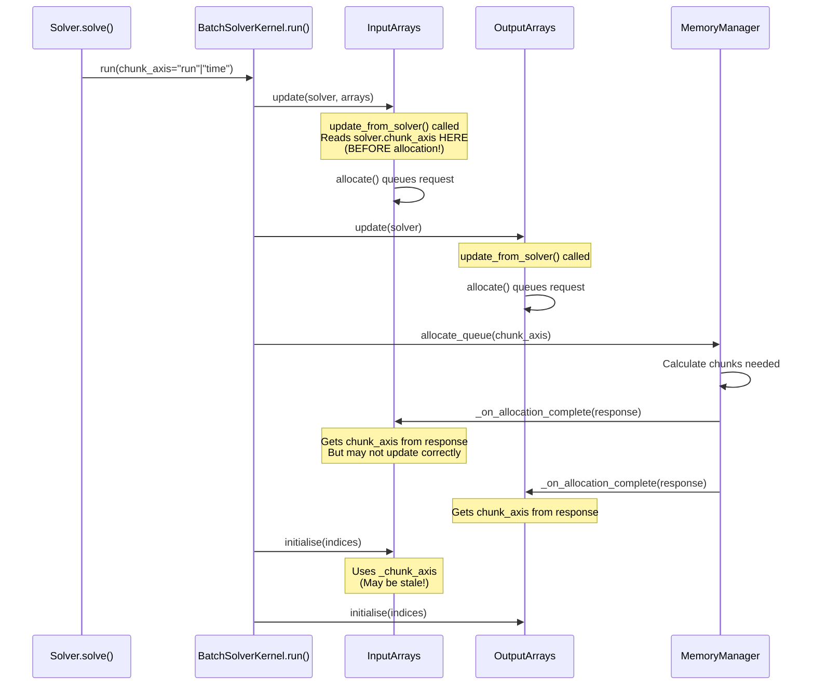
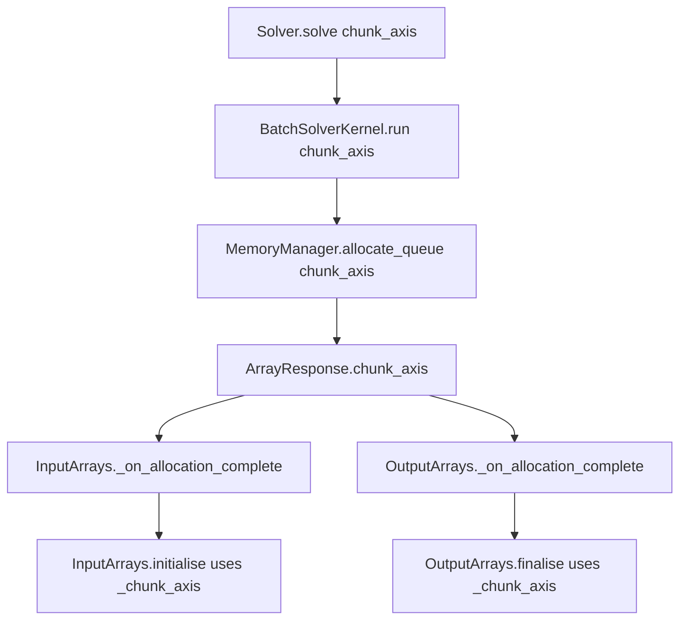

# Chunk Axis Refactor: Human Overview

## User Stories

### US-1: Single Source of Truth for Chunk Axis

**As a** developer maintaining the CuBIE codebase,
**I want** chunk_axis to have a single source of truth that flows from the
solver.solve() call down to all array operations,
**So that** the chunking behavior is consistent and predictable throughout
the integration pipeline.

**Acceptance Criteria:**
- chunk_axis is set once during solver.run() and propagated to all
  dependent components
- No component independently sets or assumes chunk_axis values
- Array managers receive chunk_axis through a consistent update path
- Tests in test_chunked_solver.py pass for both "run" and "time" axes

### US-2: Consistent Chunk Axis in Array Managers

**As a** developer working with the batch solver,
**I want** InputArrays and OutputArrays to use the chunk_axis value
determined by the memory manager's allocation response,
**So that** array slicing in initialise() and finalise() methods uses the
correct axis for chunked transfers.

**Acceptance Criteria:**
- Array managers use chunk_axis from ArrayResponse, not from solver
  properties accessed before allocation
- The chunk_axis used in initialise/finalise matches the axis used for
  array allocation
- Chunked transfers work correctly for multi-chunk runs

### US-3: Correct Array Shapes During Chunked Execution

**As a** user running batch integrations that exceed GPU memory,
**I want** the solver to correctly chunk and transfer data along the
specified axis,
**So that** my results are correct regardless of available GPU memory.

**Acceptance Criteria:**
- Chunked runs produce the same final results as non-chunked runs
- No stride incompatibility errors when chunking on "run" axis
- No missing axis errors when chunking on "time" axis

---

## Overview

### Problem Summary

The current chunk_axis implementation has multiple sources of truth:

1. **BatchSolverKernel.chunk_axis** - Instance attribute set to "run" at
   init, updated during run()
2. **InputArrays._chunk_axis** - Read from solver in update_from_solver()
3. **OutputArrays._chunk_axis** - Set via _on_allocation_complete() callback
4. **ArrayResponse.chunk_axis** - Returned by MemoryManager

The issue is that InputArrays reads chunk_axis from solver BEFORE the
memory manager determines the actual chunk_axis and number of chunks.
This creates a timing problem where:

- update_from_solver() is called
- InputArrays reads solver.chunk_axis (still default "run")
- allocate_queue() runs and determines actual chunking
- initialise() uses the stale chunk_axis value

### Data Flow Diagram

### Proposed Solution

Make chunk_axis flow consistently from solver.run() through the
allocation response and into array manager operations:

### Key Changes

1. **Remove early chunk_axis read from solver**: InputArrays and
   OutputArrays should NOT read chunk_axis from solver in
   update_from_solver(). Instead, they should only use the chunk_axis
   from _on_allocation_complete().

2. **Ensure consistent callback handling**: The _on_allocation_complete()
   callback already sets _chunk_axis from the response. Verify this
   happens correctly for both array managers.

3. **BatchSolverKernel.chunk_axis should be set by run()**: The chunk_axis
   property on BatchSolverKernel should be set from the run() parameter
   BEFORE arrays are updated, so any reads during the update phase get
   the correct value.

### Component Responsibility

| Component | Responsibility |
|-----------|---------------|
| Solver.solve() | Accepts chunk_axis parameter from user |
| BatchSolverKernel.run() | Receives chunk_axis, sets self.chunk_axis, passes to allocate_queue() |
| MemoryManager.allocate_queue() | Uses chunk_axis for chunking decisions, includes in ArrayResponse |
| ArrayResponse | Carries chunk_axis from MM to array managers |
| BaseArrayManager._on_allocation_complete() | Sets _chunk_axis from response |
| initialise()/finalise() | Uses _chunk_axis for slicing |

### Impact Assessment

**Files Modified:**
- `src/cubie/batchsolving/arrays/BatchInputArrays.py` - Remove early
  chunk_axis read from update_from_solver()
- `src/cubie/batchsolving/BatchSolverKernel.py` - Set chunk_axis early
  in run() before array updates

**Risk Level:** Low - Changes are isolated to chunk_axis flow, no kernel
or algorithm changes.

**Backwards Compatibility:** No API changes - chunk_axis parameter
already exists on solve().
