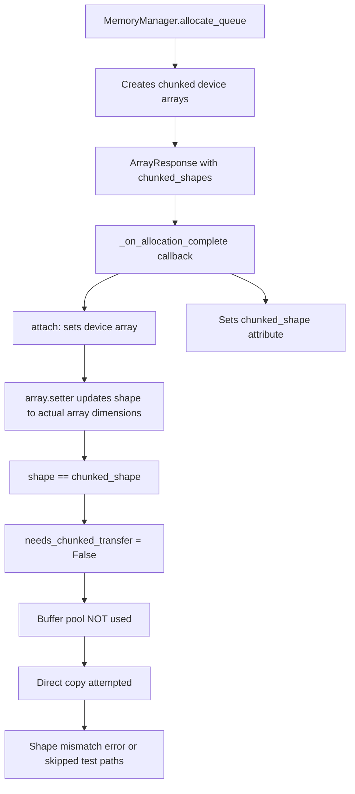
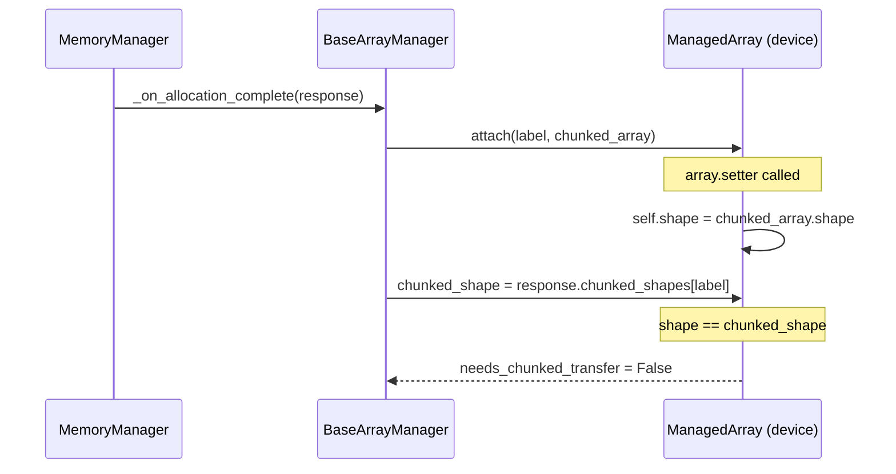
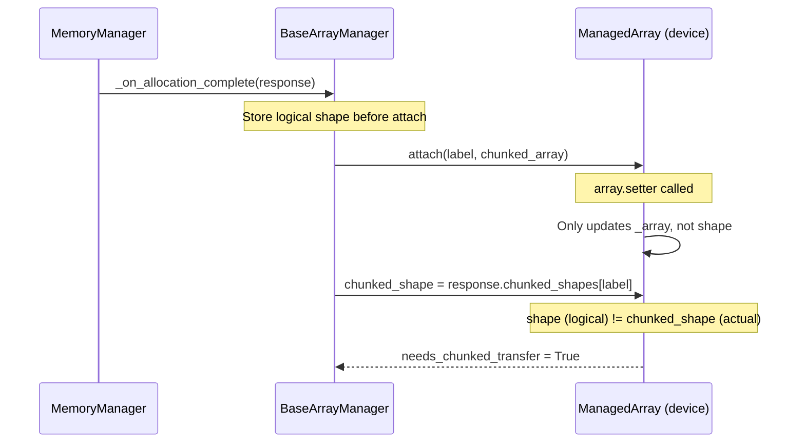

# Chunked Transfer Shape Fix - Human Overview

## User Stories

### US-1: Shape Preservation During Chunked Array Allocation
**As a** developer using CuBIE's batch solver with memory chunking,
**I want** the full logical shape of arrays to be preserved when device arrays are allocated with chunked dimensions,
**So that** the `needs_chunked_transfer` property correctly identifies arrays requiring sliced copy operations.

**Acceptance Criteria:**
- Device ManagedArray's `shape` attribute retains the full logical shape (matching host array)
- Device ManagedArray's `chunked_shape` attribute stores the per-chunk allocation shape
- `needs_chunked_transfer` returns `True` when `shape != chunked_shape`
- Host-to-device and device-to-host transfers correctly use slice-based copying when chunked

### US-2: Buffer Pool Activation for Chunked Transfers
**As a** developer using chunked mode for large batch runs,
**I want** the buffer pool mechanism to be activated when arrays require chunked transfers,
**So that** pinned memory staging works correctly for H2D and D2H operations.

**Acceptance Criteria:**
- `InputArrays.initialise()` uses buffer pool when `needs_chunked_transfer=True`
- `OutputArrays.finalise()` uses buffer pool when `needs_chunked_transfer=True`
- Buffer pool buffers are correctly acquired and released

### US-3: Test Fixtures Use Realistic Chunking Scenarios
**As a** test developer,
**I want** test fixtures to create scenarios where `needs_chunked_transfer` is properly triggered,
**So that** chunked transfer logic paths are correctly exercised.

**Acceptance Criteria:**
- Tests use sufficient run counts so `chunk_size < num_runs`
- Tests properly set `chunked_shape` on device arrays without overwriting `shape`

---

## Executive Summary

The test failures relate to the `needs_chunked_transfer` property in `ManagedArray` returning `False` when it should return `True`. This occurs because:

1. **Shape Overwriting**: When `ManagedArray.array` setter is called with a chunked device array, it updates the `shape` attribute to match the actual array dimensions. Since `chunked_shape` is also set to these dimensions, `shape == chunked_shape`, causing `needs_chunked_transfer` to return `False`.

2. **Test Fixture Issues**: Some test fixtures create scenarios where `num_runs // chunk_count = chunk_size`, and when both shapes end up equal, the property returns `False`.

### Root Cause Analysis

### Solution Overview

The fix involves separating the concept of **logical shape** (what the user expects) from **actual array shape** (what's allocated on device). The `ManagedArray` class needs to:

1. **Preserve logical shape**: The `shape` attribute should represent the full logical dimensions (matching host arrays)
2. **Track actual allocation**: Either via `chunked_shape` or a new attribute for the actual device allocation dimensions

### Data Flow - Before Fix

### Data Flow - After Fix

---

## Technical Decisions

### Option 1: Modify array.setter to not update shape (CHOSEN)
- Pros: Minimal change, shape semantically represents "logical" dimensions
- Cons: Breaks current behavior where shape auto-syncs with array
- Mitigation: Only apply this behavior for device arrays or when `chunked_shape` is set

### Option 2: Add separate `logical_shape` attribute
- Pros: Clear separation, doesn't change existing behavior
- Cons: More invasive change, need to update all consumers

### Option 3: Change `needs_chunked_transfer` to use different comparison
- Pros: Localized fix
- Cons: Semantically confusing, `shape` would still be wrong

**Decision**: Option 1 is chosen because `shape` semantically should represent the logical dimensions, not the current physical allocation. The fix should prevent the `array.setter` from updating `shape` when the array is being set for chunked operation.

---

## Test Issues Summary

| Test Category | Count | Root Cause | Fix |
|--------------|-------|------------|-----|
| needs_chunked_transfer = False | ~9 | shape == chunked_shape after attach | Don't overwrite shape |
| Buffer pool empty | ~5 | needs_chunked_transfer = False | Same as above |
| Memory too low | 2 | Mock memory < test requirements | Increase mock memory |

---

## References

- `src/cubie/batchsolving/arrays/BaseArrayManager.py` - ManagedArray and attach logic
- `src/cubie/batchsolving/arrays/BatchInputArrays.py` - initialise() with buffer pool
- `src/cubie/batchsolving/arrays/BatchOutputArrays.py` - finalise() with buffer pool
- `src/cubie/memory/mem_manager.py` - from_device and to_device methods
