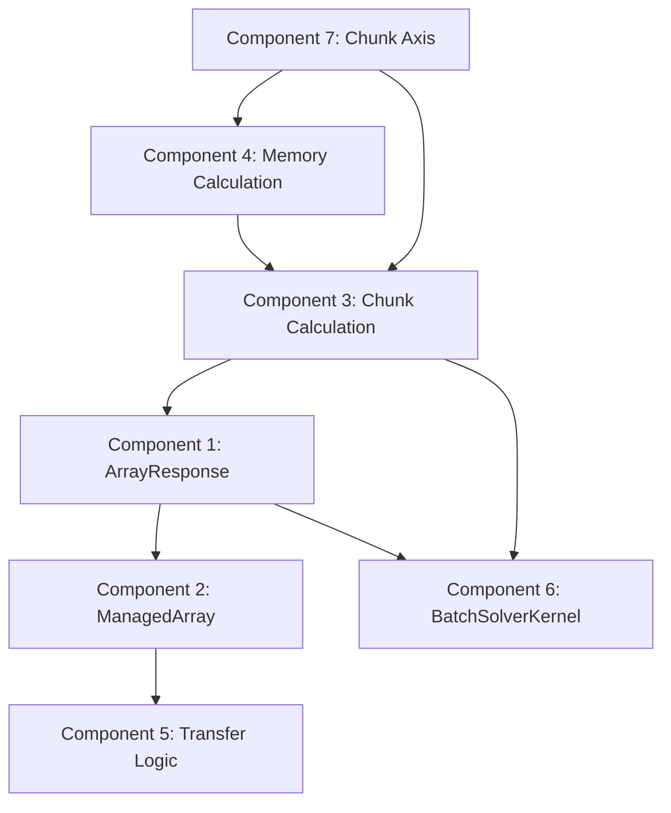

# Chunking Logic Overhaul - Agent Implementation Plan

## Overview

This plan restructures CuBIE's array chunking system to consolidate ownership in MemoryManager, fix the chunk size calculation bug, and simplify transfer logic. The changes are extensive and breaking.

---

## Component 1: Enhanced ArrayResponse

### Purpose
Store complete chunking metadata returned from MemoryManager, including per-array chunked shapes.

### Expected Behavior
- `ArrayResponse` gains a `chunked_shapes` dict mapping array labels to their chunked shapes
- The response includes both `num_chunks` (for iteration count) and per-array `chunked_shapes` (for exact sizing)
- Existing `chunks` field is retained for backward compatibility during transition

### Architectural Changes
- **File:** `src/cubie/memory/array_requests.py`
- Add `chunked_shapes: Dict[str, Tuple[int, ...]]` field to ArrayResponse
- Default to empty dict for non-chunked allocations
- `chunk_axis` remains to indicate which axis was chunked

### Integration Points
- MemoryManager populates `chunked_shapes` during allocation
- BaseArrayManager reads `chunked_shapes` in `_on_allocation_complete`
- ManagedArray receives its specific chunked_shape from the response

### Edge Cases
- Empty chunked_shapes dict indicates no chunking occurred
- Arrays not in chunked_shapes use their original shape

---

## Component 2: ManagedArray with Chunked Shape

### Purpose
Store both original shape and chunked shape to enable simple shape-comparison-based branching.

### Expected Behavior
- `ManagedArray.chunked_shape` holds the per-chunk shape when chunking is active
- When not chunked, `chunked_shape == shape`
- The `is_chunked` boolean can be derived as `shape != chunked_shape` or deprecated

### Architectural Changes
- **File:** `src/cubie/batchsolving/arrays/BaseArrayManager.py`
- Add `chunked_shape: Optional[Tuple[int, ...]]` field to ManagedArray
- Add property `needs_chunked_transfer` returning `self.shape != self.chunked_shape`
- Initialize `chunked_shape = shape` by default

### Integration Points
- BaseArrayManager._on_allocation_complete updates managed arrays with chunked_shapes from response
- Transfer functions check `needs_chunked_transfer` instead of complex boolean logic

### Edge Cases
- chunked_shape is None until first allocation completes
- For unchunkable arrays, chunked_shape always equals shape

---

## Component 3: Centralized Chunk Calculation in MemoryManager

### Purpose
Consolidate all chunk size and count calculations into MemoryManager, eliminating scattered logic.

### Expected Behavior
- MemoryManager computes `num_chunks` based on total memory of chunkable arrays only
- It computes `chunk_size = floor(axis_length / num_chunks)` to avoid overflow
- It computes exact `chunked_shape` for each array request
- Returns both in ArrayResponse

### Architectural Changes
- **File:** `src/cubie/memory/mem_manager.py`
- Refactor `chunk_arrays()` to compute chunked_shapes correctly:
  - Use floor division for chunk size, not ceiling
  - Handle final partial chunk explicitly
- Refactor `get_chunks()` to consider only chunkable array memory
- Add helper `compute_chunked_shapes()` returning Dict[str, Tuple[int, ...]]

### Integration Points
- `single_request()` and `allocate_queue()` call new calculation methods
- Results stored in ArrayResponse for consumers

### Data Structures
```python
def compute_chunked_shapes(
    requests: Dict[str, ArrayRequest],
    num_chunks: int,
    chunk_axis: str,
) -> Dict[str, Tuple[int, ...]]:
    """
    Compute per-array chunked shapes.
    
    For each chunkable array, compute the shape that fits
    within one chunk, using floor division to avoid overflow.
    Returns original shape for unchunkable arrays.
    """
```

### Edge Cases
- num_chunks == 1: all chunked_shapes equal original shapes
- Final chunk may have fewer items than chunk_size
- Arrays without chunk_axis in stride_order: use original shape

---

## Component 4: Accurate Chunkable Memory Calculation

### Purpose
Calculate memory requirements considering only arrays that will actually be chunked.

### Expected Behavior
- Sum memory for arrays where:
  - `chunk_axis in request.stride_order`
  - `request.unchunkable == False`
- This sum determines chunk count
- Unchunkable arrays are allocated at full size (not divided by num_chunks)

### Architectural Changes
- **File:** `src/cubie/memory/mem_manager.py`
- Add helper `get_chunkable_request_size()` that filters requests
- Modify `get_chunks()` or its callers to use this filtered size
- In `chunk_arrays()`, skip modification for unchunkable requests (already exists, verify correct)

### Integration Points
- Called by `single_request()` and `allocate_queue()` before computing num_chunks

### Edge Cases
- All arrays unchunkable: num_chunks = 1 (no chunking needed)
- Zero chunkable memory: avoid division by zero

---

## Component 5: Simplified Transfer Logic

### Purpose
Replace complex `is_chunked` flag logic with simple shape comparisons.

### Expected Behavior
- Transfer functions check `managed.shape != managed.chunked_shape`
- If shapes differ, use staged buffer transfers
- If shapes match, use direct transfers
- No need for separate is_chunked flags or chunk count checks

### Architectural Changes
- **File:** `src/cubie/batchsolving/arrays/BatchInputArrays.py`
- **File:** `src/cubie/batchsolving/arrays/BatchOutputArrays.py`
- Simplify `initialise()` and `finalise()` methods
- Replace `self.is_chunked and slot.is_chunked` with shape comparison
- Remove redundant is_chunked checks

### Integration Points
- Relies on ManagedArray.chunked_shape being set correctly
- Uses existing buffer pools and transfer mechanisms

### Edge Cases
- First run before any allocation: chunked_shape may be None, use shape
- Shape changes between runs: allocation callback updates chunked_shape

---

## Component 6: BatchSolverKernel Chunking Delegation

### Purpose
Remove chunk calculation from BatchSolverKernel; delegate entirely to MemoryManager.

### Expected Behavior
- BatchSolverKernel's `chunk_run()` method simplified or removed
- ChunkParams derived from ArrayResponse metadata, not recalculated
- Kernel launch loop uses num_chunks from allocation response

### Architectural Changes
- **File:** `src/cubie/batchsolving/BatchSolverKernel.py`
- Remove or simplify `chunk_run()` method
- ChunkParams computed from response data, not independently
- `run()` method reads chunk info from array managers

### Integration Points
- `_on_allocation()` callback receives ArrayResponse with chunk data
- Stored in kernel for iteration loop
- Array managers already have chunked shapes

### Edge Cases
- chunk_axis == "time": duration chunking has different semantics, may need special handling
- Warmup period: first chunk may have different timing

---

## Component 7: Consistent Chunk Axis Handling

### Purpose
Ensure chunk_axis flows correctly through the system with consistent interpretation.

### Expected Behavior
- chunk_axis parameter passed from Solver.solve to MemoryManager
- ArrayRequest.stride_order used to find the chunked dimension index
- All components use the same axis interpretation

### Architectural Changes
- Verify chunk_axis propagation through:
  - `Solver.solve()` → `BatchSolverKernel.run()` → `MemoryManager.allocate_queue()`
- Ensure ArrayRequest includes stride_order for axis resolution
- Verify ManagedArray stride_order matches ArrayRequest

### Integration Points
- Already mostly in place; verify consistency

### Edge Cases
- chunk_axis not in stride_order: array is not chunked on that axis
- Multi-dimensional chunking: not currently supported, verify single-axis assumption

---

## Dependencies Between Components



**Implementation Order:**
1. Component 4 (Memory Calculation) - foundation
2. Component 3 (Chunk Calculation) - core logic
3. Component 1 (ArrayResponse) - data structure
4. Component 2 (ManagedArray) - storage
5. Component 7 (Chunk Axis) - verification
6. Component 6 (BatchSolverKernel) - integration
7. Component 5 (Transfer Logic) - simplification

---

## Test Considerations

### Existing Tests to Update
- `tests/batchsolving/test_chunked_solver.py` - verify chunked execution
- `tests/memory/test_memmgmt.py` - chunk calculation tests
- `tests/batchsolving/arrays/test_basearraymanager.py` - ManagedArray changes
- `tests/batchsolving/arrays/test_batchinputarrays.py` - transfer logic
- `tests/batchsolving/arrays/test_batchoutputarrays.py` - transfer logic

### New Test Cases Needed
- Test exact chunk boundary handling (e.g., 5 runs with 4 chunks)
- Test unchunkable arrays don't inflate chunk count
- Test chunked_shape == shape when not chunked
- Test final partial chunk has correct size

### Edge Cases to Test
- num_runs % num_chunks != 0 (uneven division)
- Only unchunkable arrays (no chunking should occur)
- Single run (num_chunks should be 1)
- Memory exactly divisible (no partial chunks)

---

## Backward Compatibility Notes

This is explicitly a breaking change. Areas that may affect external code:

1. **ArrayResponse structure** - adds chunked_shapes field
2. **ManagedArray** - adds chunked_shape field
3. **is_chunked semantics** - may be deprecated in favor of shape comparison
4. **ChunkParams** - may be simplified or removed

Internal code using these APIs will need updates. No external public API changes expected since chunking is internal to the solve path.
