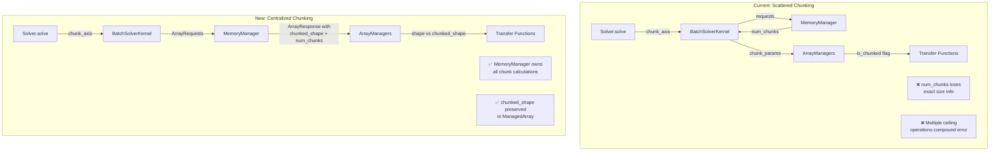
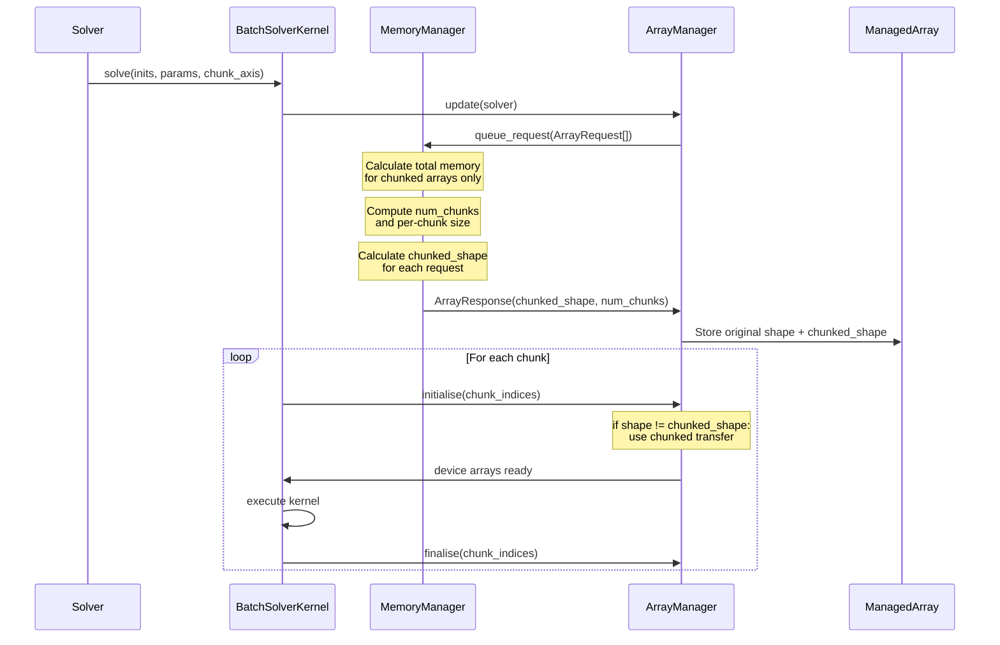

# Chunking Logic Overhaul - Human Overview

## User Stories

### US1: Consistent Chunk Size Calculation
**As a** CuBIE user running large batches  
**I want** the chunking system to correctly calculate chunk sizes  
**So that** I don't encounter array index out-of-bounds errors when runs don't divide evenly into chunks

**Acceptance Criteria:**
- When 5 runs need 4 chunks, the system handles remainder correctly
- Chunk indices never exceed the actual array bounds
- The final chunk processes only remaining runs (not a full chunk size)

### US2: Unified Chunking Logic Ownership
**As a** CuBIE developer  
**I want** chunking logic consolidated in a single location  
**So that** I can understand, maintain, and debug chunking behavior without tracing through multiple modules

**Acceptance Criteria:**
- Chunk calculation is performed in one authoritative location (MemoryManager)
- BatchSolverKernel, array managers, and solve functions delegate to this authority
- No duplicate chunk calculations across modules

### US3: Accurate Memory-Based Chunking
**As a** CuBIE user  
**I want** chunking to correctly account for which arrays are chunked vs unchunked  
**So that** the system allocates appropriate GPU memory and chunks only when necessary

**Acceptance Criteria:**
- Memory calculation distinguishes between chunked and unchunked arrays
- Unchunkable arrays (e.g., driver_coefficients) don't inflate chunk count
- Available memory is accurately compared against actual chunked memory needs

### US4: Simplified Chunk State Detection
**As a** CuBIE developer  
**I want** a simple way to determine if an array needs chunked transfers  
**So that** host↔device transfer code is clean and straightforward

**Acceptance Criteria:**
- `chunked_shape != shape` provides definitive chunking status
- Transfer functions use this simple comparison instead of complex `is_chunked` flags
- ManagedArray stores both original and chunked shapes

---

## Executive Summary

This overhaul restructures CuBIE's array chunking logic to fix existing bugs and consolidate ownership. The current implementation scatters chunking logic across `solve`, `BatchSolverKernel`, array managers, and `MemoryManager`, leading to:

1. **Index overflow bugs** - ceiling-rounded chunk sizes can extend past array bounds
2. **Lost precision** - returning `num_chunks` loses the information needed to calculate correct chunk sizes
3. **Inconsistent calculations** - chunk counts assume all arrays are chunked when some aren't
4. **Complex maintenance** - distributed logic makes debugging difficult

The new design centralizes chunk calculation in `MemoryManager`, stores complete chunking metadata in `ManagedArray`, and simplifies transfer logic with clear shape comparisons.

---

## Architecture Overview



---

## Data Flow Diagram



---

## Key Technical Decisions

### 1. MemoryManager as Single Source of Truth

**Rationale:** The MemoryManager already has access to available GPU memory and coordinates allocations. It should also own chunk size calculations since chunking is fundamentally a memory management concern.

**Change:** Move chunk calculation logic entirely into MemoryManager. It receives ArrayRequests with stride_order and chunk_axis, calculates the optimal chunk size once, and returns both `num_chunks` and `chunked_shape` in the ArrayResponse.

### 2. Store chunked_shape in ManagedArray

**Rationale:** Currently, `is_chunked` is a boolean flag that loses information. By storing the actual `chunked_shape` alongside the original `shape`, we preserve exact sizing and enable simple comparison-based branching.

**Change:** Add `chunked_shape` field to ManagedArray. Transfer logic becomes:
```python
if managed.shape != managed.chunked_shape:
    # Use chunked transfer with staging buffers
else:
    # Direct transfer
```

### 3. Compute Chunk Size, Not Just Chunk Count

**Rationale:** The current bug stems from computing `num_chunks = ceil(request_size / available)` and later computing `chunk_size = ceil(run_count / num_chunks)`. Two ceiling operations can produce chunk_size × num_chunks > run_count.

**Change:** Compute `chunk_size` directly as `floor(run_count / num_chunks)` where `num_chunks = ceil(request_size / available)`. Then handle the final partial chunk explicitly.

### 4. Distinguish Chunked vs Unchunked Arrays in Memory Calculation

**Rationale:** Driver coefficients and other unchunkable arrays don't benefit from chunking but currently inflate memory requirements in chunk calculations.

**Change:** When computing required memory:
- Sum memory for arrays where `chunk_axis in stride_order AND not unchunkable`
- Use this sum for chunk count calculation
- Unchunkable arrays are allocated at full size once

---

## Trade-offs and Alternatives

### Alternative A: Per-Array Chunk Calculation
Each ArrayRequest could specify its own chunking preference, and MemoryManager would return per-array chunk counts.

**Rejected:** Adds complexity and doesn't solve the coordination problem. All arrays in a stream group must use the same chunk boundaries for kernel execution.

### Alternative B: Chunking Coordinator Class
Create a new ChunkingCoordinator class to own all chunking logic.

**Rejected:** Adds indirection without clear benefit. MemoryManager already coordinates memory and is the natural home for this logic.

### Alternative C: Minimal Patches to Existing Logic
Fix the ceiling bug without restructuring.

**Rejected:** The issue explicitly requests extensive, breaking changes for a cleaner structure. Minimal patches would leave the scattered logic and future maintenance burden.

---

## Impact on Existing Architecture

### Files Significantly Modified
- `src/cubie/memory/mem_manager.py` - Enhanced chunk calculation
- `src/cubie/memory/array_requests.py` - ArrayResponse gains chunked_shape
- `src/cubie/batchsolving/arrays/BaseArrayManager.py` - Simplified chunk handling
- `src/cubie/batchsolving/arrays/BatchOutputArrays.py` - Updated transfer logic
- `src/cubie/batchsolving/arrays/BatchInputArrays.py` - Updated transfer logic
- `src/cubie/batchsolving/BatchSolverKernel.py` - Delegates chunking to MemoryManager

### Files Removed or Consolidated
- Potentially `chunk_run()` method in BatchSolverKernel (logic moves to MemoryManager)

### Breaking Changes
- ArrayResponse structure changes (adds chunked_shape)
- ManagedArray gains chunked_shape field
- ChunkParams may be simplified or removed
- is_chunked boolean replaced by shape comparison

---

## Research References

- Issue describes ceiling-rounded chunk bug example: 4 chunks for 5 runs → chunk size 2 → indices 0-7 when only 0-4 exist
- Current MemoryManager.get_chunks() at line 946-974 returns only num_chunks
- chunk_arrays() at line 1138-1184 applies ceiling division per-array
- ArrayRequest.stride_order exists and is used for axis identification
- ManagedArray.is_chunked boolean exists but doesn't capture shape delta
