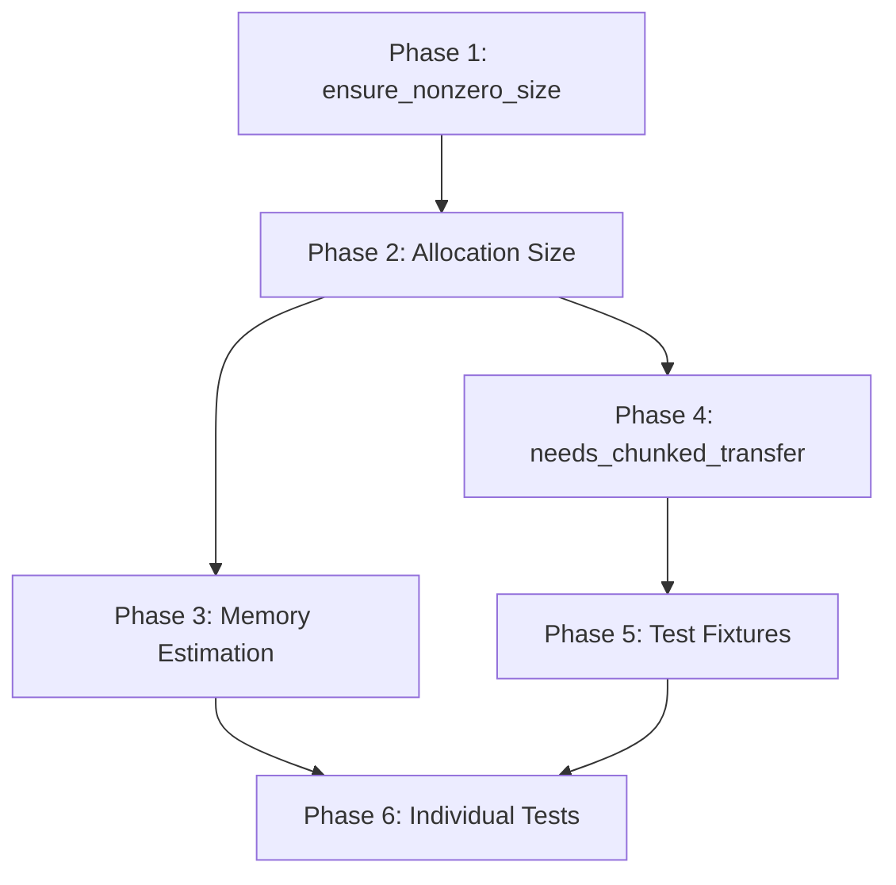

# Chunking Refactor Test Fixes - Agent Plan

## Overview

This plan addresses 67 failing tests after a chunking refactor. Fixes are organized by dependency order to enable incremental validation.

---

## Phase 1: Fix `ensure_nonzero_size` Function (Category 7)

### Component: `src/cubie/_utils.py`

**Current Behavior:**
- `ensure_nonzero_size((0, 5))` returns `(1, 5)` - only zero elements replaced
- `ensure_nonzero_size` does not handle `None` values in tuples
- Docstring examples show `(0, 2, 0)` → `(1, 2, 1)` which is WRONG

**Required Behavior:**
- When ANY tuple element is 0, the ENTIRE tuple becomes all 1s: `(0, 5)` → `(1, 1)`
- When ANY tuple element is 0: `(0, 2, 0)` → `(1, 1, 1)` 
- When ANY tuple element is 0: `(3, 0)` → `(1, 1)`
- `None` values should be treated as 0 (inactive): `(0, None)` → `(1, 1)`
- Integer inputs: `0` → `1`, non-zero unchanged
- If no zeros in tuple, preserve original: `(2, 3, 4)` → `(2, 3, 4)`

**Rationale:** This function creates a size-1 placeholder shape that `cuda.local.array` can instantiate without error. If ANY dimension is 0, that means the array is not active/needed, and we replace the ENTIRE shape with a minimal size-1 placeholder `(1, 1, ...)` rather than wasting memory on extra elements from non-zero dimensions. The shape `(0, 5)` means "zero rows of 5 columns" which is empty - we don't need 5 columns of nothing.

**Implementation:**
```python
def ensure_nonzero_size(value):
    if isinstance(value, int):
        return max(1, value)
    elif isinstance(value, tuple):
        # If ANY element is 0 or None, return all-ones tuple
        has_zero = any(
            (isinstance(v, (int, float)) and v == 0) or v is None
            for v in value
        )
        if has_zero:
            return tuple(1 for _ in value)
        return value
    else:
        return value
```

**Docstring must also be updated** to reflect the correct behavior with examples:
- `ensure_nonzero_size((0, 5))` → `(1, 1)` 
- `ensure_nonzero_size((0, 2, 0))` → `(1, 1, 1)`
- `ensure_nonzero_size((2, 3, 4))` → `(2, 3, 4)` (unchanged, no zeros)

**Affected Tests:**
- `tests/outputhandling/test_output_sizes.py::TestNonzeroProperty::test_nonzero_property_tuple_values`
- `tests/outputhandling/test_output_sizes.py::TestBatchInputSizes::test_nonzero_functionality`
- `tests/test_utils.py::TestEnsureNonzeroSize` (verify existing tests still pass)

**Integration Points:**
- `ArraySizingClass.nonzero` property in `output_sizes.py` uses this function
- All sizing classes rely on this for safe array allocation

---

## Phase 2: Fix Device Array Allocation Size (Categories 1-2)

### Problem Statement

Device arrays are allocated with size 1 on the run axis instead of `chunk_length`. This causes:
1. `IndexError` when kernel accesses `inits[:, run_index]` with `run_index > 0`
2. `ValueError: incompatible shape` during `copy_to_host` when device has different shape than host slice

**Error Details:**
- Device array has shape `(101, 3, 1)` - only 1 run on axis 2
- Host array has shape `(101, 3, 5)` - 5 runs on axis 2
- The device array wasn't allocated with chunk_length, but with default size 1

### Component: `src/cubie/memory/mem_manager.py`

**Verified Allocation Flow (Code Review):**

```
1. BaseArrayManager.allocate() - line 836-866
   - Creates ArrayRequest with shape=host_array.shape (full batch size, e.g., 5 runs)
   - Calls queue_request()

2. MemoryManager.allocate_queue() - line 1158-1238
   - Computes axis_length from get_chunk_axis_length() 
   - Computes chunk_length, num_chunks from get_chunk_parameters()
   - Computes chunked_shapes via compute_chunked_shapes()
   - Creates chunked_requests with modified shapes (line 1213-1215)
   - Calls allocate_all(chunked_requests, instance_id, stream)
   - Calls allocation_ready_hook with ArrayResponse

3. allocate_all() - line 970-1004
   - Uses request.shape from chunked_requests ✓
   - Calls allocate(shape=request.shape, ...)
   
4. allocate() - line 1006-1051
   - Calls cuda.device_array(shape, dtype) ✓
```

**Root Cause Identified:**

The issue is NOT in the allocation code itself. The issue is that the **default fallback shape** in `ManagedArray.__attrs_post_init__` (line 96-100 of BaseArrayManager.py) creates arrays with shape `(1,) * len(stride_order)`:

```python
def __attrs_post_init__(self):
    shape = self.shape
    stride_order = self.stride_order
    defaultshape = shape if shape else (1,) * len(stride_order)
    self._array = np_zeros(defaultshape, dtype=self.dtype)
```

When `ManagedArray.shape` is an empty tuple or None, the default becomes `(1, 1, 1)`. The actual device array from `allocate_queue()` is stored via `_on_allocation_complete()`, but if that callback never runs (no requests queued) or runs with wrong data, the default shape persists.

**Investigation Points:**
1. Check if `queue_request()` is actually queuing requests
2. Check if `allocate_queue()` is being called with correct stream_group
3. Verify `_on_allocation_complete()` callback is receiving correct arrays

### Component: `src/cubie/batchsolving/arrays/BaseArrayManager.py`

**_on_allocation_complete Method (lines 338-384):**
- Receives `ArrayResponse` with `chunked_shapes`
- Stores arrays via `self.device.attach(array_label, arrays[array_label])`
- Stores `chunked_shape` in both device and host `ManagedArray`

**Potential Issue:** The arrays in `response.arr` may already be wrong size when received from `allocate_queue()`.

**Affected Tests:**
- `test_solver.py::test_chunk_related_properties`
- `test_chunked_solver.py` - all chunked execution tests
- `test_pinned_memory_refactor.py` - most tests

---

## Phase 3: Fix Memory Estimation (Category 3)

### Component: `src/cubie/memory/mem_manager.py`

**Error Pattern:** 
```
ValueError: Can't fit a single run in GPU VRAM. Available memory: 4096.
```

**Location:** `get_chunk_parameters()` method (line 1240+)

**Analysis Required:**
1. The simulated VRAM is 4096 bytes in tests
2. Memory calculation must be overestimating required size
3. Check `get_portioned_request_size()` for calculation errors
4. Verify `get_available_memory()` returns correct values

**Fix Strategy:**
- Review memory calculation logic
- Ensure unchunkable_size calculations are correct
- Verify available_memory calculation against simulated VRAM

**Affected Tests:**
- Tests using memory-constrained fixtures with 4096 bytes

---

## Phase 4: Fix needs_chunked_transfer and Buffer Pool (Categories 4, 6)

### Component: `src/cubie/batchsolving/arrays/BaseArrayManager.py`

**ManagedArray.needs_chunked_transfer Property (lines 85-94):**
```python
@property
def needs_chunked_transfer(self) -> bool:
    if self.chunked_shape is None:
        return False
    return self.shape != self.chunked_shape
```

**Problem:** Returns `False` when `chunked_shape is None`, which happens when:
1. `allocate_queue()` was never called
2. Array not included in response (peer notification case)

**Root Cause:** Tests or code paths that call `allocate()` without calling `allocate_queue()` leave `chunked_shape` as `None`.

**Investigation Points:**
1. Trace test fixtures to verify they call `allocate_queue()`
2. Check `solver.py` flow to ensure `allocate_queue()` is called before kernel
3. Verify `_on_allocation_complete` is being invoked

### Component: `src/cubie/batchsolving/arrays/BatchInputArrays.py`

**initialise Method (lines 290-335):**
- Checks `needs_chunked_transfer` to decide buffer pool usage
- If `False` when it should be `True`, buffers aren't acquired

**Affected Tests:**
- Tests asserting `len(_active_buffers) > 0`
- Tests checking buffer pool population

---

## Phase 5: Fix Test Fixtures (Category 5)

### Problem: device_initial_values is None

**Error Pattern:**
```
assert device_initial_values is not None
```

**Root Cause:** Tests call `allocate()` but don't call `allocate_queue()` to process queued requests.

**Fix Strategy:**
1. Update test fixtures to call `allocate_queue()` after `allocate()`
2. Or update tests to use `Solver.solve()` which handles this correctly

**Affected Files:**
- Test fixtures in `tests/conftest.py`
- Individual test setup code

---

## Phase 6: Fix Remaining Individual Tests (Category 8)

### test_basearraymanager.py: TypeError on None array

**Error:** `TypeError: 'NoneType' object has no attribute 'copy_to_host'`

**Fix:** Ensure device arrays are allocated before transfer operations

### test_conditional_memory.py: memory_type is 'pinned' instead of 'host'

**Error:** Host array memory_type not being downgraded for chunked mode

**Location:** `BatchOutputArrays._downgrade_pinned_to_host()` method

**Investigation:** Check if method is being called when `needs_chunked_transfer` is True

### test_memmgmt.py: shape (4, 4, 8) instead of (4, 4, 4)

**Error:** Array shape mismatch in chunk size test

**Investigation:** Verify expected chunk size calculation

### test_memmgmt.py: Regex pattern mismatch

**Error:** Error message doesn't match expected pattern

**Fix:** Update regex pattern or error message to match

---

## Architectural Integration Points

### Data Flow: Solver → Memory Manager → Array Managers

```
Solver.solve()
  ├── kernel.run()
  │     ├── input_arrays.update(solver) → allocate() → queue_request()
  │     ├── output_arrays.update(solver) → allocate() → queue_request()
  │     ├── memory_manager.allocate_queue() → _on_allocation_complete()
  │     ├── input_arrays.initialise(chunk_i)
  │     ├── output_arrays.initialise(chunk_i)
  │     ├── kernel[...](...) ← Uses device arrays
  │     ├── input_arrays.finalise(chunk_i)
  │     └── output_arrays.finalise(chunk_i)
```

### Key State Variables

| Variable | Location | Purpose |
|----------|----------|---------|
| `chunked_shape` | `ManagedArray` | Per-chunk array shape |
| `_chunks` | `BaseArrayManager` | Number of chunks |
| `needs_chunked_transfer` | `ManagedArray` | Whether staging buffers needed |
| `_active_buffers` | `InputArrays` | Acquired staging buffers |
| `chunked_slices` | `ArrayResponse` | Slice functions per array |

---

## Edge Cases to Consider

1. **Single chunk (num_chunks=1):** Should behave like non-chunked mode
2. **Final chunk smaller than chunk_length:** Must handle partial chunks
3. **Time-axis chunking:** Different from run-axis chunking
4. **Unchunkable arrays:** Must not be chunked regardless of memory pressure
5. **Peer notifications:** Empty ArrayResponse for non-requesting peers

---

## Dependencies Between Fixes



---

## Success Criteria

1. All 67 failing tests pass
2. No new test failures introduced
3. No changes to public API
4. Memory allocation correctly uses chunk sizes
5. Buffer pool populated for chunked transfers
6. `ensure_nonzero_size` handles zeros and None correctly
