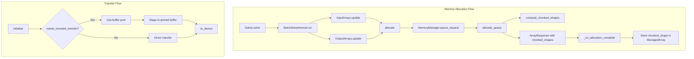

# Chunking Refactor Test Fixes - Human Overview

## User Stories

### US-1: As a developer, I want device arrays to be allocated with the correct chunk size so that kernel execution can access array elements without IndexError

**Acceptance Criteria:**
- Device arrays for chunked batches are allocated with `chunk_length` runs, not 1
- The `rx_inits = inits[:, run_index]` access in `BatchSolverKernel.py:791` succeeds for all valid run indices
- Tests in `test_solver.py`, `test_chunked_solver.py`, and `test_pinned_memory_refactor.py` pass

### US-2: As a developer, I want host-to-device and device-to-host transfers to use matching array shapes so that no ValueError occurs during copy

**Acceptance Criteria:**
- The `copy_to_host()` call in `mem_manager.py:1139` receives arrays with matching shapes
- No `ValueError: incompatible shape: (X, Y, Z1) vs. (X, Y, Z2)` errors during chunked execution
- Device arrays have chunk-sized run dimensions matching the pinned staging buffers

### US-3: As a developer, I want memory estimation to correctly calculate available VRAM so that single-run fits are not incorrectly rejected

**Acceptance Criteria:**
- Memory estimation accounts for all allocation factors correctly
- No `ValueError: Can't fit a single run in GPU VRAM` for valid small batches
- Memory chunking logic triggers only when genuinely required

### US-4: As a developer, I want the buffer pool to be populated when chunked transfers are needed so that staging buffers are available

**Acceptance Criteria:**
- `_active_buffers` is populated when `needs_chunked_transfer` returns `True`
- The `assert len(_active_buffers) > 0` check passes in buffer pool tests
- `needs_chunked_transfer` correctly identifies when chunking is active

### US-5: As a developer, I want the nonzero property to correctly handle output sizing so that zero-sized arrays become minimal placeholder arrays

**Acceptance Criteria:**
- When any tuple dimension is 0, the entire tuple becomes `(1, 1, ...)` for safe allocation
- `ensure_nonzero_size((0, 5))` returns `(1, 1)`, not `(1, 5)`
- `None` values in tuples are converted to `1` for safe allocation

---

## Executive Summary

This plan addresses 67 failing tests (46 failed + 21 errors) after a large refactor of chunking and array operations in CuBIE. The failures cluster into 8 distinct categories, with most stemming from two root causes:

1. **Device arrays allocated with size 1 instead of chunk size** (Categories 1-2, ~22 failures)
2. **Incorrect `needs_chunked_transfer` behavior** (Categories 4, 6, ~10 failures)

---

## Architecture Overview



---

## Root Cause Analysis

### Category 1 & 2: IndexError and Shape Mismatch (22+ failures)

**Error Pattern:**
```
IndexError: index 12 is out of bounds for axis 1 with size 1
ValueError: incompatible shape: (101, 3, 1) vs. (101, 3, 5)
```

**Root Cause Analysis (Code Traced):**

The allocation code path is CORRECT - `allocate_queue()` does compute chunked shapes and allocate with them. The issue is that some code paths are accessing device arrays BEFORE `allocate_queue()` processes the requests, or the callbacks aren't being triggered correctly.

**Traced Flow:**
1. `BaseArrayManager.allocate()` creates `ArrayRequest` with host array shape and calls `queue_request()`
2. `MemoryManager.allocate_queue()` computes chunked shapes and calls `allocate_all()` with correct shapes
3. `allocate_all()` uses `request.shape` which is the chunked shape ✓
4. Callback `_on_allocation_complete()` stores arrays and chunked_shape in ManagedArray

**Likely Issue:** The `ManagedArray.__attrs_post_init__` creates a default numpy array with shape `(1,) * len(stride_order)`. If `allocate_queue()` is never called or the callback fails, the default array (size 1 on each axis) is used instead.

**Investigation Focus:**
- Verify that `queue_request()` is adding requests to the queue
- Verify that `allocate_queue()` is being called with correct triggering instance
- Verify that the callback `_on_allocation_complete()` receives correct arrays

### Category 3: Can't Fit Single Run (6 failures)

**Error Pattern:**
```
ValueError: Can't fit a single run in GPU VRAM. Available memory: 4096.
```

**Root Cause:** Memory estimation logic in `get_chunk_parameters` incorrectly calculates required memory, causing valid small batches to be rejected. The simulated VRAM of 4096 bytes is being exceeded by incorrect size calculations.

### Category 4 & 6: Buffer Pool / needs_chunked_transfer (10 failures)

**Error Pattern:**
```
assert len(_active_buffers) > 0
chunked_shape is None
needs_chunked_transfer returns False
```

**Root Cause:** The `needs_chunked_transfer` property in `ManagedArray` returns `False` when `chunked_shape is None`. For non-chunked mode, this is correct. But when chunking IS needed, `chunked_shape` must be set via `_on_allocation_complete`. If `allocate_queue()` is never called (tests call `allocate()` without `allocate_queue()`), `chunked_shape` remains `None`.

### Category 7: nonzero Property (3 failures)

**Error Pattern:**
```
assert nonzero_sizes.state == (1, 1)  # but got (1, 5)
assert nonzero_sizes.driver_coefficients[1] == 1  # but got None
```

**Root Cause:** The `ensure_nonzero_size` function only replaces individual zeros, but it should create a minimal size-1 placeholder shape when ANY dimension is zero.

**Design Intent:** This function creates a size-1 placeholder shape that `cuda.local.array` can instantiate without error. If ANY dimension is 0, that means the array is not active/needed, and we replace the ENTIRE shape with a minimal size-1 placeholder `(1, 1, ...)` rather than wasting memory on extra elements from non-zero dimensions. The shape `(0, 5)` means "zero rows of 5 columns" which is empty - we don't need 5 columns of nothing.

**Required Behavior:**
- `(0, 5)` → `(1, 1)` (ANY zero means ALL become 1)
- `(0, 2, 0)` → `(1, 1, 1)` (ANY zero means ALL become 1)
- `(3, 0)` → `(1, 1)` (ANY zero means ALL become 1)
- `(2, 3, 4)` → `(2, 3, 4)` (no zeros, preserve original)
- `None` values treated as inactive (zero)

**Implementation fix needed in:** `src/cubie/_utils.py` - both function and docstring

---

## Fix Strategy by Category

| Category | Type | Fix Location | Description |
|----------|------|--------------|-------------|
| 1-2 | Production Bug | `mem_manager.py`, `BaseArrayManager.py` | Ensure device arrays allocated with chunk_length size |
| 3 | Production Bug | `mem_manager.py` | Fix memory estimation in get_chunk_parameters |
| 4, 6 | Production Bug | Test flow / `BaseArrayManager.py` | Ensure allocate_queue() called before kernel |
| 5 | Test Issue | Various tests | Tests call allocate() without allocate_queue() |
| 7 | Production Bug | `_utils.py` | Fix ensure_nonzero_size to handle None and zero-implies-all-ones |
| 8 | Mixed | Various | Individual fixes per test |

---

## Dependency Order

1. **First:** Fix `ensure_nonzero_size` (Category 7) - standalone, no dependencies
2. **Second:** Fix allocation flow (Categories 1-2) - core issue affecting most tests  
3. **Third:** Fix memory estimation (Category 3) - depends on allocation being correct
4. **Fourth:** Fix buffer pool/chunked_transfer (Categories 4, 6) - depends on allocation
5. **Fifth:** Update test fixtures (Category 5) - depends on production code being correct
6. **Last:** Fix remaining individual tests (Category 8)

---

## Expected Impact

- **Lines of production code changed:** ~20-50 lines
- **Test file changes:** ~5-10 lines of test fixture updates
- **Risk:** Medium - changes to core memory allocation affect many code paths
- **Testing:** All 67 failing tests should pass after fixes

---

## References

- Issue context from PR review comments
- `cubie_internal_structure.md` for architecture understanding
- Memory management flow in `mem_manager.py`
- Array management in `BaseArrayManager.py`, `BatchInputArrays.py`, `BatchOutputArrays.py`
