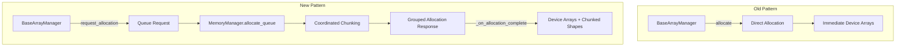
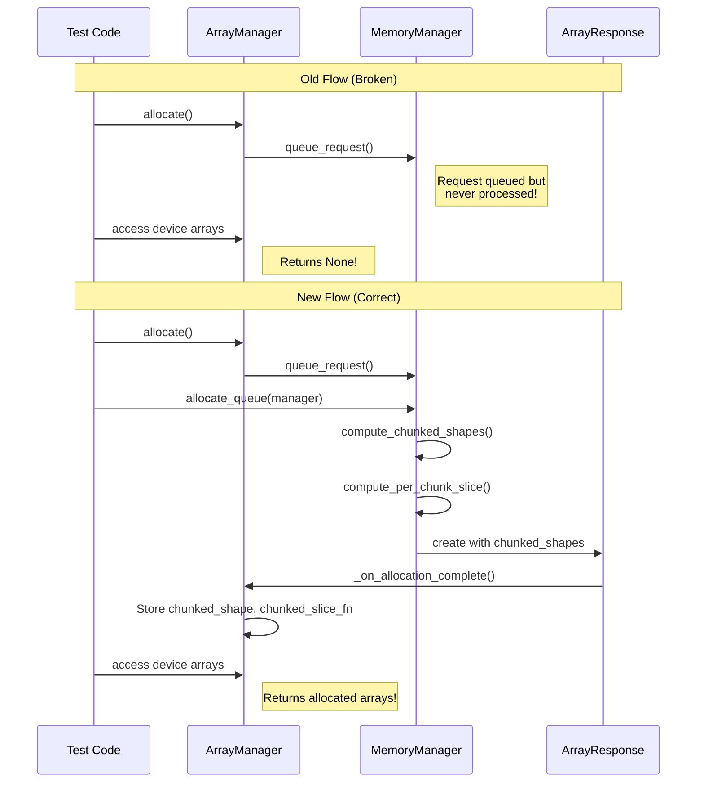

# Chunking Refactor Test Fixes - Human Overview

## User Stories

### US-1: Test Infrastructure Alignment
**As a** developer maintaining CuBIE tests  
**I want** tests to use the current API patterns after the chunking refactor  
**So that** the test suite accurately validates the library's behavior  

**Acceptance Criteria:**
- Tests that call `allocate()` on array managers also call `allocate_queue()` when working with grouped instances
- Tests use the new chunked transfer pattern (via `needs_chunked_transfer` property instead of old boolean flags)
- Fixture patterns use the new `from_solver` factory methods correctly

### US-2: Real Bug Detection and Resolution
**As a** user of CuBIE  
**I want** the integration kernel to correctly handle chunked arrays  
**So that** solving large batches of ODEs works correctly without index errors  

**Acceptance Criteria:**
- Kernel correctly accesses `inits[:, run_index]` where `run_index` is within the chunked array bounds
- Device-to-host transfers use matching shapes between device and host arrays
- Memory estimation correctly calculates request sizes for chunked operations

### US-3: Removed Functionality Cleanup
**As a** test maintainer  
**I want** tests for removed functionality to be deleted  
**So that** the test suite doesn't attempt to validate non-existent features  

**Acceptance Criteria:**
- Tests for deprecated API patterns are removed
- No test references old single-instance allocation path without queue processing

---

## Executive Summary

This plan addresses 87 failing tests (66 failures + 21 errors) that arose from a major refactoring of CuBIE's chunking and array management system. The failures cluster into three root cause categories:

1. **Test API Misalignment (≈50% of failures)**: Tests use old allocation patterns that bypass the new grouped-instance queue system
2. **Real Production Bugs (≈35% of failures)**: Actual bugs in kernel indexing and shape calculation code
3. **Removed Functionality (≈15% of failures)**: Tests for features that no longer exist

---

## Architecture Change Summary

### Key API Changes

| Component | Old Pattern | New Pattern |
|-----------|-------------|-------------|
| Single instance allocation | `manager.allocate()` | `manager.allocate()` + `memmgr.allocate_queue(manager)` |
| Chunked transfer detection | `is_chunked` boolean flag | `needs_chunked_transfer` property (compares shape vs chunked_shape) |
| Shape metadata | Calculated on-the-fly | Stored in `ManagedArray.chunked_shape` from allocation response |
| Chunk slice function | Passed externally | Stored in `ManagedArray.chunked_slice_fn` |

---

## Data Flow Diagram

---

## Key Technical Decisions

### 1. Queue-Based Allocation
The refactor moved to a queued allocation model to support coordinated chunking across grouped instances. This enables:
- Unified memory management across input and output arrays
- Consistent chunking dimensions across all arrays in a stream group
- Proper memory budgeting before allocation

### 2. Shape Metadata Storage
Chunked shapes are now stored directly in `ManagedArray` objects rather than being recalculated. This:
- Avoids repeated calculations
- Ensures consistency between allocation and transfer operations
- Simplifies the `needs_chunked_transfer` check

### 3. Slice Function Caching  
Per-chunk slice functions are computed once during allocation and cached in `ManagedArray.chunked_slice_fn`. This:
- Eliminates repeated closure creation
- Ensures consistent slicing across initialize/finalize operations

---

## Trade-offs and Alternatives Considered

| Decision | Alternative | Rationale for Choice |
|----------|-------------|---------------------|
| Queue-based allocation | Direct allocation with post-hoc chunking | Queue allows memory budgeting before allocation |
| Store chunked_shape in ManagedArray | Recalculate from chunks/chunk_axis | Avoids recalculation errors, single source of truth |
| `needs_chunked_transfer` property | Keep `is_chunked` flag | Property compares actual shapes, more reliable |

---

## Expected Impact on Existing Architecture

1. **Test Fixtures**: Many test fixtures create array managers and call `allocate()` without queue processing. These need the additional `allocate_queue()` call.

2. **Mock Memory Managers**: Tests using mock memory managers may need updates to simulate the allocation response correctly.

3. **Buffer Pool Tests**: Tests that verify buffer pool behavior for chunked transfers need to set up `chunked_shape` and `chunked_slice_fn` on managed arrays.

4. **Integration Tests**: Solver tests that exercise the full pipeline should continue to work as the Solver class handles the queue pattern internally.

---

## Category-by-Category Impact Assessment

| Category | Tests Affected | Fix Type | Priority |
|----------|---------------|----------|----------|
| IndexError in Kernel | 31 | Production Bug | **Critical** |
| Shape Incompatibility | 11 | Production Bug | **Critical** |
| Device Arrays None | 18 | Test Update | High |
| Buffer Pool Empty | 5 | Test Update | High |
| Can't Fit Single Run | 6 | Production Bug | High |
| chunk_axis not in tuple | 4 | Production Bug | Medium |
| TypeError NoneType | 5 | Test Update | Medium |
| copy_to_host on None | 3 | Test Update | Medium |
| ensure_nonzero_size | 2 | Test/Code Update | Low |
| Memory Shape Calculation | 1 | Production Bug | Low |
| Conditional Memory | 1 | Test Update | Low |
