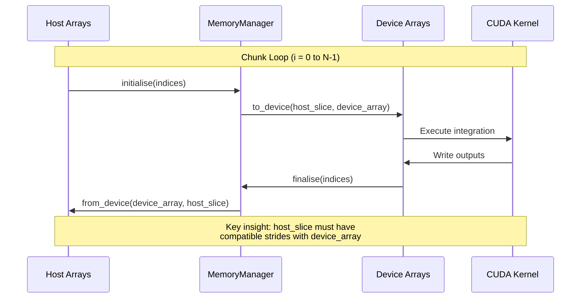

# Chunking and Stride Fix - Human Overview

## User Stories

### US-1: As a user running large batch integrations, I want chunked execution to work correctly so that I can run simulations that exceed available VRAM

**Acceptance Criteria:**
- Batch runs with more data than available VRAM are automatically chunked
- Run-axis chunking correctly transfers host array slices to/from device
- Time-axis chunking correctly transfers host array slices to/from device
- No stride mismatch errors occur during chunked host-device transfers
- Solver returns correct numerical results for chunked vs non-chunked runs

### US-2: As a maintainer, I want the striding system simplified so that the codebase is easier to maintain and the hot-path is efficient

**Acceptance Criteria:**
- Custom striding code is removed from mem_manager.py
- Custom striding code is removed from BaseArrayManager.py
- Arrays are created with correct stride order from the start
- No extra reorders or reshapes occur in the hot-path (finalise/initialise)
- Device arrays are contiguous for optimal CUDA compiler assumptions

### US-3: As a developer, I want regression tests for chunking so that future changes don't reintroduce these bugs

**Acceptance Criteria:**
- Tests cover run-axis chunking with multiple chunks
- Tests cover time-axis chunking with multiple chunks
- Tests work in CUDASIM mode (no real GPU required)
- Tests verify numerical correctness of chunked outputs
- Tests verify that host-device transfers succeed without errors

---

## Executive Summary

The chunking subsystem in CuBIE has regressed after several refactors. Two
critical bugs manifest when VRAM is limited:

1. **Run-axis chunking stride mismatch**: When device arrays are chunked on
   the run axis, the `copy_to_host` operation fails because the host array
   slice has different strides than the device array (the host is a view
   into a larger contiguous array).

2. **Time-axis chunking `tuple.index` error**: When chunking on the time
   axis, input arrays (which have no "time" dimension) cause a `ValueError`
   when the code attempts to find the time axis index.

The root cause is the complex custom striding system that was designed for
flexible memory layouts but has become a maintenance burden with subtle
bugs. The proposed fix removes custom striding entirely and ensures arrays
are created in the correct order from the start.

---

## Architecture Overview

```mermaid
graph TD
    subgraph "Current Flow (Buggy)"
        A[Solver.solve] --> B[BatchSolverKernel.run]
        B --> C[allocate_queue]
        C --> D[chunk_arrays]
        D --> E[allocate with custom strides]
        E --> F[finalise - copy_to_host FAILS]
    end

    subgraph "Fixed Flow"
        A2[Solver.solve] --> B2[BatchSolverKernel.run]
        B2 --> C2[allocate_queue]
        C2 --> D2[chunk_arrays - skip non-applicable axes]
        D2 --> E2[allocate contiguous arrays]
        E2 --> F2[finalise - direct slice copy]
    end
```

---

## Data Flow - Chunked Execution

---

## Key Technical Decisions

### 1. Remove Custom Striding Entirely

**Rationale**: The custom striding system (`get_strides`, `_convert_to_device_strides`,
`_stride_order` tracking) adds complexity without clear benefit. CUDA compilers
can only assume arrays are contiguous if they have standard C-order strides.
Custom strides break this assumption and prevent optimizations.

**Changes**:
- Remove `_stride_order` from MemoryManager
- Remove `get_strides()` from MemoryManager  
- Remove `set_global_stride_ordering()` from MemoryManager
- Remove `_convert_to_device_strides()` from BaseArrayManager
- Remove stride-related fields from ArrayRequest
- Simplify `create_host_array()` to always create C-contiguous arrays

### 2. Fix chunk_arrays to Handle Missing Axes

**Rationale**: Input arrays (2D) don't have a "time" axis, so chunking on
time should skip them. The current code crashes because it assumes all
arrays have the chunk axis.

**Changes**:
- Add defensive check in `chunk_arrays()` to skip arrays without the chunk axis
- The `unchunkable` flag already exists but isn't being used correctly for this

### 3. Fix Host-Device Slice Compatibility

**Rationale**: When slicing a host array for chunked transfers, the slice is
a view with strides of the parent array. The device array has its own strides.
Numba's `copy_to_host` requires matching strides.

**Changes**:
- Create host arrays as contiguous in the correct order from the start
- Use `.copy()` on host slices when necessary to make them contiguous
- Or: create host arrays with correct chunked dimensions initially

### 4. Ensure Arrays Are in Correct Order Initially

**Rationale**: The current system transposes arrays post-hoc. Instead, arrays
should be created in the canonical order: `(time, variable, run)` for 3D
and `(variable, run)` for 2D.

**Changes**:
- Review and update all `ManagedArray` stride_order definitions
- Ensure BatchGridBuilder creates arrays in correct order
- Ensure OutputArrayContainer and InputArrayContainer specify correct orders

---

## Trade-offs Considered

### Option A: Fix Custom Striding (Rejected)
- **Pros**: Preserves flexibility for future stride optimizations
- **Cons**: Complex, error-prone, no clear performance benefit demonstrated

### Option B: Remove Custom Striding (Selected)
- **Pros**: Simpler code, fewer bugs, CUDA compiler can optimize better
- **Cons**: Removes theoretical flexibility (that wasn't being used)

### Option C: Add Contiguity Checks at Copy Time (Partial)
- **Pros**: Quick fix without architectural changes
- **Cons**: Doesn't address root complexity, may have performance impact

**Decision**: Option B with defensive checks from Option C as a safety net.

---

## Impact on Existing Architecture

### Files Modified

| File | Change Type | Impact |
|------|-------------|--------|
| `mem_manager.py` | Major | Remove striding logic |
| `BaseArrayManager.py` | Major | Remove stride conversion |
| `BatchOutputArrays.py` | Minor | Update finalise for direct copy |
| `BatchInputArrays.py` | Minor | Update initialise for direct copy |
| `array_requests.py` | Minor | Remove stride_order field |
| `tests/` (new files) | Addition | Regression tests |

### API Changes

- `MemoryManager.set_global_stride_ordering()` - **REMOVED**
- `BatchSolverKernel.set_stride_order()` - **REMOVED**
- `ArrayRequest.stride_order` - **REMOVED**

---

## Expected Outcomes

1. Chunked batch runs work correctly for both run and time axes
2. No stride mismatch errors during host-device transfers  
3. Simpler, more maintainable memory management code
4. Regression tests prevent future breakage
5. CUDA compiler can assume contiguous arrays for better optimization

---

## Research References

- Numba CUDA array documentation on stride requirements
- Original issue traceback analysis showing stride mismatch values
- Code inspection of `chunk_arrays()` and `finalise()` methods
