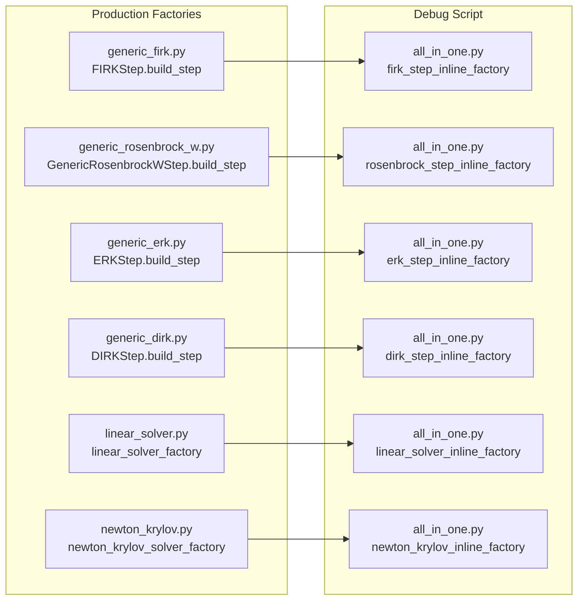

# Cleanup all_in_one.py Debug Script

## User Stories

### US-1: As a developer debugging CUDA integrators, I want the all_in_one.py script's device function factories to match production implementations, so that debugging reveals production behavior rather than artifacts from ad-hoc modifications.

**Acceptance Criteria:**
- Factory-scope variables in all_in_one.py step functions match those in production factories
- Variables used for `cuda.local.array` sizes are native Python ints (not `int32` or other Numba types)
- No unnecessary variables clutter the factory closures
- The script compiles and runs successfully after cleanup

### US-2: As a developer maintaining the codebase, I want consistent typing between all_in_one.py and production modules, so that the debug script serves as a reliable reference.

**Acceptance Criteria:**
- All array size parameters passed to `cuda.local.array` are Python `int` types
- Precision conversions match production patterns
- Factory closure variables match production naming and typing conventions

---

## Executive Summary

This task cleans up the `tests/all_in_one.py` debug script by comparing each device function factory against its production counterpart and removing unnecessary variables, ensuring consistent typing, and aligning factory-scope variables with production implementations.

## Architecture Overview

## Key Technical Decisions

1. **Variable Typing for cuda.local.array**: Variables used as sizes for `cuda.local.array()` must be native Python `int`, not `int32` or other Numba types. Production achieves this via `int32(n)` for loop bounds but plain `int` for array sizes.

2. **Factory-Scope Variable Cleanup**: Each factory should only capture the minimum variables needed by its device function, matching production patterns.

3. **No Functional Changes**: This is a pure cleanup task - no behavior should change.

## Scope of Work

### Factories to Compare and Clean:

1. **FIRK Step** (`firk_step_inline_factory`):
   - Compare against `generic_firk.py::FIRKStep.build_step`
   - Key variables: `stage_count`, `all_stages_n`, buffer settings

2. **Rosenbrock Step** (`rosenbrock_step_inline_factory`):
   - Compare against `generic_rosenbrock_w.py::GenericRosenbrockWStep.build_step`
   - Key variables: `stage_count`, `cached_auxiliary_count`, buffer settings

3. **ERK Step** (`erk_step_inline_factory`):
   - Compare against `generic_erk.py::ERKStep.build_step`
   - Key variables: `stage_count`, `accumulator_length`, buffer settings

4. **DIRK Step** (`dirk_step_inline_factory`):
   - Compare against `generic_dirk.py::DIRKStep.build_step`
   - Key variables: `stage_count`, solver scratch, buffer settings

5. **Linear Solver** (`linear_solver_inline_factory` and `linear_solver_cached_inline_factory`):
   - Compare against `linear_solver.py::linear_solver_factory` and `linear_solver_cached_factory`
   - Key variables: `n`, tolerance, max_iters

6. **Newton-Krylov Solver** (`newton_krylov_inline_factory`):
   - Compare against `newton_krylov.py::newton_krylov_solver_factory`
   - Key variables: `n`, tolerance, max_iters, damping

## Expected Outcome

After cleanup:
- Each factory in all_in_one.py will have the same set of factory-scope variables as production
- All `cuda.local.array` size parameters will be Python `int` type
- The script will compile and run correctly with all algorithm types
