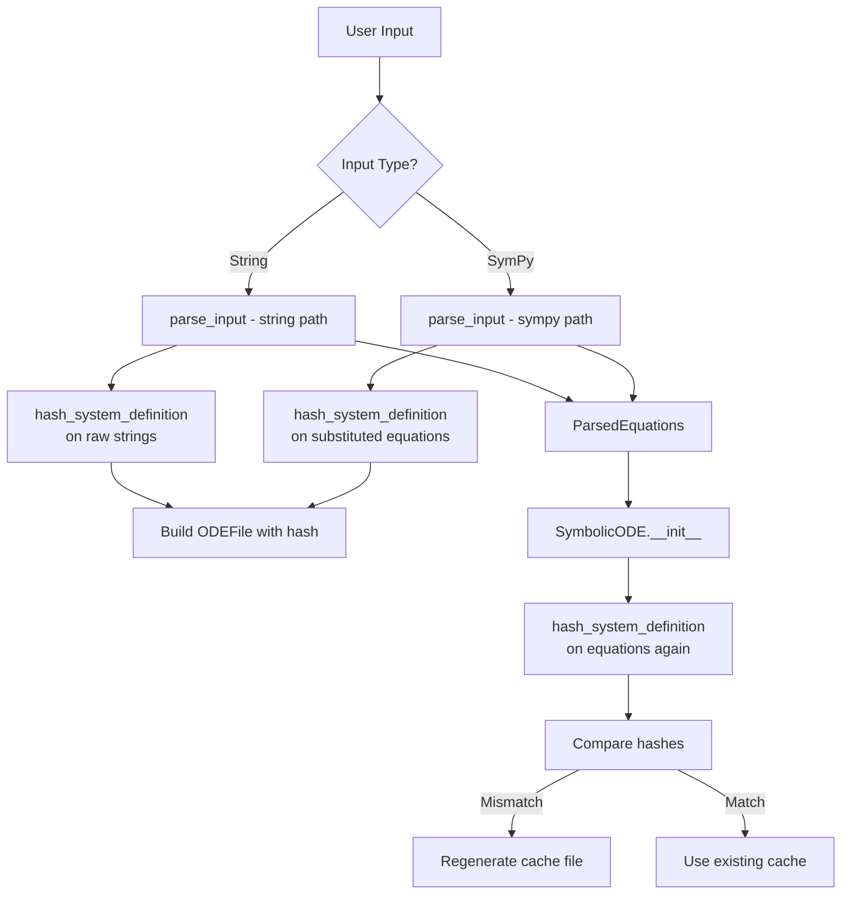
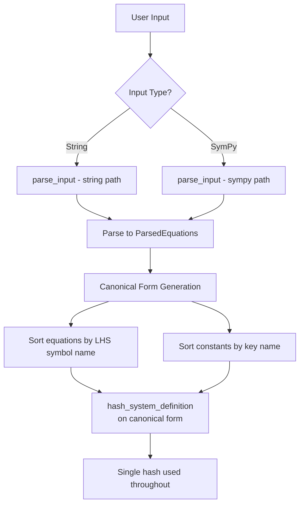
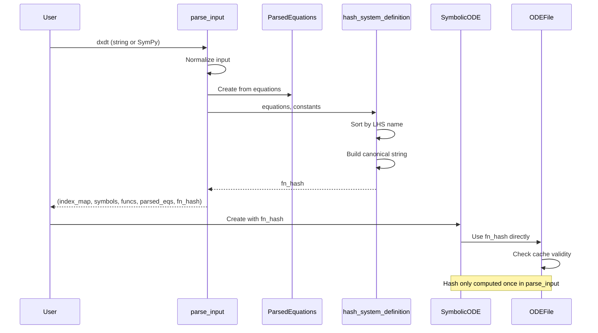

# Codegen Hash Unification - Overview

## User Stories

### US-1: Consistent Cache Behavior
**As a** CuBIE user creating ODE systems  
**I want** the codegen cache to produce consistent hits for identical systems  
**So that** I avoid unnecessary re-compilation when creating systems with the same equations and constants

**Acceptance Criteria:**
- Systems created from string input and SymPy input produce the same hash for equivalent definitions
- Creating a system from a `ParsedEquations` object produces the same hash as creating from raw strings
- Changing equation order (when mathematically equivalent) does not change the hash
- Cache hits occur reliably across different construction pathways

### US-2: Hash Determinism
**As a** developer working with SymbolicODE  
**I want** `hash_system_definition()` to produce deterministic output  
**So that** the same system definition always results in the same cache key

**Acceptance Criteria:**
- Hash is deterministic regardless of input format (string, list, tuple, SymPy objects)
- Whitespace differences in string input do not affect the hash
- The hash captures: equations, constants, and their values
- Observable/parameter assignments are properly captured in the hash

### US-3: Simplified Hash Entry Points  
**As a** maintainer of the CuBIE codebase  
**I want** a single canonical path for hash computation  
**So that** the hashing logic is maintainable and predictable

**Acceptance Criteria:**
- Redundant code paths in `hash_system_definition()` are consolidated
- All callers use a consistent input format
- The function signature clearly indicates expected input types

---

## Executive Summary

The `hash_system_definition()` function in `sym_utils.py` has multiple code paths that attempt to convert various input formats into a hashable string. When receiving `ParsedEquations` vs raw strings, the parsing pipeline may reorder expressions, leading to different hashes for mathematically identical systems. This causes cache misses and unnecessary re-codegen.

### Root Cause Analysis

The function has 5+ conditional branches handling:
1. `(list, tuple)` with `sp.Equality` elements
2. `(list, tuple)` with `(Symbol, Expr)` tuples  
3. `(list, tuple)` with nested lists/tuples
4. Other iterables (fallback)
5. Plain strings

Each branch constructs the hashable string differently, and SymPy expression reordering during parsing means the same system can produce different strings.

---

## Architecture

### Current Flow

### Problem Points

1. **In `parse_input()`**: Hash computed from raw input (lines 1378, 1420)
2. **In `SymbolicODE.__init__()`**: Hash recomputed from `ParsedEquations` if `fn_hash` is `None` (lines 180-184)
3. **In `SymbolicODE.build()`**: Hash recomputed from `self.equations` (lines 371-373)

The `ParsedEquations` iteration order comes from SymPy processing, which may differ from the original string order.

### Proposed Solution

**Key Changes:**

1. **Normalize to canonical form before hashing**: Sort equations by LHS symbol name (alphabetically) before building the hash string
2. **Simplify `hash_system_definition()`**: Accept only `ParsedEquations` or normalized equation list, remove redundant branches
3. **Hash after parsing**: Move hash computation to after `ParsedEquations` construction in `parse_input()`, not before
4. **Remove redundant hash points**: Eliminate the hash recomputation in `SymbolicODE.__init__()` when `fn_hash` is provided

---

## Data Flow Diagram

---

## Key Technical Decisions

### 1. Canonical Sorting Strategy
**Decision**: Sort equations alphabetically by string representation of LHS symbol

**Rationale**: 
- Simple and deterministic
- LHS symbols are unique (each variable assigned once)
- String comparison is stable across Python versions

### 2. Hash Computation Location
**Decision**: Compute hash in `parse_input()` after `ParsedEquations` construction

**Rationale**:
- Single point of truth for hash computation
- `ParsedEquations` is the normalized form used everywhere
- Eliminates mismatches between string-path and sympy-path

### 3. Input Simplification
**Decision**: `hash_system_definition()` accepts only `ParsedEquations` or `Iterable[Tuple[Symbol, Expr]]`

**Rationale**:
- Removes 5+ conditional branches
- Callers must normalize input first
- Clearer API contract

---

## Trade-offs Considered

### Alternative 1: Hash Raw Strings Only
- **Pro**: Simple, no SymPy processing needed
- **Con**: Cannot support SymPy input pathway; requires string reconstruction

### Alternative 2: Use SymPy's canonical representation
- **Pro**: Mathematically precise equivalence checking
- **Con**: SymPy's string representation can change between versions; adds overhead

### Alternative 3: Keep current multi-path approach, fix ordering
- **Pro**: Minimal code changes
- **Con**: Maintains complexity; ordering fixes in each branch are error-prone

**Chosen approach**: Normalize all inputs to `ParsedEquations`, then hash the sorted canonical form. This balances simplicity with correctness.

---

## Expected Impact on Existing Architecture

1. **`sym_utils.hash_system_definition()`**: Simplified signature, fewer branches
2. **`parser.parse_input()`**: Hash computed after `ParsedEquations` creation
3. **`symbolicODE.SymbolicODE.__init__()`**: No longer recomputes hash when `fn_hash` provided
4. **`symbolicODE.SymbolicODE.build()`**: Uses stored `fn_hash`, only recomputes if constants change
5. **Tests**: Need tests verifying hash consistency across input pathways

---

## References

- Issue #469: Original bug report
- Issue #429: Related caching feature request
- `src/cubie/odesystems/symbolic/sym_utils.py`: Hash function location
- `src/cubie/odesystems/symbolic/parsing/parser.py`: Input parsing with hash calls
- `src/cubie/odesystems/symbolic/symbolicODE.py`: SymbolicODE construction
